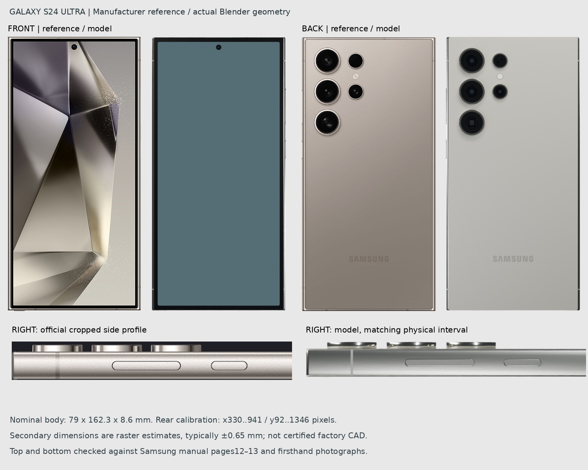
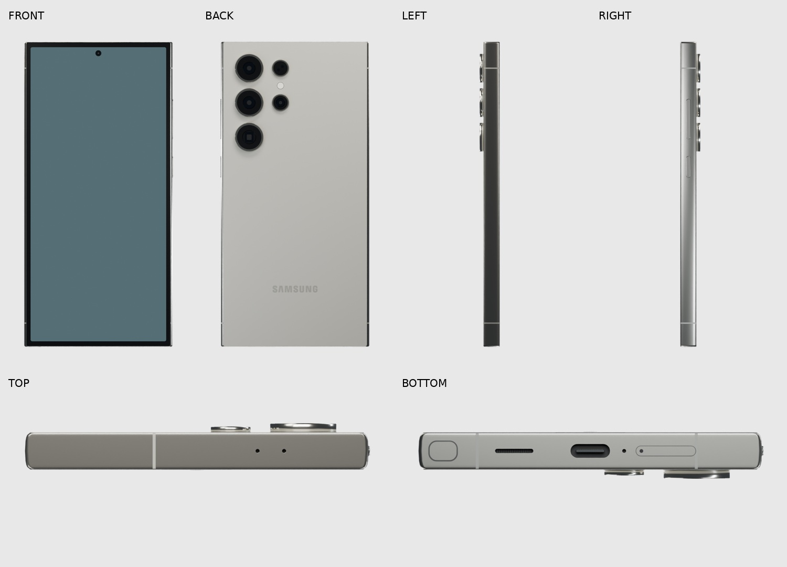
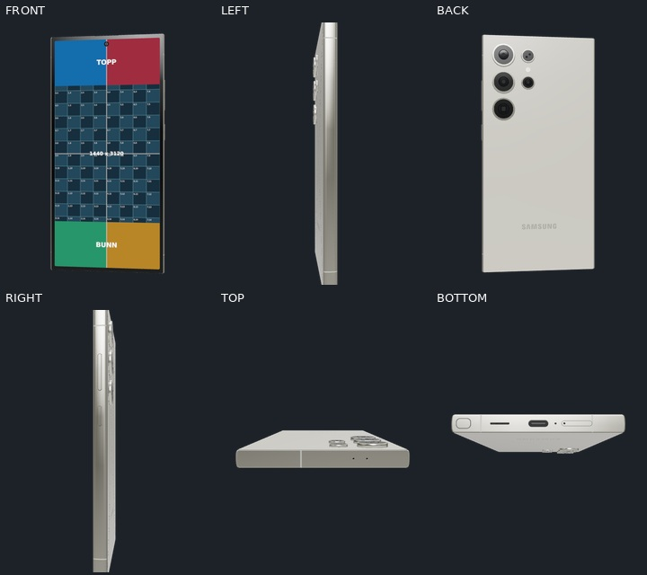

# Samsung Galaxy S24 Ultra — Titanium Gray

A video-ready Samsung Galaxy S24 Ultra, international SM-S928B/DS variant. Curved titanium side rails, flat end rails, nearly square corners, four camera apertures, laser AF windows, flash, buttons, S Pen cap, USB-C, speaker slot, microphones, air vent and SIM tray are separate semantic parts.

| Property | Value |
| --- | --- |
| Nominal body, W × H × D | 79.0 × 162.3 × 8.6 mm |
| Screenshot | 1440 × 3120 pixels |
| Rectangular display diagonal | 172.5 mm |
| Active display model | 72.287537 × 156.622991 mm |
| Runtime GLB | 1,743,512 bytes (1.74 MB) |
| Editable studio | 1,085,719 bytes |
| Triangles / meshes | 85,094 / 70 |
| GLB SHA-256 | `e281ee966cfb475ee022ebeed0832467edd1d57a4f7af4eca666cddd8fc77030` |

## Sources and dimensional confidence

Body dimensions, display diagonal and native pixels come from [Samsung's SM-S928B specifications](https://www.samsung.com/es/business/smartphones/galaxy-s/galaxy-s24-ultra-sm-s928bztgeub/). Secondary dimensions are measured from Samsung product imagery and checked against the [official design images](https://www.samsung.com/hk_en/smartphones/galaxy-s24-ultra/), the manufacturer's user guide pages 12–13, and firsthand physical-device photographs. Sources and individual pixel annotations are in [references.json](../../assets/models/galaxy-s24-ultra/references.json).

No publicly available, dimensioned mechanical CAD drawing was located. The manufacturer's user guide contains feature diagrams; the secondary dimensions here are **raster measurements**, generally with ±0.65 mm comparison tolerance. The largest selected reference deviation is 0.114 mm. This describes agreement with these images, not manufacturing accuracy. Internal lens design, coating response, microscopic seams and minor port dimensions remain visual approximations. The nominal width, height, thickness and rectangular display diagonal are measured from the actual saved geometry. The body thickness excludes camera protrusions, buttons and optical overlay offsets.

This is the international/sub6 variant, without the US mmWave side window. Only the visible, stowed S Pen cap is included. Hidden internals and a full removable stylus are deliberately omitted to keep the asset small. The Samsung wordmark follows the SVG outline on Samsung's own site.




## Files and video workflow

- `client/static/galaxy-s24-ultra.glb`: self-contained runtime model with opaque PBR materials. No cameras, lights, animations or decoder extensions.
- `assets/models/galaxy-s24-ultra/galaxy-s24-ultra-studio.blend`: editable master. Select `screen` in scene `01_MOCKUP_galaxy-s24-ultra`; replace `MAT_SCREEN_VIDEO` → `REPLACE_MEDIA`. Animate `PHONE_ROOT__animate_this`. The second scene is the two-phone studio composition.
- `assets/models/galaxy-s24-ultra/galaxy-s24-ultra-web.blend`: clean web source, applied transforms; Blender Z up and front −Y. The glTF export is +Y up, front +Z.
- The runtime mesh, mesh data and single material are all named `screen`. No other exported name contains that substring. Screen UVs are upright 0–1 with the native screenshot ratio. Studio-only reflection layers are excluded from GLB.
- `camera_cutout` masks the front camera independently. Main groups use meaningful names such as `frame`, `back_glass`, `volume_rocker`, `power_button`, `camera_telephoto_5x_ring`, `s_pen_cap` and `sim_tray`.

For a Blender movie, select a Movie image on `REPLACE_MEDIA` and set its frame duration to the clip length. Auto Refresh is enabled; the supplied timeline is 180 frames at 30 fps. The web app supplies the video texture automatically.

## Verification

The reimported GLB passes 32 structural and geometry checks. The reference audit contains 27 measurements. Front, back, left, right, top and bottom are rendered from the Blender model. The side/reference comparison caught an antenna-position error and the user-guide drawing corrected the orientation of the folded 5× optical aperture before the final renders. Hollow, slightly tapered camera rings and a welded screen grid avoid degenerate or grazing-angle geometry; the web screen plane is explicitly flattened to remove float32 rotation residue.

App render results are saved under `qa/app`: every animation preset, all catalogue-model stills, screen alignment, landscape, reflection option, case recolouring and 4K. The report records the GLB hash; `pixel-checks.json` verifies that it matches the shipped file and compares 156,000 interior screen pixels during recolouring. The exact comparison without MSAA passes. SwiftShader with MSAA shows one isolated pixel of an occluded camera ring; this is explicitly recorded and limited to 1/156,000 pixels, rather than reported as exact equality. Hardware GPU rendering was not tested. Representative contact sheets remain in Git; raw frames stay local.



## Rebuild

Run from the repository root with Blender 5.2.1. The supplied demo/alignment images and Samsung SVG path keep the build self-contained. `common/blender_batch.py` avoids this host's audio shutdown hang.

```sh
blender -b -noaudio --python assets/models/common/blender_batch.py -- assets/models/galaxy-s24-ultra/build.py
blender -b -noaudio assets/models/galaxy-s24-ultra/galaxy-s24-ultra-studio.blend --python assets/models/common/blender_batch.py -- assets/models/common/export_web.py galaxy-s24-ultra
blender -b -noaudio --python assets/models/common/blender_batch.py -- assets/models/common/validate.py galaxy-s24-ultra
blender -b -noaudio assets/models/galaxy-s24-ultra/galaxy-s24-ultra-studio.blend --python assets/models/common/blender_batch.py -- assets/models/common/audit_dimensions.py galaxy-s24-ultra
blender -b -noaudio assets/models/galaxy-s24-ultra/galaxy-s24-ultra-studio.blend --python assets/models/common/blender_batch.py -- assets/models/common/render.py galaxy-s24-ultra final
blender -b -noaudio assets/models/galaxy-s24-ultra/galaxy-s24-ultra-studio.blend --python assets/models/common/blender_batch.py -- assets/models/common/render.py galaxy-s24-ultra audit
npm --prefix mcp run build
node mcp/scripts/render-model-check.mjs galaxy-s24-ultra assets/models/galaxy-s24-ultra/screen-alignment.png assets/models/galaxy-s24-ultra/qa/app
python3 assets/models/common/qa_boards.py galaxy-s24-ultra
python3 assets/models/galaxy-s24-ultra/compare_reference.py
```
