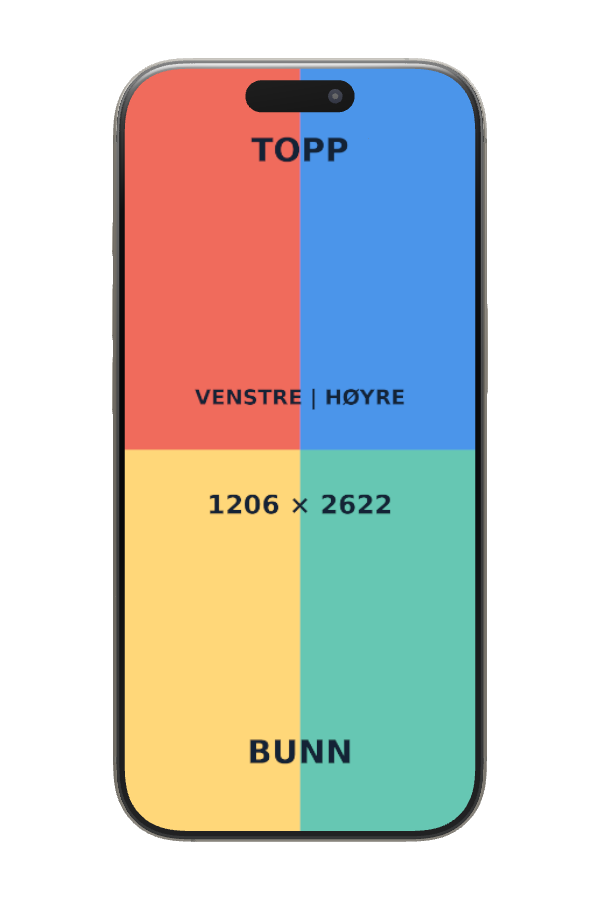
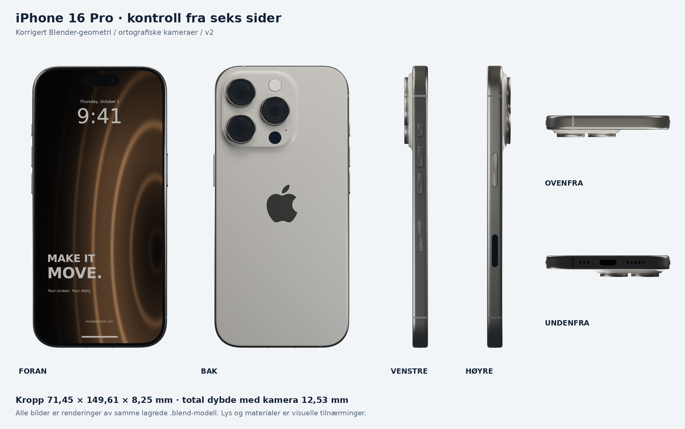
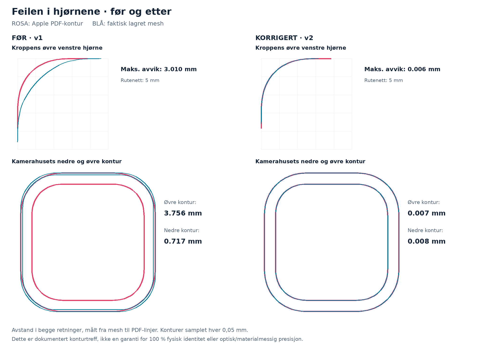
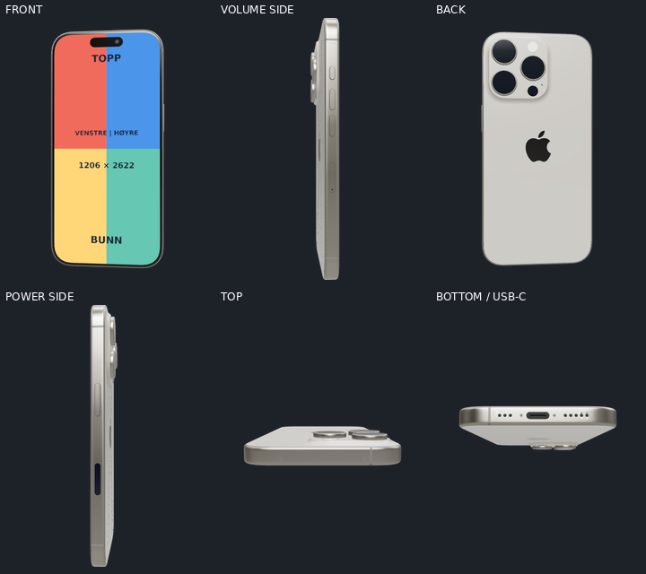

# iPhone 16 Pro — Natural Titanium

The `iphone-16-pro` catalogue entry adds an iPhone 16 Pro with a replaceable
portrait screen. The model uses the international layout with a physical SIM
tray. Select **iPhone 16 Pro** in the editor, or pass `model: "iphone-16-pro"`
to the MCP render tools. The catalogue's default model is unchanged.

| Property | Value |
| --- | --- |
| Body, width × height × depth | 71.45 × 149.61 × 8.25 mm |
| Camera projection from the back | 4.28 mm |
| Screenshot resolution | 1206 × 2622 |
| GLB size | 2.04 MB |
| Triangles / mesh objects | 94,765 / 73 |
| Coordinates | Metres; glTF +Y up, +Z front; centred on the complete bounding box |
| Screen binding | One object, mesh and material named `screen`; `uv: "planar"` |
| Finish | Native materials (`caseColor: null`) |



## Editable files

- Runtime asset: `client/static/iphone-16-pro.glb`.
- Catalogue: `client/src/lib/models/3d-models/iphone-16-pro.model.json`.
- Browser source: `assets/models/iphone-16-pro/iphone-16-pro-web.blend`.
- Studio source: `assets/models/iphone-16-pro/iphone-16-pro-studio.blend`.
- Test image: `assets/models/iphone-16-pro/screen-alignment.png`.

Both Blender files were saved with Blender 5.2.1 LTS. The web source has only
phone meshes, Z up and front toward −Y. The studio file retains its own
presentation scenes, procedural materials, glass and optics. Its content
surface is `SCREEN_VIDEO__REPLACE_MEDIA`, with a packed demo image and the
media helper in Blender's Text Editor. Use the web source for browser exports.

From the repository root:

```sh
blender -b assets/models/iphone-16-pro/iphone-16-pro-web.blend \
  --python assets/models/iphone-16-pro/export_glb.py
```

To regenerate the web source, GLB and catalogue from the studio source:

```sh
blender -b assets/models/iphone-16-pro/iphone-16-pro-studio.blend \
  --python assets/models/iphone-16-pro/derive_web.py
```

This derivation was rerun from the checked-in studio file and reproduced the
same GLB bytes. `export-stats.json` records its dimensions and budget.

The GLB contains no images, external files, lights, cameras, animations or
decoder compression. Materials are opaque Principled PBR. The standard
`KHR_materials_specular` extension reduces reflections on the antireflective
camera cutout; the repository's GLTFLoader supports it without a decoder.
Opaque parts use backface culling so hidden camera faces do not produce stray
pixels through the screen in software rendering. The planar logo faces outward
from the rear glass.

## Drawing comparison

The studio geometry was rebuilt from Apple's original
[dimensional drawings](https://developer.apple.com/download/files/accessories/dimensional-drawings/iphone-16-pro.pdf),
with device specifications checked against
[Apple's technical specifications](https://support.apple.com/en-us/121031).

Saved and reopened mesh contours were measured against the PDF vectors in
both directions, with samples every 0.05 mm. Maximum measured deviations are
0.00646 mm for the body, 0.00759 mm for the camera plateau base and 0.00664 mm
for its upper contour. See
`assets/models/iphone-16-pro/dimensional-audit.json` for the individual results.





These are checks of selected nominal dimensions and exterior contours, not
certification against a physical phone. Apple does not provide a separate top
elevation in the referenced sheets. Optical internals, material response,
microscopic details and interpolation around camera plateau corners are
approximations.

The browser version retains the body and camera plateau contours, with these
rendering adaptations:

- Screen width is 66.57 mm and height is 144.73179 mm to match 1206/2622
  exactly. This is 0.05821 mm shorter than the studio source's 144.79 mm.
- The black underlay is recessed another 0.04 mm, leaving about 0.045 mm
  behind the screen. The original 0.005 mm gap caused depth fighting at
  oblique angles in Chromium SwiftShader.
- The logo is offset another 0.04 mm outside the rear glass to prevent the
  same depth fighting when the back is tilted; its measured outline is unchanged.
- Lens covers are opaque, small parts are simplified, and separate front
  glass is removed to follow the [model guide](../phone-model-guide.md).

The complete bounding box is about 72.350 × 149.679 × 12.638 mm, including
buttons, small port surfaces and the technical cutout 0.1 mm in front of the
screen. Body dimensions in the table exclude those features.

## Validation

The exported GLB was imported into an empty Blender scene and checked for
names, UV direction, screen ratio and normal, dimensions, origin, materials,
depth clearance and budget. Preview images were rendered from the imported
file. The studio drawing audit applies to the studio source; the browser
adaptations above are recorded separately.

The repository's shared `SceneRenderer`, through the MCP `RenderSession`,
was used for all 11 presets: keyframe boundaries, midpoints and quarter
duration samples. Checks also cover a still from all 13 catalogue models,
portrait and landscape output, 2160 × 3840 output, glass reflections,
recolouring and a two-second MP4 with changing screen content. The screen
test's top, bottom, left and right labels stay upright; recolouring preserves
screen pixels. Some presets intentionally zoom or enter outside the frame.

To repeat the visual checks after rebuilding the MCP:

```sh
cd mcp
npm run build
node scripts/render-model-check.mjs iphone-16-pro \
  ../assets/models/iphone-16-pro/screen-alignment.png /tmp/iphone-16-pro-checks
```

The script writes PNGs and a report with the GLB's SHA-256. Inspect the images;
successful rasterisation alone does not establish correct geometry or UVs.
The existing `iphone-test-phone-3`, `iphone-test-phone-3-1` and
`iphone-test-phone-3-2` entries still show their old rotated UV mapping. Their
assets and catalogue entries are unchanged by this addition.

Machine-readable results are stored in
`assets/models/iphone-16-pro/glb-validation.json` (32 checks) and
`assets/models/iphone-16-pro/validation-summary.json` (build, render and video
results, including the final GLB hash).


