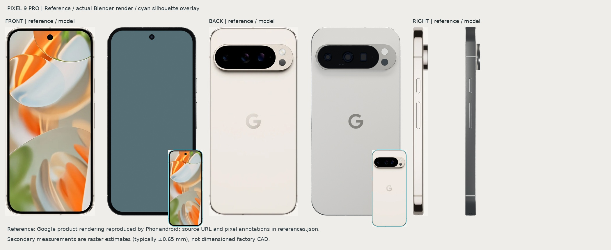
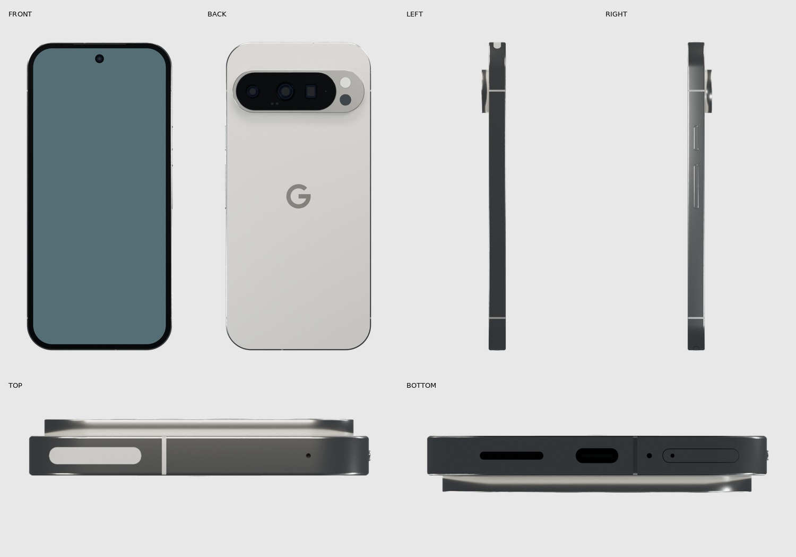
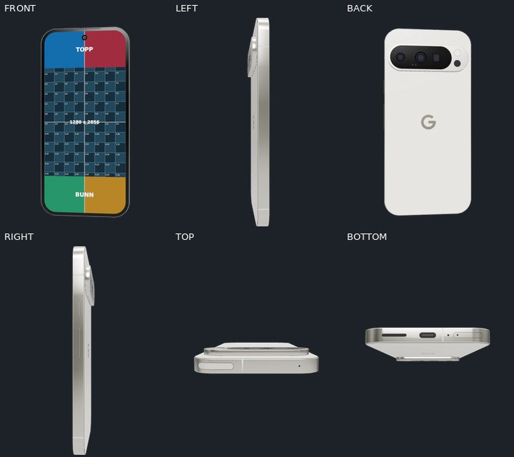

# Google Pixel 9 Pro — Porcelain

A native-size, video-ready Pixel 9 Pro for PhoneMockup. The satin back, polished aluminium sides, dual-finish pill camera bar, three camera apertures, flash, temperature sensor, power/volume buttons, curved SIM tray, USB-C, speaker, microphones and antenna breaks are modelled separately.

| Property | Value |
| --- | --- |
| Nominal body, W × H × D | 72.0 × 152.8 × 8.5 mm |
| Screenshot | 1280 × 2856 pixels |
| Active display model | 65.80 × 146.81625 mm |
| Runtime GLB | 1,607,544 bytes (1.61 MB) |
| Triangles | 79,227 |
| Meshes | 62 |
| GLB SHA-256 | `363232a7c3fe97a54500fbbec90a0a173280fab8cce1cc4ae954e5979e81bb0b` |

## Sources and accuracy

Nominal dimensions and display pixels come from [Google's hardware specifications](https://support.google.com/pixelphone/answer/7158570?hl=en-AU). Feature identities and placement are checked with [Google's hardware diagram](https://support.google.com/pixelphone/answer/7157629?hl=en), the Google Pixel 9 Pro Repair Manual V1.1, and photographs of a physical review unit. [Google's design article](https://blog.google/products-and-platforms/devices/pixel/google-pixel-9-series-design/) describes the finishes.

No public dimensioned mechanical drawing comparable to Apple's accessory drawings was located. Secondary dimensions are reverse measured from the manufacturer's front/back/right product elevations and checked against the diagram and firsthand photographs. They are **raster estimates**, usually with an approximately ±0.65 mm comparison tolerance. This is not factory CAD or a certified manufacturing model. Internal optical assemblies, exact coating response, microscopic seams and small port dimensions remain visual approximations.

The source manifest, pixel annotations, individual tolerances and measured deviations are in [references.json](../../assets/models/pixel-9-pro/references.json) and [the dimensional audit](../../assets/models/pixel-9-pro/qa/dimensional-audit.json). The largest selected raster-reference deviation is about 0.39 mm. Nominal width and height match to floating-point precision. The 8.5 mm nominal depth is the distance from the flat back glass to the display plane; buttons, camera protrusion and the small graphics offsets for optical overlays are excluded.




## Files and usage

- `client/static/pixel-9-pro.glb`: runtime asset; self-contained, opaque materials, no lights/cameras/animations or decoder extensions.
- `assets/models/pixel-9-pro/pixel-9-pro-studio.blend`: editable studio master. In `01_MOCKUP_pixel-9-pro`, select `screen`, then replace the image on `MAT_SCREEN_VIDEO` → `REPLACE_MEDIA`. Animate `PHONE_ROOT__animate_this`. `02_STUDIO_Front_and_Back` uses collection instances.
- `assets/models/pixel-9-pro/pixel-9-pro-web.blend`: clean, applied-transform web source. Blender Z up, front −Y; glTF exports +Y up, front +Z.
- `screen`, its mesh data and its only material are named exactly `screen` in the web source. No other exported name contains that substring. UVs run upright across 0–1, and the outline uses the exact screenshot ratio.
- The studio has thin reflection coatings; the web asset omits them and uses opaque optics as required by the app's model guide.

For a Blender movie, select a Movie image on `REPLACE_MEDIA` and set its frame duration to the clip length. Auto Refresh is enabled; the supplied timeline is 180 frames at 30 fps. The web app supplies the video texture automatically.

## Validation

The reimported GLB passes 32 structural and geometry checks, including exact screenshot ratio, normal direction, upright UVs, clipping-mask separation, metric scale, centred origin, triangle/file-size budgets and absence of unsupported extensions. The actual shared app renderer is exercised with all 11 presets, front/landscape, 4K, reflection option and case recolouring. The central 156,000 screen pixels are compared before/after case recolouring. Reports include the exact GLB hash so stale checks cannot silently pass.

The port/SIM close-up caught two real issues during inspection: discarded custom normals caused diagonal metal reflections, and a flat triangle fan across the curved tray cut through the frame. The exporter now preserves evaluated split normals, and curved inlays use narrow strips that follow the frame.



## Rebuild

Run from the repository root with Blender 5.2.1. `assets/models/common/blender_batch.py` avoids this host's audio shutdown hang; it does not change the saved project. Supply `-noaudio` for batch work.

```sh
blender -b -noaudio --python assets/models/common/blender_batch.py -- assets/models/pixel-9-pro/build.py
blender -b -noaudio assets/models/pixel-9-pro/pixel-9-pro-studio.blend --python assets/models/common/blender_batch.py -- assets/models/common/export_web.py pixel-9-pro
blender -b -noaudio --python assets/models/common/blender_batch.py -- assets/models/common/validate.py pixel-9-pro
blender -b -noaudio assets/models/pixel-9-pro/pixel-9-pro-studio.blend --python assets/models/common/blender_batch.py -- assets/models/common/audit_dimensions.py pixel-9-pro
blender -b -noaudio assets/models/pixel-9-pro/pixel-9-pro-studio.blend --python assets/models/common/blender_batch.py -- assets/models/common/render.py pixel-9-pro final
blender -b -noaudio assets/models/pixel-9-pro/pixel-9-pro-studio.blend --python assets/models/common/blender_batch.py -- assets/models/common/render.py pixel-9-pro audit
npm --prefix mcp run build
node mcp/scripts/render-model-check.mjs pixel-9-pro assets/models/pixel-9-pro/screen-alignment.png assets/models/pixel-9-pro/qa/app
python3 assets/models/common/qa_boards.py pixel-9-pro
python3 assets/models/pixel-9-pro/compare_reference.py
```

The provided screen demo and alignment PNGs make the build self-contained. Regeneration of the optional demo uses `common/make_media.py` with NumPy and Pillow. Raw animation frames and downloaded review photographs stay local, outside Git; sources and representative QA boards are retained.
