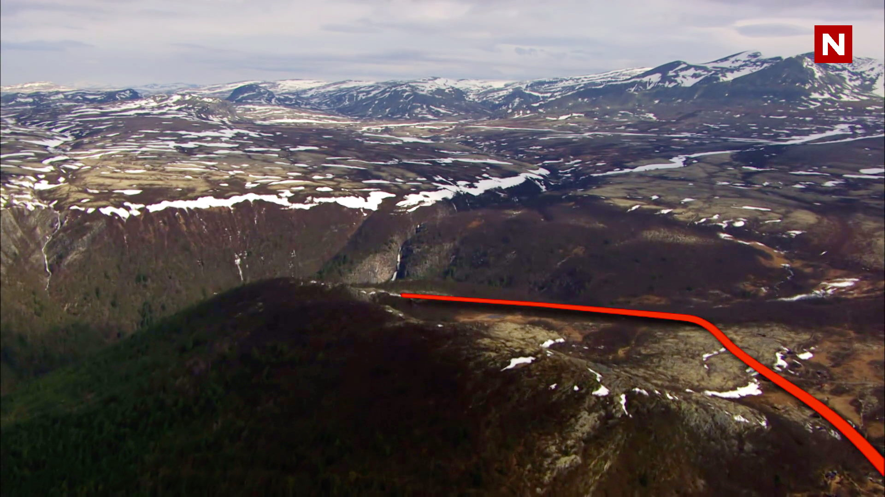

*Dronefoto: TVNorge.*

Sjelden har vel noen vært så lykkelige over å nå frem til Rondane Høyfjellshotell, som da Beat for Beat-Atle Pettersen, skiløper Øystein "Pølsa Pettersen og rapperen Pål Tøien "Onkel P." nådde frem til Rondane Høyfjellshotell 6. september i fjor på TVNorges realityprogram 71° grader nord kjendis.

Se hele episoden [her](https://www.dplay.no/programmer/71-nord-norges-tffeste-kjendis) (episode 5).

Vi som er ansatt på hotellet er umåtelig stolte over de fine TV-bildene TVNorge viste fra hotellet og områdene rundt. Det var stor stas å ha både kjendiser og TVNorges crew på besøk. Sistnevnte så vi lite til. De jobbet opp mot 16 timer i døgnet nede i Erlingstugu med redigering og organisering.

Michael Aasheim, fra hotellets markedsteam hadde ansvaret for kontakten med TVNorge og hadde travle dager. Men han fikk tatt seg en kaffe med Atle Pettersen og Onkel P. i peisestua. Der lå Atle Pettersen helt utslått på sofaen og bedyret at han aldri hadde vært så sliten før, mens Onkel P. var stolt over hva han hadde oppnådd. Han har ikke tidligere levd et alt for sunt liv, og fjellvandring har vært fjernt for han, til tross for at hans mor var ivrig DNT-medlem. Men det er lov å være sliten når du har syklet alt du kan opp Rondanevegen fra Otta!

71° grader nord det eneste realityprogrammet som vokser i antall seere, og siste sesong, som besøkte Rondane, er det mest sette noensinne. Det skyldes nok i stor grad castingen, som gir stor underholdning, både med de to nevnte kjendiser og ikke minst Jon Almaas, som har en utrolig dynamikk med Ex on the beach-stjernen Melina Johnsen. Det er trolig vanskelig å finne så to ulike personligheter.

71° grader nord var også på Rondane Høyfjellshotell i 2011 også, den gangen uten kjendiser. [Her](https://www.dplay.no/programmer/71-nord) kan du se laget komme frem til hotellet i episode 5. (Krever abonnement på Dplay).

*Foto under er tatt av TVNorge våren 2011.*

 [Gå tilbake](/javascript: history.go(-1))
