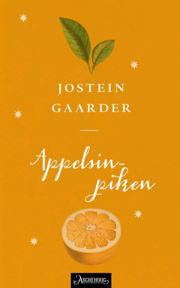
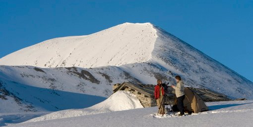

Føler du for å lese noe annet enn bloddryppende krim på fjellet, kan vi anbefale en vakker kjærlighetshistorie: Appelsinpiken av Jostein Gaarder. Boken er delvis filmatisert ikke langt fra Rondane Høyfjellshotell, ved Peer Gynt-hytta.

Foto:
Harald Paalgard

Fra ca. 0.50 sekunder inn i filmen kan du se opptak fra Rondane i

<Video id="4T5nsNEyNFc" />

 og dette er GDs [omtale](https://www.gd.no/kultur/har-store-forventninger/s/1-934610-4152448) av filmopptakene på Rondane.

Aschehoug forlags omtale av Appelsinpiken:
"Appelsinpiken" er en varm, virkelighetsnær og medrivende fortelling. Den er både et kjærlighetsdrama som spenner over to generasjoner og en far/sønn-historie på tvers av grensen mellom liv og død. Georg er 15 år en ganske alminnelig gutt - helt til han får et brev fra faren, som døde da Georg var fire år. I brevet forteller faren om jakten på Appelsinpiken, en gåtefull skikkelse som dukker opp på de mest uventede steder. Selv har Georg nylig skrevet en særoppgave om Hubble-teleskopet, og nå fletter han sine egne tanker om universet inn i farens brev. Slik samarbeider de to om å viske ut grensene mellom liv og død, fortid og nåtid.

 [Gå tilbake](/javascript: history.go(-1))
