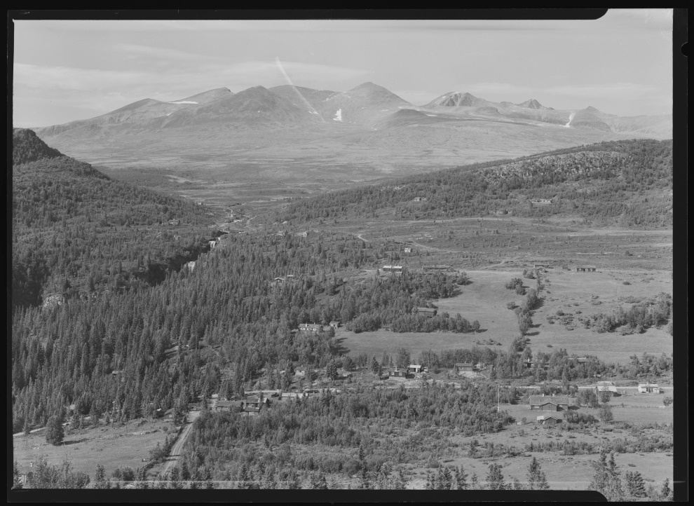
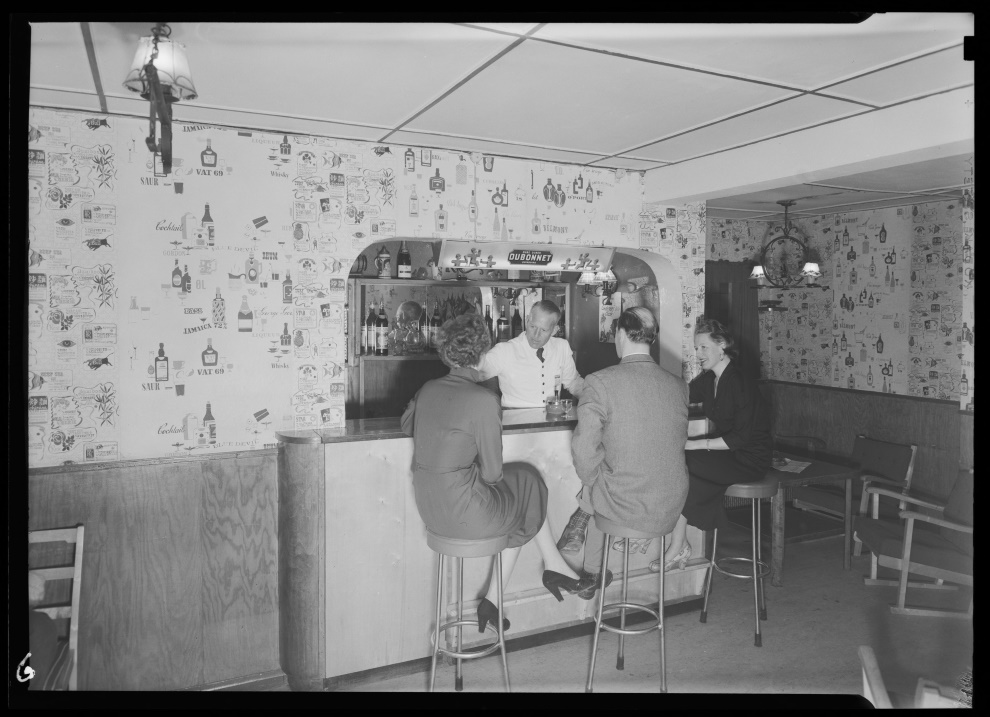
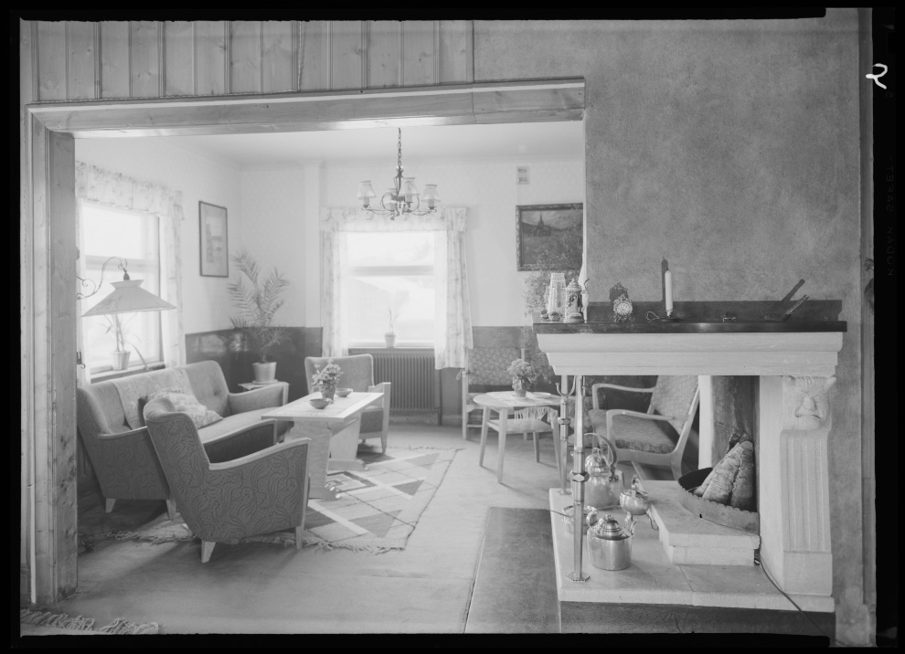

Er det noe vi har en barnslig glede av, så er det å følge med på [www.nb.no](http://www.nb.no/) for å finne ut om Nasjonalbiblioteket har skannet inn og lagt ut nye bilder fra Rondane og Mysuseter.
 Og gleden var stor sist vi sjekket, og vi så det var lagt flere bilder fra hotellet, som den gangen het Rondane Fjellstue. Det var det Rondane Høyfjellshotell het fra oppstart i 1939 til brannen i 1961. Bildene viser portalen inn til hotellet, baren, stuene og et flott utsiktbilde som er tatt rett over hotellet mot Ulafossene.

 Fotograf er Normann Kunstforlag, et av Norges eldste postkortelskaper, som ble etablert allerede i 1906. Bildene fra samlingen ble donert av familien i 2002, men Nasjonalbiblioteket har en stor jobb med å legge ut sine samlinger, så man må følge med på når det legges ut nye "perler". Det fine med disse bildene er at de er fritatt fra copyright og kan lastes ned høyoppløselig. Vi kommer derfor til å lage papirbilder av noen av dem og henge opp på fotoveggen vår i baren.

 [Gå tilbake](/javascript: history.go(-1))
