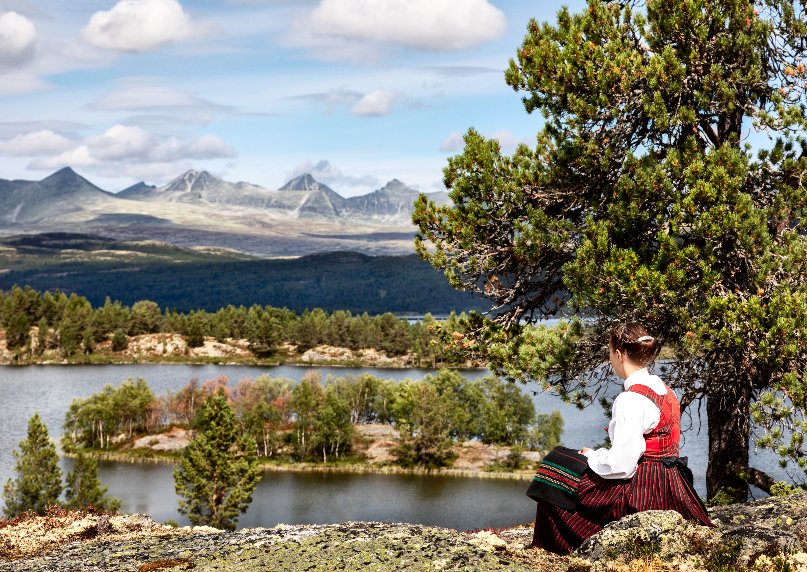
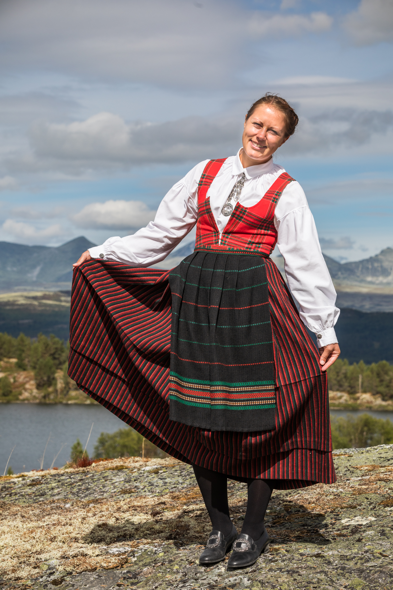

Dette fotografiet ble brukt som propaganda av Norges eksilregjering under 2. Verdenskrig. Vi ble så nysgjerrige da vi fant det i [Norsk Folkemuseums arkiv](https://digitaltmuseum.no/011013416164/avfotografert-postkort-en-kvinne-i-rondastakk-som-ser-utover-furusjoen) at vi bare måtte finne ut mer. I tillegg bare måtte vi gjenskape det med gudbrandsdøl Mari Lillebråten Øihusom som modell.

Originalotografiet viser modell Anna Veikle (Født. Breden) fra Sel, som sitter ved bredden av Årvillingen med Furusjøen i bakgrunnen. Fotografiet har fått navnet ”En kvinne i rondastakk som ser utover Furusjøen ved Rondane” og er tatt en gang på begynnelsen eller midten av 30-tallet. Den nye versjonen av fotografiet ble tatt 5. august 2018 med modell Mari Lillebråten Øihusom, også hun fra Sel.

Det opprinnelige fotografiet ble solgt som postkort og ble tatt av Normanns Kunstforlag A.S. av selskapets daglige leder Carl Normann.

Men hvordan havnet bildet i London som propaganda?

Til London

Etter den tyske okkupasjonen opprettet den norske eksilregjeringen i London Regjeringens informasjonskontor i februar 1941. Kontorets øverste leder var statsminister Johan Nygaardsvold og kontoret ble gitt to hovedoppgaver: Å binde nasjonen sammen ved å informere om alle sider av Norges sak, særlig til nordmenn utenfor landets grenser og å "selge" Norges sak overfor våre allierte. Ved hjelp av radiosendinger, presseoppslag, utstillinger og foredrag ble det formidlet kunnskap om norsk historie, kultur, motstandsbevegelse, handelsflåte og utefront.

Informasjonskontoret bygde opp en foto- og filmavdeling som fremskaffet tidligere opptak og nytt filmmateriell fra og om Norge. Bildeavdelingen ble ledet av Per Bratland og hadde 22 ansatte, hvorav fire fotografer.

Vi har ikke lykkes med å finne ut hvordan akkurat fotografiet ”En kvinne i rondastakk som ser utover Furusjøen ved Rondane” kom over til London,  eller i hvilken konkret sammenheng det ble brukt. Men vi vet at Per Bratland tok med seg et større antall filmer og fotografier da han flyktet til Sverige i 1940. Han var dessuten tilbake senere under krigen og fikk med seg så mange postkort han kunne få tak i, først og fremst for at militære myndigheter skulle studere strategiske mål med tanke på nye krigshandlinger.

Men det kom også nye forsyninger med bilder fra Norge gjennom hele krigen. I 1941 ”lånte” eksempelvis norske agenter filmer og bilder fra Norsk Films lokaler og andre steder, for å skaffe fotomateriale i forbindelse med utgivelsen av boken [Alt for Norge!](https://www.nb.no/items/d24efafa67d249bc3a3e3261f6534288?page=0&searchText=alt for Norge!): utgitt i anledning Kong Haakons 70-årsdag 3. August 1942.

Londonregjeringen fikk tilgang til informasjon og bilder fra Norge via et imponerende apparat av kurerer som smuglet materiale fra Norge til Stockholm, som så ble telegrafert videre eller sendt til London. På det meste gikk det faste ruter til Sverige to ganger i uka. Oddvar Aas skriver utførlig om dette boken [Norske penneknekter i eksil](https://www.nb.no/items/efbe8fe817d816b656e4d9276b253898?page=0&searchText=Norske penneknekter i eksil).

I statsminister Nygaardsvolds rapport [Den norske regjerings virksomhet fra 9. April 1940 til 22. Juni 1945](https://www.nb.no/items/37cc2fef22080e9d0ace3cfa3395a15b?page=0&searchText=Regjeringens informasjonskontor) fremgår det at Regjeringens informasjonskontor, med hovedkontor i Kingston House North i London,  også hadde underavdelinger hele 11 andre land rundt om i verden.

Danserestaurantene stengte ikke 9. april

En svært viktig oppgave for kontoret var å reparere det dårlige omdømmet Norge hadde fått.I aprildagene 1940 gikk det meste galt, da amerikanske aviser kunne melde at danserestaurantene i Oslo ikke lot seg affisere av invasjonen og holdt åpent hele kvelden 9. april. I all hovedsak lot nordmennene tyskerne spasere inn i hovedstaden og okkupere det de ville. Det var umulig å si i hvilken grad de allierte ville komme oss i unnsetning,  og det gjaldt for Norge å ikke bli glemt i stormaktsspillet. Mye tyder på at informasjonskontoret lyktes godt.

I 1941 skrev det britiske fagbladet ”The Motorship” at den norske tankflåten, som var kontrollert av London-regjeringen, var verdt like mye for de allierte som én million soldater på slagmarken.

Papirfotografier var viktig frem til elektronikken gjorde sitt inntog for alvor på 1990-tallet. Postkort var den tidens Instagram og Facebook. Som en del av propagandastrategien ble det utover i krigen trykket opp hele 200.000 bilder hvert halvår. Disse ble spredt rundt om i hele Europa.

Foredrag for 350.000 mennesker

Kontoret hadde også en egen foredragsavdeling som reiste land og  strand rundt for å tale Norges sak til norske og britiske forsamlinger, totalt ble det holdt 2.300 foredrag for i alt 350.000 mennesker.

"Vårt" postkort kan også ha blitt brukt i ulike tidsskrifter utgitt av eksilregjeringen fra London eller Stockholm, det vil si ”Norsk Tidend”, ”Fram”,  ”Norges-Nytt”, ”Det frie Norge” og ”Håndslag”. Mot slutten av krigen ble ”Det frie Norge” distribuert til Norge i et opplag på hele 250.000 via sjøfly og kurerer fra Sverige. Som en kuriositet kan nevnes at det også ble distribuerte hele tre millioner sigaretter til Norge, og at statsministeren skryter av det i sin rapport etter krigen!

Amerikanerne utga også to publikasjoner, som ble distribuert på ulike vis: ”Brev fra Amerika” og ”Fotorevy”, også disse hadde et utstrakt samarbeid med regjeringskontoret i London.

Vi kan godt forstå at ”En kvinne i rondastakk som ser utover Furusjøen ved Rondane” fungerte som propaganda. Rondanemassivet skiller seg ut i fjell-Norge som spesielt vakkert og kombinert med en fager kvinne i rondastakk er nasjonalromantikken komplett.

Modellens datter

Vi har snakket med Ragnhild Margrethe Eide, som er yngste datter av modellen Anna Veikle (1898-1988). Hun har tatt vare på et fotografi med et litt annet motiv, men trolig tatt samme dag. Det andre fotografiet, som også havnet i London,  viser søsknene Martha Marie Domaas og Solveig Fredrikke Gjørvstad, sammen med moren. Hun antar at de kan være rundt 5-6 år gamle på bildet og ettersom de er født i henholdsvis 1927 og 1929 kan vi anta at bildet er tatt på begynnelsen av 30-tallet.

Mye tyder på at postkortene var svært populære. Vi har funnet postkortet med barnemotivet med poststempel fra 1958, altså har det vært i salg i minst 20-25 år etter at det ble tatt.

I dag pryder Anna Veikle og Mari Lillebråten Øihusom fotoveggen i baren vår. Et hotell lever ikke bare av å vise frem vakre fjell og servere god mat. Det handler også om historiefortelling og alle bildene vi har hengt opp der forteller hver sin historie.

Ikke minst er det viktig å gi gjestene våre spennende turalternativer når de er på besøk. Fotografiet er tatt er om lag én mils gange fra Rondane Høyfjellshotell.

Fun facts

- Lederen for Regjeringens informasjonskontors fotoavdeling, Per Bratland ble berømt for å ha tatt bilde av kongen og kronprinsen foran et bjørketre utenfor Molde i 28. april 1940, senere kalt [”Kongebjørka”](https://www.nrk.no/mr/slik-ble-kongebjorka-bildet-til-1.12318956).
- Forfatteren av denne artikkelen trodde opprinnelig at bunaden Anne Veikle hadde på seg het rondastakk fordi det er en bunad brukt i traktene rundt Rondane. Men der tok jeg veldig feil. Ei rond/rånd betyr striper. (En stakk er et skjørtelignende plagg med bryststykke, ryggstykke og seler). En annen betegnelse er Råndastakk og rutaliv. Så da vet vi det.
- Rondastakken er en høyt klassifisert, da dette er en folkedrakt og ikke en konstruert bunad. En bunad er vanligvis et festplagg, mens rondastakken var et hverdagsplagg som ble brukt i alt fra fjøsstell til høyonn og kan spores tilbake til 1830-årene.
- Gudbrandsdalens festbunad ble konstruert av Aksel Waldemar Johannessen i 1920-årene. Mannsbunaden ble tegnet i 1950-årene.
- Rita Lillebråten, modellens mor, som var med på fotoopptaket som hår- og stakkonsulent, forteller at rondastakk har blitt mindre vanlig blant nyere kull av konfirmanter i Norddalen. Nå er det mer vanlig med Gudbrandsdalens festbunad. Ser man på konfirmasjonsbilder fra 80-tallet hadde så godt som alle konfirmantene rondastakk.
- Vannet modellene sitter foran heter i dag offisielt Årvillingen, men ble opprinnelig skrevet Orvillingen. Furusjøen ses godt i bakgrunnen på det første bildet, men bare så vidt på bildet som er tatt i 2018 som følge av mer vegetasjon.
- Legg merke til furutreet til høyre i motivet. Vi har studert det nøye og kommet til at det må være samme tre. Dette treet har brukt over 8o år på å få så vidt litt større grener! Furuer med dårlig jordsmonn vokser nesten ikke, i tillegg står treet nesten tusen meter over havet.
- Fotograf av begge fargebildene er russer-gudbrandsdølen Yury Rogachev.
- GPS-koordinatene for der fotografen sto er: 61°44'57.852" N 9°43'54.317” E
- NRK distriktsprogram for Oppland og Hedmark [sendte historien](https://radio.nrk.no/serie/distriktsprogram-hedmark-og-oppland/DKOP02016018/10-08-2018) om fotografiet på radio 10. august i år. (Gå frem til 46.10, for å lytte til det).
 [Gå tilbake](/javascript: history.go(-1))
