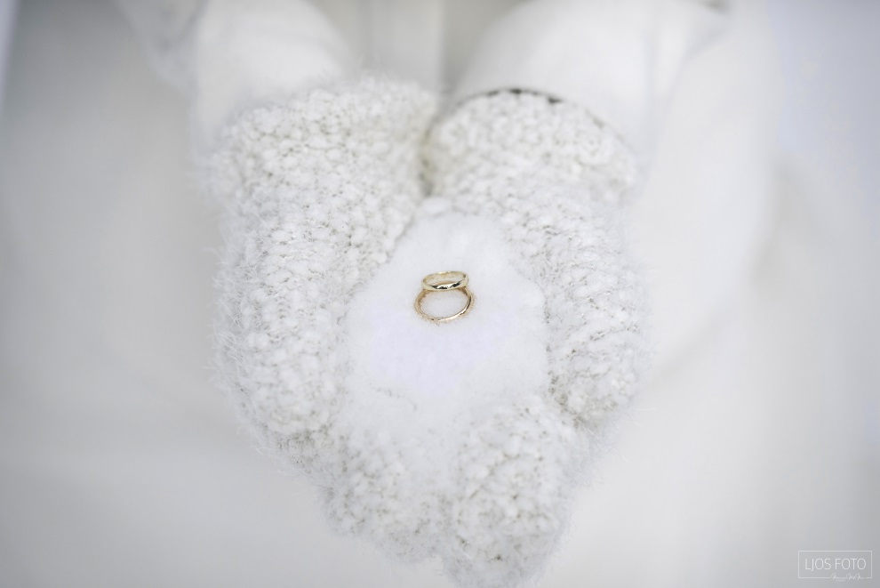
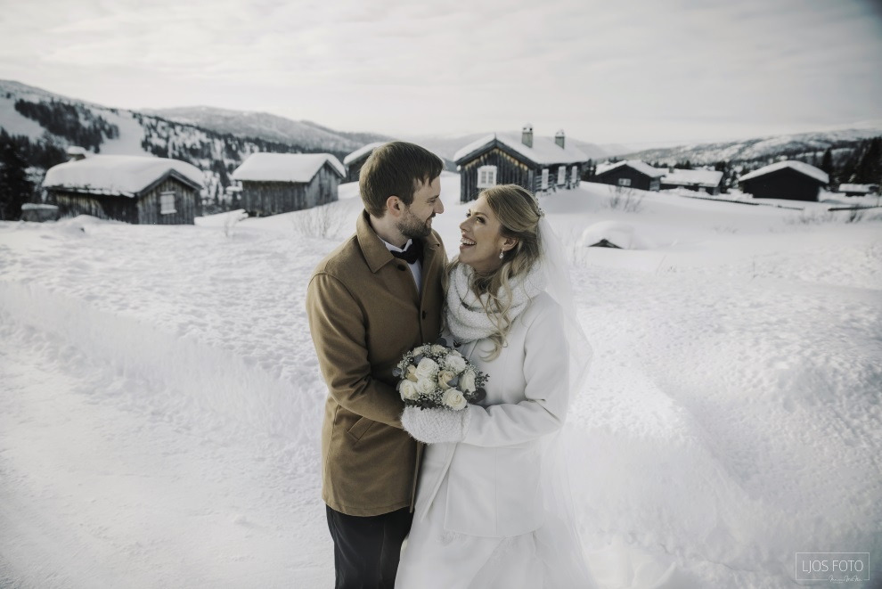
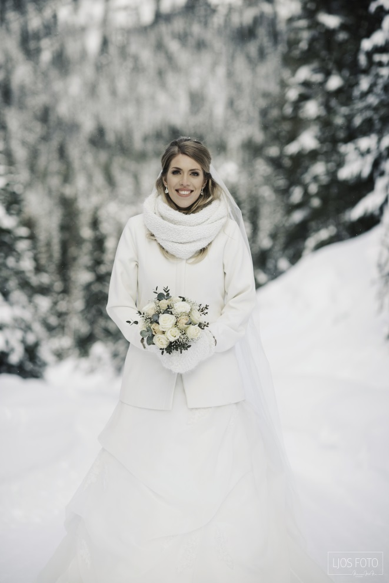
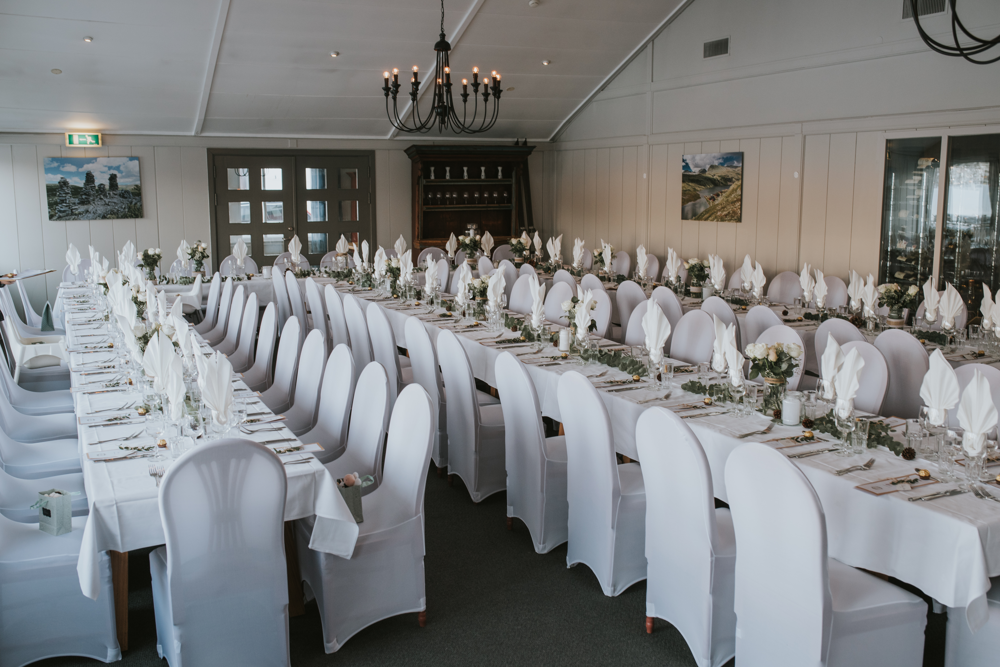
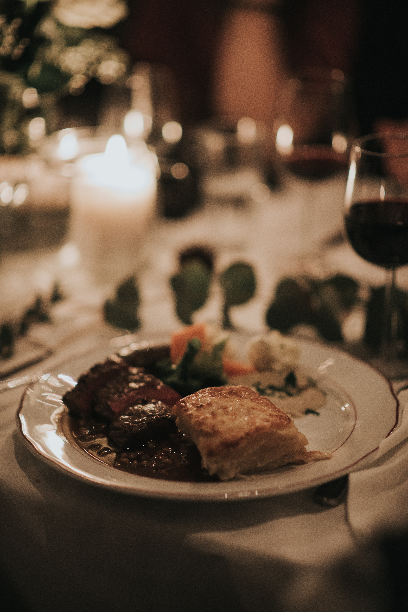
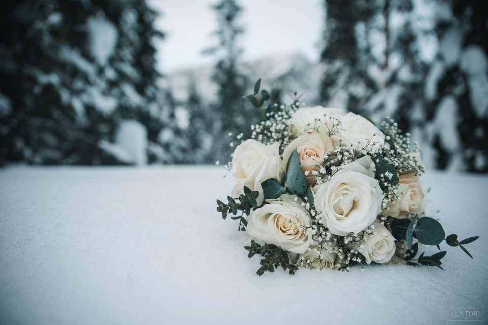

Even og Karoline fikk sitt drømmebryllup på Rondane Høyfjellshotell. – Det ble perfekt. I våre øyne kunne det ikke bli bedre, sier Even Nerås og Karoline Rødseth Strømmen samstemt.

Gjorde som oldefaren

Og bryllupet har sin forhistorie. Da Even så inskripsjonen på oldefarens ring, sto det klart for han hvordan han skulle fri til Karoline. Ringen hadde inskripsjonen «14.10.1916» og dermed var datoen for frieriet gitt.

 – Jeg fridde til Karoline nøyaktig hundre år etter, 14. oktober 2016. Det var en fin symbolikk i det å fri nøyaktig hundre år senere, sier Even.

 I likhet med Evens oldeforeldre, som giftet seg 17. desember samme år, ville også Even og Karoline ha et skikkelig vinterbryllup. Høsten 2016 begynte de å lete etter egnede steder.

Ville ha bryllupsbilder med puddersnø

– Jeg hadde alltid tenkt på å ha et vinterbryllup, men mange av de plassene vi forespurte her på Vestlandet var ikke aktuelle på grunn av værforholdene. Litt av poenget var å ha et litt annerledes bryllup. Det er nesten alltid grønt gress på  bryllupsbilder. Jeg ønsket meg puddersnø og iskrystaller, forklarer Karoline.

De sendte forespørsler til mange aktuelle steder som kunne være egnet til å samle familie og venner for en skikkelig bryllupsfeiring på vinterstid. En sen kveld,  etter et vinterferie-opphold på Geilo, sjekket Even og Karoline tilfeldigvis inn hos oss på Rondane Høyfjellshotell.

 – Vi kom sent en kveld, men det var bare YES: Her var det skikkelig bra! Overnattingsprisen føltes riktig, og ikke minst omgivelsene og atmosfæren. Etter den den turen var det jo ikke Geilo som var igjen i tankene våre, men Rondane Høyfjellshotell, sier Even.

 – Man føler seg så inkludert på Rondane Høyfjellshotell. Det er som om man er hjemme hos noen. Man tar seg tid til å ta en prat med gjestene og ser den enkelte. Det betyr mye.

Landet på Rondane

Etter et gratisopphold med prøvesmaking av bryllupsmaten, og omvisning der de fikk mer informasjon, landet det vordende ekteparet på Gudbrandsdalen og Rondane, med seremoni i Sel kirke og festmiddag på Rondane Høyfjellshotell. De gikk i gang med planlegging av bryllupet.

 – Vi har hatt veldig god kommunikasjon med dere hele veien, og det har vi satt veldig pris på. Hotellet var raskt ute med å gi gode tilbakemeldinger, og følte at vi fikk svar på alt vi lurte på. Det var helt supert, sier Even.

 Det å planlegge og gjennomføre et bryllup kan være krevende. Det er mange detaljer som må på plass, og det er lurt å starte planleggingen i god tid. Personlig oppfølging og tett dialog er en viktig del av forberedelsene.

 – Da den store dagen kom, følte vi at alt var i boks, bortsett fra små forberedelser. Det var veldig klart og tydelig hva som skulle skje, sier Even.

 – Man blir jo stresset når bryllupsdagen kommer, og det er jo så mye som skjer, men alt var så godt lagt til rette, så det gikk helt smurt, skyter Karoline inn.

Alt klaffet på den store dagen

– Det var helt perfekt. Det overgikk til og med forventningene våre da hotelldirektøren spanderte sjampanje på oss, og en av de ansatte så at jeg var forkjølet og kom opp med hostesaft til meg. Det kunne ikke vært bedre, jeg har virkelig bare positivt å si om bryllupsdagen, sier Karoline.

 – Kjøkkenet gjorde en kjempejobb. Alt var varmt og godt stekt. Tilbakemeldingene fra bryllupsgjestene var veldig gode. Det var rause porsjoner, gode smaker, og logistikken rundt var så bra! Vi er imponert over at det er mulig, og håper flere kan få den samme opplevelsen som vi hadde, sier Even.

Tar en årlig tur til Rondane

For Even og Karoline har det allerede blitt en fast årlig tradisjon å dra tilbake til Rondane Høyfjellshotell for et avbrekk på vinterstid.

 – Vi feiret ett år som gifte her nå i vinter, og vi var jo spente på om det skulle være like fint. Det var det absolutt. Helt fantastisk fint, med nydelige forhold i fjellet! Det var faktisk den fineste skituren jeg har hatt noen sinne, forteller Even entusiastisk.

 Er det noe spesielt dere vil si til andre par som vurderer et vinterbryllup i Rondane? - Gjør det! Ingen tvil. Vil man ha et eventyrlig vinterbryllup, er dette absolutt stedet å gjøre det. Vi setter veldig pris på stedet, atmosfæren og den flotte naturen, sier Karoline. - Og så er vi veldig taknemlige for at dere har strukket dere så langt for å gjøre den store dagen vår perfekt, avslutter Even.

 For ordens skyld: Even og Karoline har ikke fått noen form for kompensasjon for dette intervjuet. De har stilt opp av egen fri vilje, og de har allerede reservert rom på Rondane Høyfjellshotell til feiring av bomullsbryllup (gift i to år) i 2020.

 Vi på Rondane Høyfjellshotell vil gi Even og Karoline de varmeste ønsker om et langt og lykkelig ekteskap.

Drømmer du om å feire bryllup i et av Norges vakreste fjellandskap? [Les mer om hva vi kan tilby her](/selskap/bryllup/).

Bildene brukt i denne artikkelen er tatt av: Ljos Foto / Marianne With Nor.

 [Gå tilbake](/javascript: history.go(-1))
