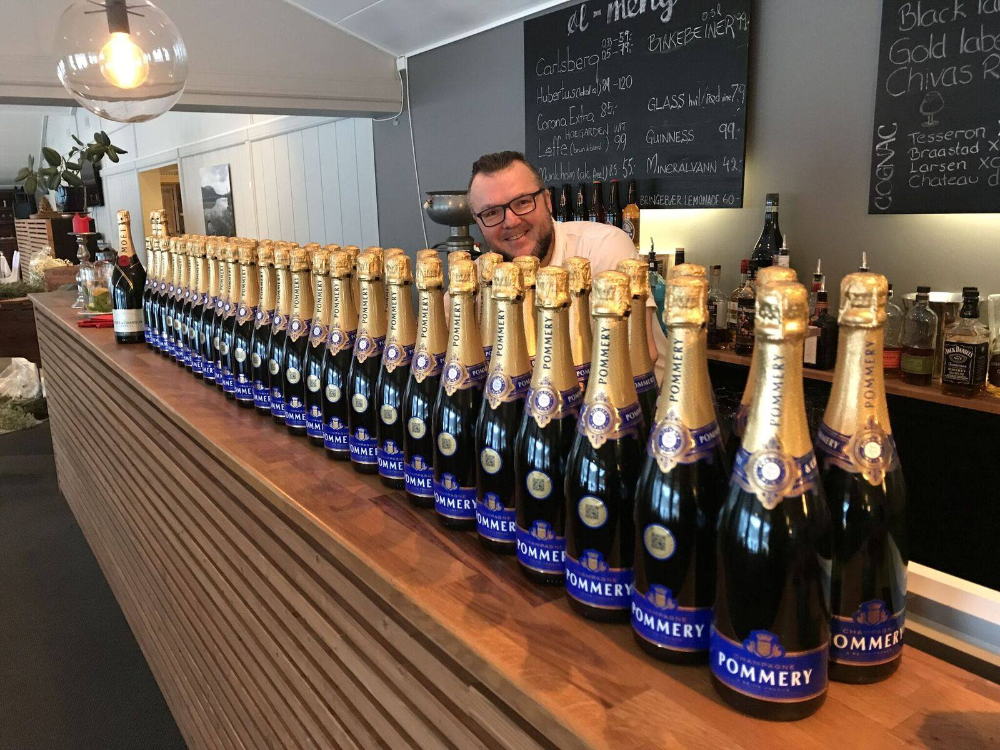
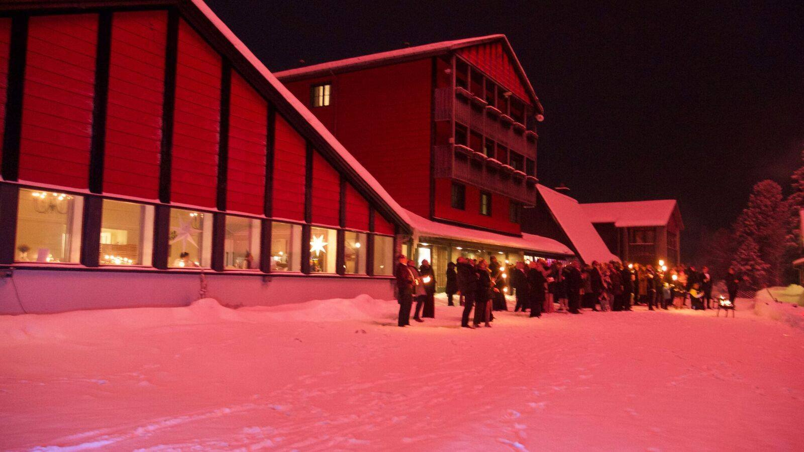
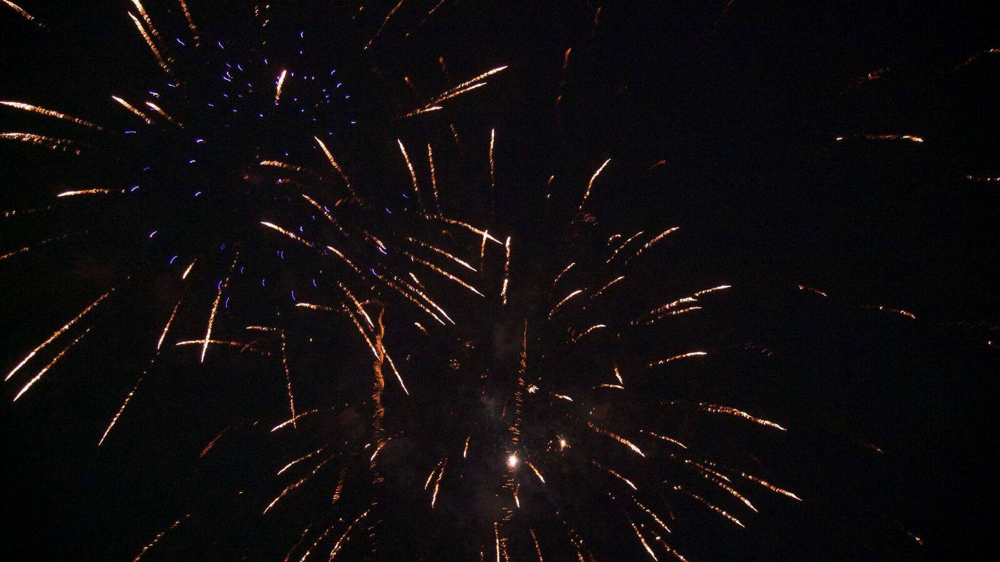

Nyttårsaften 2017 arrangerte vi eventyrbryllup på Rondane Høyfjellshotell. Det er bare å si i fra hvis du får lyst til å gifte deg hos oss!

Fordelen med bryllup på Rondane er at hotellet er relativt lite, slik at du kan sikre deg hele hotellet kun for deg og dine gjester. For brudeparet behøver det ikke bli så dyrt. Det vanlige er at gjestene betaler for oppholdet og mat skal man jo ha uansett.

Mulighetene er mange for å gjøre oppholddet til noe helt spesielt: Alt fra kanefart til hundekjøring og gløgg servert fra snøbar til topptur med guide.

 [Gå tilbake](/javascript: history.go(-1))
