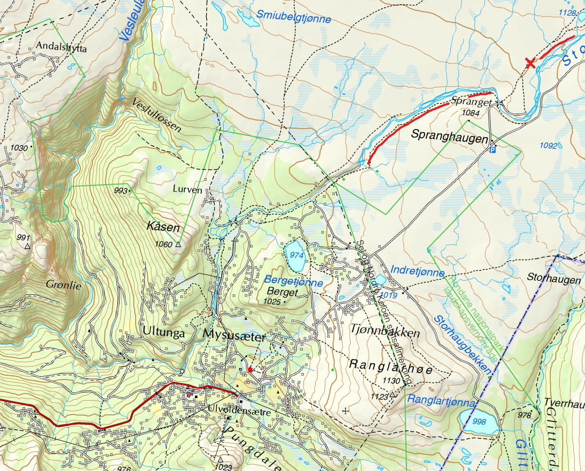
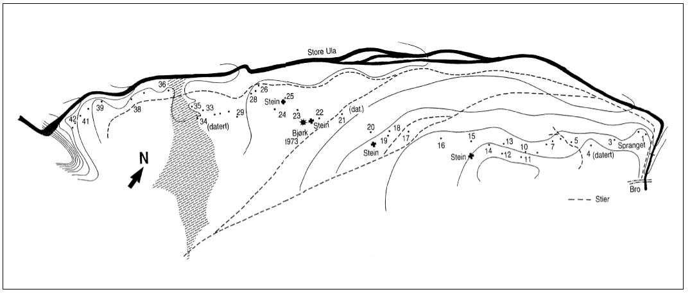
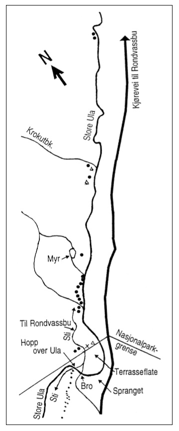
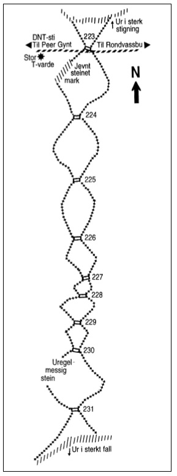

Rondane er et svært spennende sted å besøke for deg som er interessert i dyre- og planteliv, historie og geologi. Ikke langt fra hotellet finner du blant annet dyregraver og 2000 år gamle gravhauger.

Visste du at hele Rondanemassivet opprinnelig lå på havbunnen? Selv Rondeslottet som ruver 2178 meter over havet befant seg i havdypet. Fjellene her ble dannet for ca. 500 millioner år siden, da endringer i jordskorpa førte til dannelse av metamorf bergart og kvarts (1). Det er foreløpig ikke funnet fossiler i Rondane, men man kan ikke utelukke at de kan finnes, selv om bergartene her er eldre enn de eldste dinosaurene.

Dagens landskap er preget av istidene. Tre istider har formet landskapet, og elvene har gravd ut dype juv flere steder. Ett slikt eksempel er Vesle-Ula som ble dannet som følge av rask issmelting. Vesleulfossen er med sin 255 meters fall Rondanes største foss, og den ligger kun 3,1 km i luftlinje fra Rondane Høyfjellshotell. Du ser den best fra utkikkspunktet på Kåsen.

Etter at isen trakk seg tilbake for 10 000 år siden, krøp vegetasjonen oppover i fjellet, og førte med seg et rikt dyreliv med blant annet reinsdyr. Dette ga livsgrunnlag for nomadiske jegere som levde av jakt og det naturen ga dem. Fangstmennene i Rondane bygde store anlegg, noen gjerder var flere kilometer lange og ledet dyrene til fangstgravene. De eldste fellene kan være så gamle som 3500 år (2).

I Rondane er mange av disse gamle fangstgravene bevart på en unik måte, og i området rundt Mysusæter finnes det mange spennende spor etter veidemennene som levde her. På sørøst-siden av Ula, like ved Storulafossen, også kjent som «Brudesløret», finner man flere godt bevarte dyregraver like ved turstien. På strekningen mellom Spranget og i retning Storulafossen, som er mindre enn to km. lang, er det funnet og kartlagt hele 43 reinsdyrgraver (3).

Jakten foregikk ved at gjerder av stein ledet reinsdyra mot fellene. Fangsgravene var kamuflerte, med stokker, kvist og mose, og var så dype at dyra som falt ned ikke kunne komme seg opp. Ledegjerdene ble bygget opp med stein.

På turstien mellom Peer Gynt-hytta og Rondvassbu, på Randen, finner man det Edvard K. Barth beskriver som «det best ordnede fangstsystemet i hele Rondane». Her finner man sammenhengende ledegjerder mellom ni fangstgraver.

Funn tyder også på at det kan ha vært en gammel bosetting ved Ula. En gravhaug på vestsiden av elva, der man har funnet en jernkniv, er datert til å være om lag 2000 år gammel.

*Foto: Edvard K. Barth, fangstgravforsker, fra dokumentaren «Fangstgravene i Rondane». Copyright: NRK.*

Se dokumentaren «Fangstgravene i Rondane» med Edvard K. Barth. (lenke: [https://www.nrk.no/ho/fangstgravene-i-rondane-1.8250307](https://www.nrk.no/ho/fangstgravene-i-rondane-1.8250307))

Kilder:
(1) [https://nn.wikipedia.org/wiki/Rondane](https://nn.wikipedia.org/wiki/Rondane)

(2) Bryhni, Inge. (2009, 14. februar). Istid. I Store norske leksikon. Hentet 9. juni 2017 fra [https://snl.no/istid](https://snl.no/istid).

(3) [http://www.selhistorie.no/sel/historielaget/tur_til_spranget_og_ula.html](http://www.selhistorie.no/sel/historielaget/tur_til_spranget_og_ula.html)

(4) Barth, Edvard K. (2009). Fangsanlegg for Rein, gammel virksomhet og tradisjon i Rondane. Norsk institutt for Naturforskning (NINA), Trondheim.

(5) [http://www.nb.no/nbsok/nb/e9a345ef25a7b78eed173047aa0a9027?lang=no#15](http://www.nb.no/nbsok/nb/e9a345ef25a7b78eed173047aa0a9027?lang=no#15)

Turforslag: dyregraver og fangstanlegg på Spranget
Start på Rondane Høyfjellshotell. Følg asfaltveien 50 meter oppover til du kommer til infotavle. Ta til venstre inn på stien. Det er skiltet mot Per Gynt-hytta.
Følg sti/grusvei på østsiden av Ula i ca 3 km. Partiet med dyregraver begynner rett på oversiden av Storulafossen (Brudesløret). Fra Storulafossen til Spranget er det funnet og kartlagt 43 dyregraver.

 [Gå tilbake](/javascript: history.go(-1))
