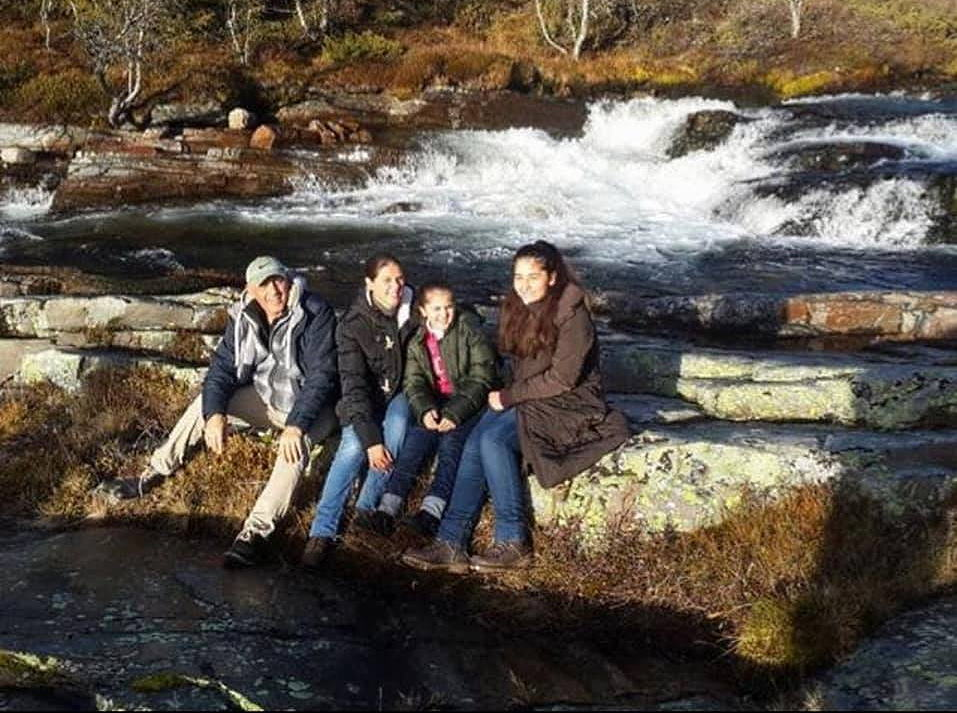

I vinter la vi ut et bilde på Facebook av flyktninger som bodde på Rondane Høyfjellshotell i 2015 og ba så mange som mulig, som hadde bodd hos oss, å gi seg til kjenne. En av familiene ble trukket ut til et gratis opphold,  og de heldige vinnerne var familien Abdouni.

  Det var en familie våre ansatte den gangen husket godt. Ikke bare var de de aller første flyktningene som kom, det var også en veldig positiv familie, som det var lett å bli glad i. Det første bildet ble tatt noen dager etter at de ankom i oktober 2015 og det siste ble tatt sist helg. Familien Abdouni var statsløse, palestinske flyktninger og kom fra Syria.

 I dag bor familien i Hjelmås, utenfor Bergen. Jentene, som den gangen var 6 og 11 år gamle og bare snakket arabisk og engelsk, er i dag blitt små voksne og snakker kav Bergensdialekt.

  Aram (15), har bestemt seg for å bli programmerer, har fått utmerkelse av Lindås kommune som Ung motivator og lillesøster Hala knuser sine jevnaldrende i løping. Mor Ola er i gang med å ta kokkeutdannelse og far Najd leter etter jobb.

  Han har litt av en CV og har blant annet jobbet som driftssjef for et stort eiendomsselskap i Dubai. - Det er bare å ta kontakt, om noen kjenner noen som kjenner noen, som har et tips om en jobb, sier Najd.

  Vi på Rondane Høyfjellshotell håper noen kan komme med et tips og kan gi de beste referanser til en familie som har vært gjennom mye. Derfor var det så godt å høre at de har fått et fint liv i Norge, et liv som er totalt forskjellig fra det de hadde før 2015.

 [Gå tilbake](/javascript: history.go(-1))
