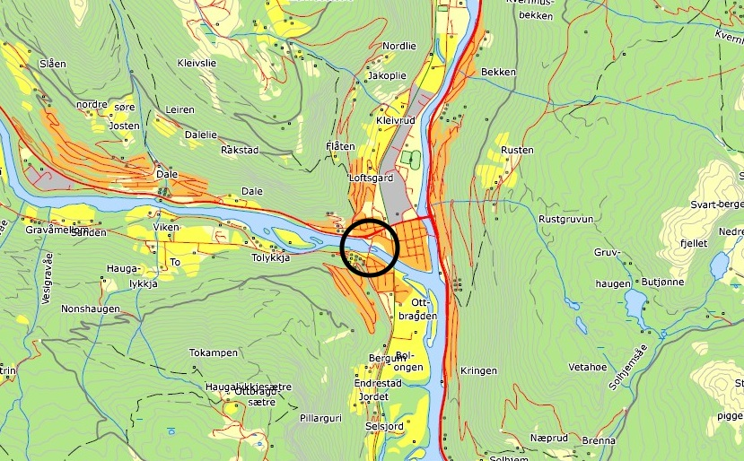

I 1944 fant Gunnar Moen et kinntannfunn av mammut i [Uladalen](https://no.wikipedia.org/wiki/Ula_(Rondane)), noen få kilometer nedenfor Rondane Høyfjellshotell.

Hovebilde fra Wikipedia

Moen hadde gjort et tilsvarende funn 34 år tidligere ved jernbanestasjonen i Otta. Begge tennene hadde tilhørt en ullhåret mammut, som levde i Norge for 55.000 til 40.000 år siden.

Så godt som alle rester av mammut, som er funnet i Norge, er funnet i Gudbrandsdalen - og av disse igjen er det ekstra stor tetthet av funn i vårt område. Det er derfor ikke urealistisk at det vil bli funnet flere ben i nærheten av hotellet. [Her](http://www.nhm.uio.no/fakta/zoologi/forhistoriske-dyr/mammut/) kan du se alle mammutfunn som er gjort i Norge.

Mammutfunnet i Otta

Gunnar Moen fant kinnbenet da han skulle fiske i Ula. Mammuttanna lå sammen med en del større stener, som lå under vann under vårløsningen, og målte ca 10x7x3 centimeter.

Mammutkinnbenet som ble funnet ved hotellet.

Vi har tatt kontakt med en av Norges fremste mammutkjennere, Jørn Harald Hurum,  førsteamanuensis ved Naturhistorisk museum, kjent fra blant annet NRK-serien Newton, og bedt om noen råd til å gå på mammutjakt. Han svarte at det er størst sjanse for å finne mammutben i vassdrag, og der elven vasker gjennom eldre hauger med sand, og som har ligget samme sted lenge (hundrevis av år).

Hvordan ser du så forskjell på et mammutben og en stein? Tannen er veldig oppfliset og vil ligne en hvit kalkstein (men lettere) og den vil ha en tendens til å falle fra hverandre i skiver. Opprinnelig var benet Moen fant større, men det ble delvis ødelagt da det ble plukket opp.

Som dette kartet viser var mammuten glad i Gudbrandsdalen.
 [Gå tilbake](/javascript: history.go(-1))
