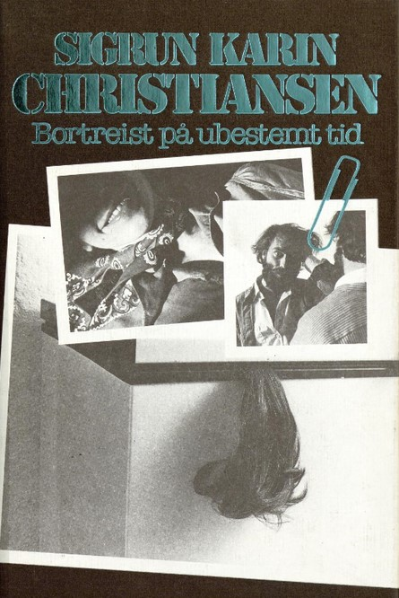

Alle under 25 vet det for lengst, mens vi andre sjelden tenker over det. Nettet flommer over av gratis bøker på norsk. Her er oppskriften på hvordan du kan nyte en god krimbok eller egentlig alle mulige sjangere, helt gratis.

Man tager et nettbrett, eller smarttelefon, og taster inn [www.nb.no](http://www.nb.no) og får i skrivende stund tilgang til 522.884 gratis bøker! Rondane Høyfjellshotell er det perfekte hotellet å lese blodig, gratis norsk krim på med gratis wifi, himmelsk god kakao fra baren og sprakende ild i peisen.

Jada, vi vet at mange lett tilårskomne vil savne den gode, gamle papirboka og vi vet at det er mer elegant å lese bøker på elektroniske lesebrett som Kindle.  Likevel vil vi påstå at man fort kommer over savnet av papir når man først har begynt å leve seg skikkelig inn en bok som leses på et vanlig nettbrett eller smarttelefon. Det er kun en vanesak, og det kan bli en lønnsom vane. For når man først venner seg til å lese bøker på den måten er gratisutvalget så stort at det er noe der ute for alle.

Nedenfor har vi funnet frem til noen riktige høykvalitets krimromaner, som til tross for at de er noen tiår gamle står seg godt.

Smuglerne
Av Arthur Omre

 Boken er skrevet i 1935, men oppleves likevel som en moderne bok,  som handler om spritsmuglere i kamp med politi, tollere og konkurrerende bander i forbudstiden.

Smuglerne var Arthur Omres debutroman og er ikke bare en thriller, men også en kjærlighetsroman. Omre het egentlig Ole Arthur Antonisen, og debuterte som forfatter samme år som han slapp ut av fengsel for siste gang. Han skildrer med andre ord et miljø han kan. Omres bøker er preget av korte setninger og raske ”bilder”.

Forbudstiden i Norge varte fra 1916 til 1927. All omsetning av alkoholholdige drikker var forbudt, noe som resulterte i utstrakt smuglervirksomhet, spesielt i Oslofjorden. Færder ble et knutepunkt hvor spriten ble hentet fra utenlandske båter.

Hvit som snø
av Jon Michelet

 I 2009 kåret Dagbladet Hvit som snø til den tredje beste krimromanen gjennom tidene Dette er den fjerde boka om Michelet skrev om romanhelten Vilhelm Thygesen. I begynnelsen av boka våkner han opp alene i bakrus.

Han har vanskelig for å huske hva som hendte dagen før. Det er blod på soveposen. På gangen finner han en frakk og et par støvletter han ikke drar kjensel på, og på badet ligger et lik.

Hvordan bli kvitt mistanken om at man er en morder? Selvsagt ved å finne morderen.

Knut Gribb
av åtte ulike forfattere

Til tross for at den første romanen om Knut Gribb kom ut i 1908,  skrevet av Sven Elvestad, fortsatte det å bli utgitt romaner og noveller om Oslo-detektiven helt frem til 2004. Det er det åpenbare grunner til, og vi anbefaler varmt flere av novellene og romanene som er skrevet om han. Gribb er Norges svar på James Bond.

Fullmektig Knut Gribb har forblitt et sted i 40-årene i nesten hundre år. Han er over 1,80 meter høy, bredskuldret og veltrent, har mørkt, gråsprengt hår og skarpe, grå øyne. Han er glattbarbert, elegant og velkledd på en diskret måte. Ansiktet er markert. Hans private våpen, som han alltid bærer uten hensyn til norsk politis våpeninnstruks, er en WaltherPPK, kaliber 7,65. Han bor i en leilighet i Oscarsgate i Oslo sammen med schäferen Nero. Gribbs omgangskrets består i tillegg til Nero av husholdersken fru Halvorsen, betjent Harald Brede, som har et "jovialt bondeansikt" og overkonstabel Finn Jerven.  Han er glad i mat og lett overvektig, mens Jerven er svak for kvinner. Damer interesserer derimot ikke Gribb, med et mulig unntak for storforbrytersken Olga Barkowa.

Bortreist på ubestemt tid
Av [Sigrun Karin Christiansen ](https://bokelskere.no/folk/sigrun-karin-christiansen/5430750/)

Boken er en "omvendt thriller", dvs. at spenningen ikke først og fremst dreier seg om hvem som har begått mordet, men om det vil bli oppdaget, og hvilke konsekvenser det får for morderen og den kvinnen som, temmelig tilfeldig, dukker opp i hovedpersonens liv. Handlingen foregår på Nordvestlandet, der fergetider og muligheter for å krysse fjordene får stor betydning for handlingsforløpet, slik det også får i så mange livssituasjoner på den kanten av landet.  (Tekst hentet fra bokomslag).

Riktignok er det lagt ned en del fergestrekninger siden 1972, men handlingen er like spennende for det. Bortreist på ubestemt tid fikk Rivertonsklubbens aller første Rivertonpris, Den gyldne revolver i 1972.
 [Gå tilbake](/javascript: history.go(-1))
