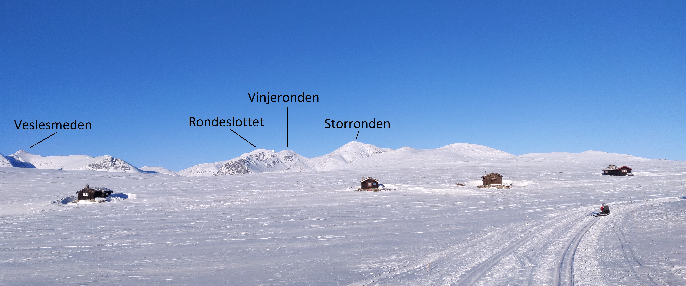

Som bergtatt satt jeg der, inne på Nasjonalgalleriet, midt i Oslo. Lyden av biler i det fjerne, folk, stemmer og suset fra byen, druknet i stillheten og stemningen i det store oljemaleriet. Foran meg hang bildet "Vinternatt i Rondane", og jeg ble tatt med på en reise inn i det kalde, klare vinterlandskapet.

Harald P. Solhbergs maleri fra 1914, er et av de aller mest ikoniske maleriene vi har i Norge. For meg personlig betyr det mye; det fanger følelsen og stemningen man kan oppleve i Rondane på en helt unik måte; Den øredøvende stillheten, det kalde, blå månelyset som kaster skygger over de myke, snødekte fjellene og ikke minst følelsen av av å være alene med naturen - og i naturen.
 For Solhberg representerte bildet kvintessensen av hans kunstsyn, og var «som en hel livsopgave». Dette ene maleri vilde være nok til at jeg kunde være tilfreds med mitt livs arbeide" skrev han i sin dagbok fra 1914.

 Mange av gjestene på Rondane Høyfjellshotell er nysgjerrige på hvilket motiv vi ser i vinternatt i Rondane. Utsikten fra hotellet ligner nemlig veldig på motivet i Sohlsbergs ikoniske maleri. Er det Smiubelgin med sine runde, myke former, vi ser avbildet, undrer folk. Det er det ikke, men det kunne godt ha vært det.

 Sohlberg fant inspirasjonen til bildet på en av sine reiser gjennom Østerdalen, der han så over Atnasjøen og inn mot Rondane. Det er viktig å understreke at maleriet ikke er en fotografisk avbilding av Rondane, men at det er basert på forskjellinge skisser og inntrykk. Det handler mer om å fange idéen og følelsen av å være i Rondane en vinternatt enn å være en realistisk avbildning.

 Fra Rondane Høyfjellshotell kan man, etter en kort gåtur, se akkurat de samme fjellene som i Sohlbergs maleri, men fra den andre siden. Fra toppen av Tjønnbakken, ca. 2 km fra hotellet, har man panoramautsikt inn over Rondane-platået mot Storronden og Rondeslottet.

*Dette bildet er tatt ca. 2 km fra Rondane Høyfjellshotell: *

 Det er min mening at man må oppleve Rondane en kald, stjerneklar vinternatt selv for å virkelig forstå hva Sohlberg forsøkte å formidle gjennom sitt maleri. Først da forstår man virkelig hvilken bragd det er å gjenskape den samme følelsen i et oljemaleri.

 Jeg klyper meg selv i armen og reiser vekk fra vinteren, fjellet og bildet med det drømmeaktige sløret. Det nærmer seg stengetid på Nasjonalgalleriet, og jeg er plutselig tilbake i storbyen. Neste tur må bli til Rondane for å oppleve vinternatten på ekte.

 /Christoffer

 Kilder:
 Stenseng, Arne. 1963. Harald Sohlberg. Oslo, Gyldendal Norsk Forlag.
 [http://www.geo365.no/geoturisme/vinternatt-i-rondane/](http://www.geo365.no/geoturisme/vinternatt-i-rondane/)
 [https://no.wikipedia.org/wiki/%C2%ABVinternatt_i_Rondane%C2%BB](https://no.wikipedia.org/wiki/«Vinternatt_i_Rondane»)

[https://nbl.snl.no/Harald_Sohlberg](https://nbl.snl.no/Harald_Sohlberg)
 [Gå tilbake](/javascript: history.go(-1))
