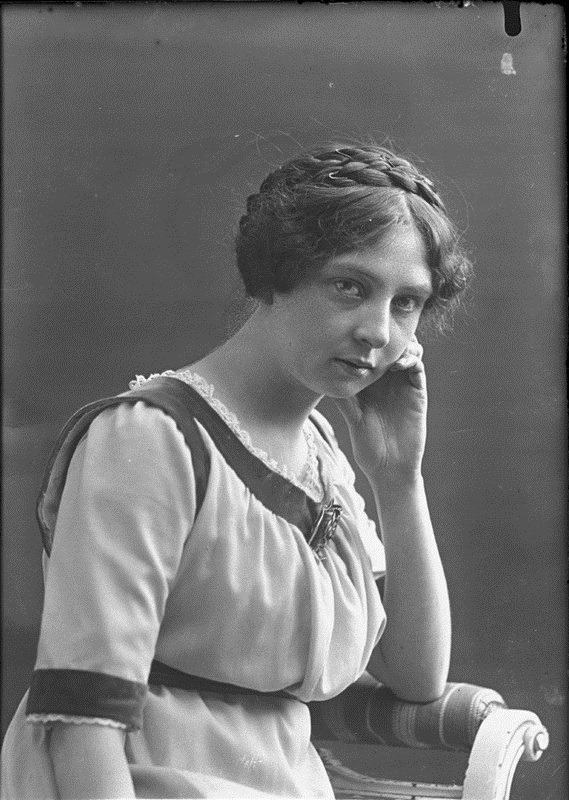

Når man rusler ut av hotelldøra på Rondane Høyfjellshotell og innover mot viddene og fjellet, går man på de samme stiene som Sigrid Undset ruslet i for litt over hundre år siden. Det er spennende å tenke på at hun kom hit, lot seg inspirere i dette området og skrev de fantastiske bøkene om Kristin Lavransdatter. Foto: Ernest Rude - Oslo Museum, CC BY-SA 3.0

I sin barndom, og som ung forfatter, var Undset mye i Rondane. Hun var kanskje ikke den første personen man vil tenke på som utpreget naturmenneske – Undset var en typisk kontordame, bodde i Kristiania, skrev og jobbet med litteraturen på nattestid. Hun dampet sigaretter som en helt og bøttet nedpå med kaffe. Det ryktes på bygda at hun røkte så mye, at de lokale ikke orket å oppholde seg i samme rom som henne når de spilte kort på kveldstid på Høvringen.

Men hit, til Nord-Gudbrandsdalen, vendte hun stadig tilbake i løpet av livet. Nærheten til naturen, og kanskje til fjellet spesielt, gjennomsyrer romantrilogien om Kristin Lavransdatter.

Det er ikke vanskelig å forstå henne. Det er lett å se for seg gjenskinnet av alvemøen i ringene i et fjellvann en lys sommernatt, eller se for seg den staute Erlend Nikolaussen på hesteryggen med Smiubelgen i bakgrunnen. Naturen er nærmest som en karakter i seg selv i Undsets verk.

Ved filmatiseringen av Kransen bodde Liv Ullmann på Rondane Høyfjellshotell, på rom 219 har vi hørt. Hun har tydeligvis også latt seg inspirere av naturen her, for flere av åpningsscenen er filmet ved Storulfossen (kjent som Brudesløret), som er en fin fire kilometers gåtur fra hotellet.

<Video id="eRkgmfh6D0E" />

Miniatyrdokumentar av Christoffer Biong

Vi anbefaler alle som leser dette på det varmeste å ta turen til Sel og Kristin Lavransdatterspelet som settes opp på Jørundgård i slutten av juni hvert år. Her kan du vandre i fjellet i Sigrid Undsets fotspor, og la deg inspirere av naturen i Kristin Lavransdatters rike."
 [Gå tilbake](/javascript: history.go(-1))
