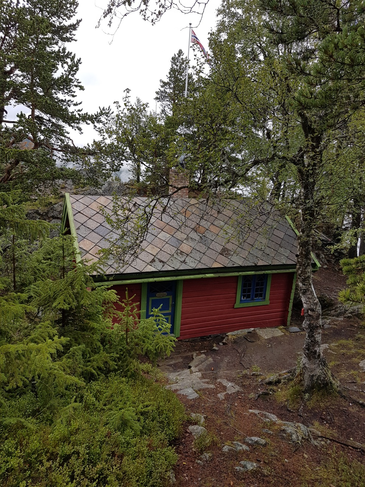
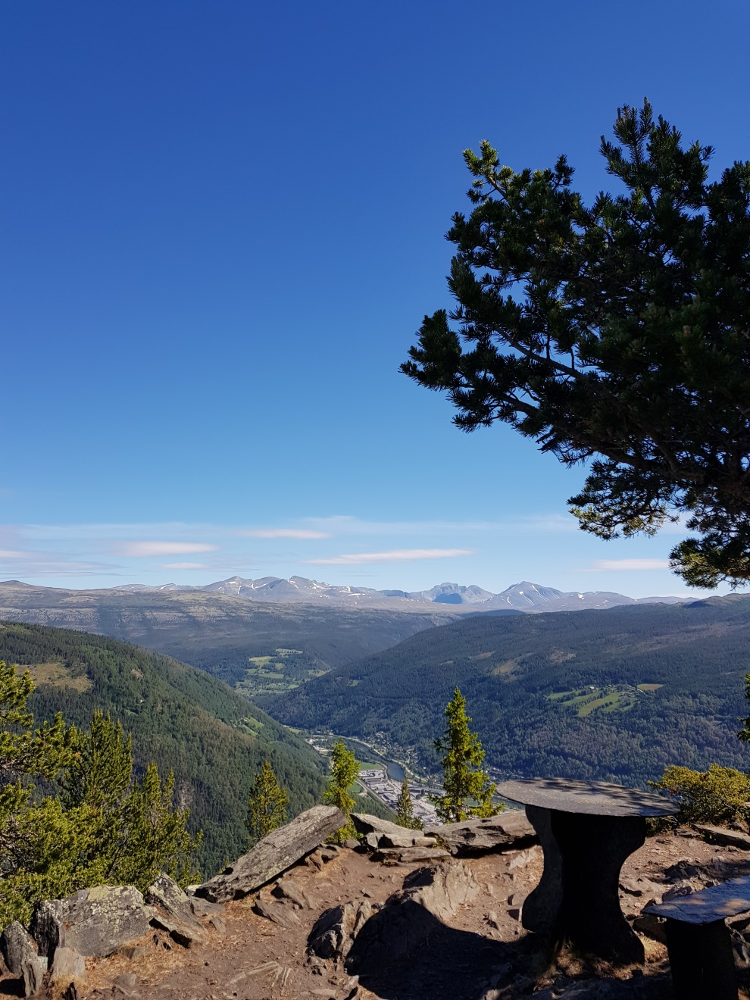

Marcello Haugen (1878 til 1967), var en kjent ”mystiker” i sin samtid. Han var en blanding helbreder og coach og var kjent over hele verden. Hugens hytte Sameti er et fint turmål fra Rondane Høyfjellshotell.

På den andre siden av Gudbrandsdalen, i forhold til Rondane Høyfjellshotell, ligger Haugens hytte Sameti. I kjøreavstand er det bare rundt 40 minutter, mens det vil ta rundt fem timer å gå dit.

Websiden marcellohaugen.no beskriver hytta slik:

” Marcello Haugen bygde en liten toromshytte på Thokampen i Sel Kommune i 1912. Hytta ligger på ca. 1000 moh. med vid utsikt til Rondane, stasjonsbyen Otta, Gudbrandsdalslågen, Otta-elva og fjellterrenget rundt. Marcello, som på den tid kjørte som lokomotivfyrbøter på strekningen Hamar-Dombås, fikk tillatelse av bonden Bredevangen, eier av gården NedreTho, til å sette opp Sameti , etter at han en gang hadde stoppet en hest som løp løpsk med Bredevangen bak i vogna.” På websiden heter det videre at:

” Meningen med Sameti
På den tiden Sameti ble bygget (1912 - 1915) brukte Marcello mye tid på å utforske sitt eget indre, dyktiggjøre seg i å utvikle sine evner, reise mye og treffe mennesker som kunne hjelpe han i denne prosessen. Blant annet betydde Rudolf Steiner mye på denne tiden. Marcello hadde helt siden han var liten følt seg "rar" og annerledes, men forsto etter hvert at denne merkelige indre spenningen ikke var noe rart, men snarere en egenskap som var helt unik. Han brukte på denne tiden også mye tid på å lese/studere og søke etter livets dypeste mening. Dette skulle senere resultere i at han skrev to bøker og en rekke betraktninger/meddelelser om viktige forhold i livet.

Ordet Sameti har så langt vi har kunnet bringe på det rene to betydninger. For det første betyr det på hebraisk "Jeg tørster" - det samme Jesus utbrøt da han hang på korset. I den Hinduistiske mytologien betyr ordet " Møteplass". En møteplass har Sameti alltid vært for Marcellos familie og venner, og med den beliggenhet og spesielle fredfulle ro som omgir stedet får det oss alle til å tørste etter nærhet med Marcello og etter en dypere forståelse av evighetens mystikk - Mystica Eterna.

Ta turen opp til Sameti
Stiftelsen Sameti jobber for å ivareta og vedlikeholde denne praktfulle hytta som er åpen for alle. Utenfor hytta, til venstre for døren, henger nøkkelen. Dersom du ønsker å reise dit er det bare et par instrukser du må følge for å kunne benytte deg fritt av Sameti, til glede for deg selv og dine medreisende. Vi anbefaler på det varmeste å ta turen innom Sameti. Hytta ble bygget "der solen alltid skinner" og dette sier i grunnen alt. Eksteriøret og naturen omkring må bare oppleves! Inne i hytta finner man brev, tekster og bøker av allviteren og filosofen Marcello Haugen. Vi ønsker så mange som mulig velkommen til Sameti, som et sted preget av skjønnhet og drama, stillhet og åndelig fornyelse.”

Kontakt stiftelsen Marcello Haugens venner for mer informasjon. Det er også mulighet for å komme inn i hytta ved å ta kontakt med foreningen. Epost: [medlem@marcellohaugen.no](mailto:medlem@marcellohaugen.no)

Mobil [95479736](tel:95479736)  eller [95134376](tel:95134376)

Les mer om Marcello Haugen på [www.marcellohaugen.no](http://www.marcellohaugen.no).

 [Gå tilbake](/javascript: history.go(-1))
