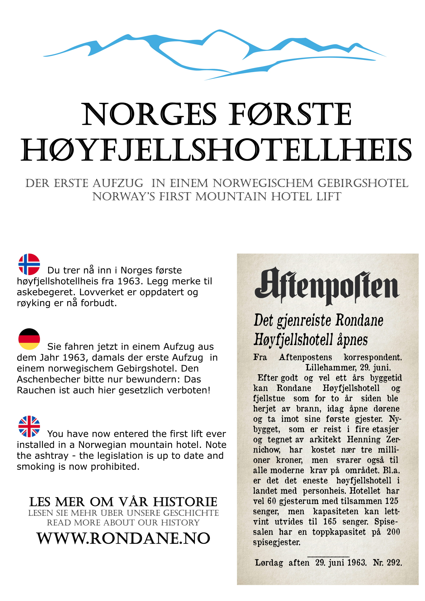

Heisen på Rondane Høyfjellshotell er så gammel og rar at vi syntes den fortjente en forklaring, så vi hang opp en plakat på tre språk.

Faktisk snakker vi om Norges aller første heis montert på et høyfjellshotell. Det forteller jo litt om samfunnsutviklingen at Norges største avis på den tiden, Aftenposten, så på det som en nyhetssak i 1963.

Det som er spesielt sært med heisen er at den både har askebeger og forbudsskilt mot røyking. Vi kan ikke hevde at den er spesielt vakker innvending, men den har sin sjarm,  og med plakaten vi har hengt opp vil i det minste våre gjester få en forklaring på hvorfor vi føler den har affeksjonsverdi.

 [Gå tilbake](/javascript: history.go(-1))
