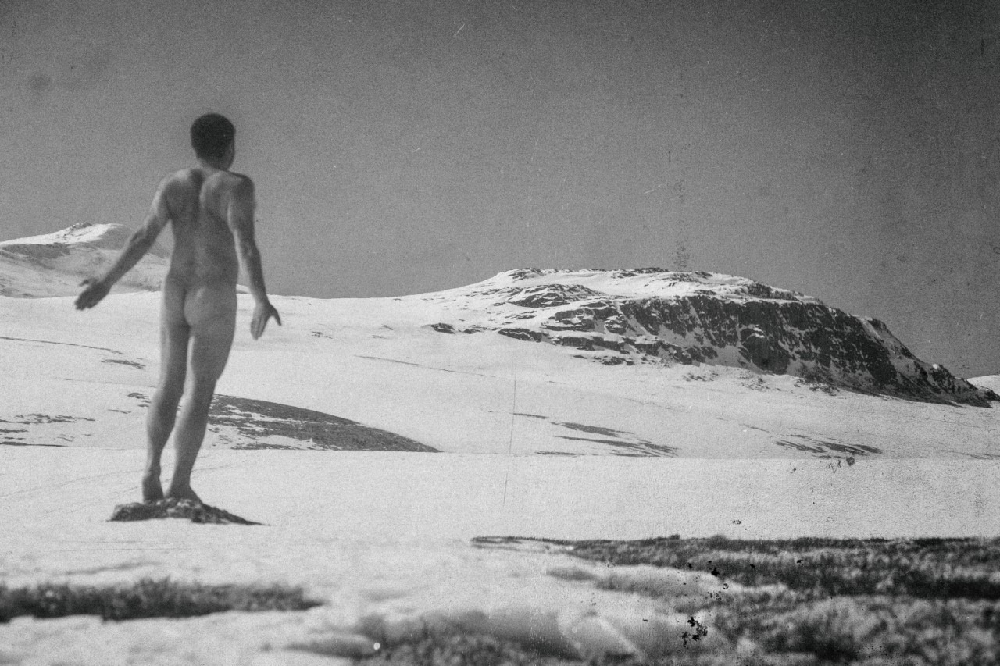

En vakker vinterdag i april 1924 tok fotograf Anders Beer Wilse  fotografiet  "Du herlige Høifjeld" av en ung skuespillerinne ved Skorutberget, ikke langt fra Peer Gynt-hytta. 95 år etter, inviterte Rondane Høyfjellshotell til fotokonkurranse.

Konkurransens formål var å ta et bilde som var inspirert av "Du herlige Høifjeld" - det skulle være estetisk vakkert og det skulle tas i Rondane.

Og vinneren ble russer-gudbrandsdøl og mangeårig beboer i Berlin -  Yury Rogachev - med et bilde han har kalt “Forutfølelse”. Dermed kunne han innkassere førstepremien, som var et gavekort på 10.000 kroner, som kan benyttes til mat og overnatting på Rondane Høyfjellshotell.

Rogachev fant ikke frem til samme steinen som modellen i 1924 sto på, men komposisjonen er nesten den samme og likevel forskjellig. Juryen falt for idéen om at det denne gangen ble benyttet en mannlig modell og at bildet fikk en tittel som gir rom for stor tolkning. Bildets estetiske kvaliteter er helt klart i henhold til konkurransens ånd.

Fotograf [Anders Beer Wilse](https://no.wikipedia.org/wiki/Anders_Beer_Wilse) (1865-1949) var en av Norges mest berømte fotografer i sin samtid. Vi mener det er grunn til å hevde at "Du herlige Høifjeld" er Norges første nakingfotografi - naking er altså fenomenet der modeller stiller seg opp, som oftest i fjellandskap, og viser sin naturlige nakenhet i symbiose med prangende natur.

Dagbladet har skrevet om "Du herlige Høifjeld"[ her](https://www.dagbladet.no/tema/trodde-du-naking-var-et-nytt-fenomen-tro-om-igjen-dette-bildet-ble-tatt-i-rondane-i-1924/69636782).

For de som vil vite mer:

- "Du herlige Høifjeld" kan beskues på vår fotovegg i baren på hotellet. Snart vil “Forutfølelse” også kunne beskues på samme vegg.
- Anders Beer Wilses bilder er en del av norsk naturarv og ”Rondane – Høifjeldssang, Du herlige Høifjeld”, som er fotografiets fulle tittel, er ett av en serie bilder han tok i Rondane i 1924.
- [Nasjonalbibliotekets arkiver](https://www.nb.no/) inneholder tusenvis av Wilse-fotografier. Søker man på stikkordet Rondane, dukker det opp hele [316 motiver](https://www.nb.no/cgi-bin/galnor/gn_sok.sh?context=0&offset=0&skjema=0&type=a&tittel=&ar1=&ar2=&invnr=&fm=1&limit=20&user_offset=1&komm=&sted=Rondane&person=Wilse,+Anders+Beer&persontype='11','12','13'&person2=&persontype2=0&Start=S�k), mange av dem tatt på Mysuseter.
- Den observante leser av dette innlegget og Dagbladets artikkel, vil legge merke til at fotografiet vi benytter og det Dagbladet har trykket er av litt ulik kvalitet. Årsaken er at originalbildet ble tatt av modellen med undertøy, som i ettertid er endret ved hjelp av håndtegning. Vi har forbedret bildet litt med Photoshop, fordi vi mener fotografen ville gjort det samme, dersom Photoshop hadde vært tilgjengelig for 95 år siden.

 [Gå tilbake](/javascript: history.go(-1))
