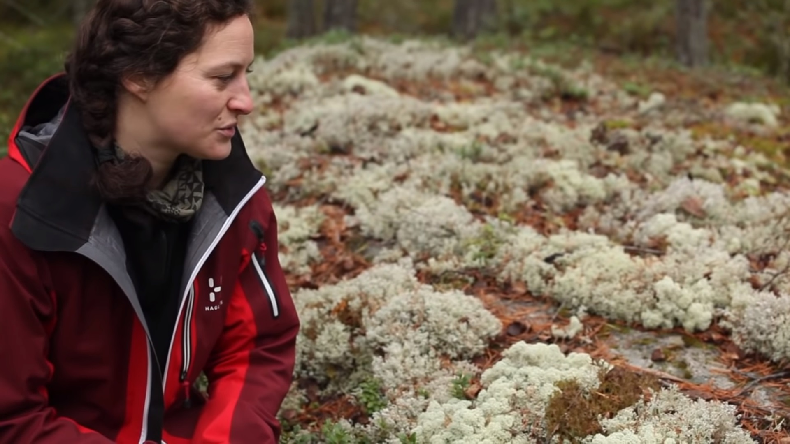

Du kan ikke besøke Rondane Høyfjellshotell hvis du ikke kan forskjell på mose og lav.

[Denne bloggen](http://blogg.vm.ntnu.no/blog/2012/12/05/5-desember-reinlav/) gir en god innføring i emnet, og skulle du ikke ha tid til å lese den, eller se den flotte filmen om emnet: Kortversjonen er denne: Lav er en sopp. Mose er en plante!

<Video id="Hi6zorMyhVU" />

Se videoen: Det är för f-n inte mossa! - Mirja Hagström (Youtube.com)

 [Gå tilbake](/javascript: history.go(-1))
