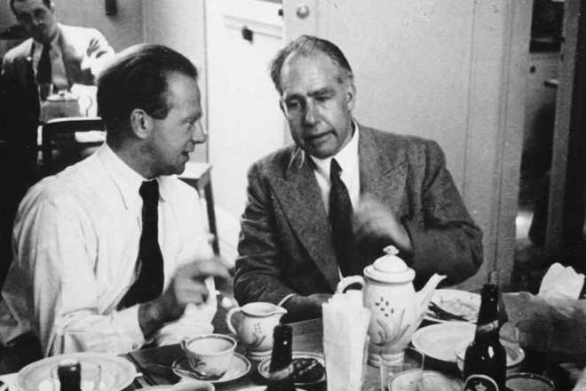
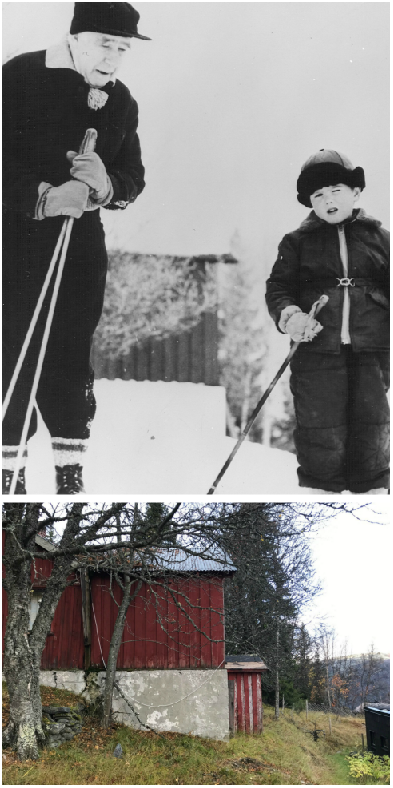

Vår uten tvil mest berømte gjest må sies å være den danske atomfysikeren [Niels Bohr](https://no.wikipedia.org/wiki/Niels_Bohr) (1885 – 1962), som fikk Nobelprisen i fysikk i 1922.

Han kan neppe plasseres i kategorien "kjendis", men var desto mer berømt sett i en historisk sammenheng. Blant folk flest er han mest kjent forillustrasjonene vi alle har sett i skolefysikkbøkene, der atomer er tegnet som ”solsystemer”. Det var Bohr som første gang fremstilte atomer grafisk på den måten.

Atomfysikeren ble gitt en fremtredende plass i manuset i Norges dyreste TV-produksjon: ”Kampen om tungtvannet” (NRK), hvor vi så at han i 1941 hadde et møte med sin tidligere elev Werner Heisenberg. Heisenberg ledet det tyske atomvåpenprogrammet og Bohr oppfattet [møtet](http://forskning.no/vitenskapshistorie-media-store-vitenskapsfolk-atombombe-nazisme-stub/2008/02/copenhagen-endelig-i) som at han ville ha sin tidligere læremesters hjelp. Bohr ville ikke hjelpe tyskerne. Etter å ha fått advarsler om at nazistene ville bringe ham til Tyskland med tvang flyktet Bohr til England og reiste derfra videre til USA. Her han deltok i amerikanernes Manhattanprosjekt med utviklingen av Hiroshima og Nagasaki-atombomben. Amerikanerne hadde kommet langt med utviklingen på det tidspunktet, men Bohrs bidrag kan ha fremskyndet prosjektet.

Werner Heisenberg med Niels Bohr 1934

Vi snakker med andre ord om en mann, som med sin avgjørelse om å velge rett side kan ha endret historiens gang.

Og hva så med Bohr og Rondane Høyfjellshotell? Det Ingrid Erlandsen – 2. generasjonseier av hotellet med sin mann Erling, husker best er at han kom med privatfly. Bohr var glad i å gå på ski og besøkte oss i 1954 eller 1955, da kom han med sin sønn [Aage Bohr ](https://no.wikipedia.org/wiki/Aage_Niels_Bohr)og hans familie. (Aage fikk forøvrig også Nobelprisen i fysikk. Det var i 1975 for «oppdagelsen av forbindelsen mellom kollektive bevegelser og partikkelbevegelser i atomkjerner, samt den derpå baserte utviklingen av teorien for atomkjernens struktur»). Bildet over viser Niels med barnebarn Vilhelm som trener ski foran bestyrerboligen, som ligger på oppsiden av hotellet. Bildet er kjøpt av [Niels Bohr Arkivet](http://www.nbarchive.dk) i København.

Niels og Vilhelm Bohr ved Rondane Høyfjellshotell 1954 eller 1955

At Niels Bohr var en slags fysikkens superkjendis i sin samtid, er det liten tvil om. Kanskje kan han beskrives som sin tids Stephen Hawkings. Det forteller litt at han spiste middag med Kong Haakon, og faktisk gjorde det på Slottet kvelden 8. april 1940.

Det må også nevnes at det var på en skitur at Bohr kom på idéen til [komplementaritetsprinsippet](https://en.wikipedia.org/wiki/Complementarity_(physics)). Skituren fant sted i 1927. I Gudbrandsdalen.

Bohr hadde også mye med Albert Einstein å gjøre, og historikerne mener Einsteins kritikk av Bohrs arbeider stimulerte ham positivt til å gjøre nye oppdagelser.

Nils Bohr med Albert Eistein

Men utover Bohr er det ikke så rent få superkjendiser Rondane Høyfjellshotell kan skilte med, fra kongelige til en av verdens mest berømte popstjerner. Imidlertid har vi det prinsippet at vi ikke forteller hvem som har vært hos oss av nålevende personer, så lenge vi ikke har fått tillatelse til å offentliggjøre at de har vært hos oss.

[Arve Opsahl](https://no.wikipedia.org/wiki/Arve_Opsahl) (Død 2007) - bl.a. kjent som Egon Olsen i Olsenbanden - var fast gjest hos oss. [Arne Brimi](https://no.wikipedia.org/wiki/Arne_Brimi) hjalp daværende vertsfamilie Erlandsen i noen uker med menyen en gang på 80-tallet. Det kan også nevnes at for rundt 30 år siden kom en rekke hemmelige gjester til oss fra [SAS](https://no.wikipedia.org/wiki/Special_Air_Service) – Special Air Service. Personalet på hotellet måtte vise den ytterste diskresjon og aldri fortelle utenforstående om at de britiske soldatene bodde og trente i traktene rundt hotellet.

Nils Bohr med superstjernen Louis Armstrong
 [Gå tilbake](/javascript: history.go(-1))
