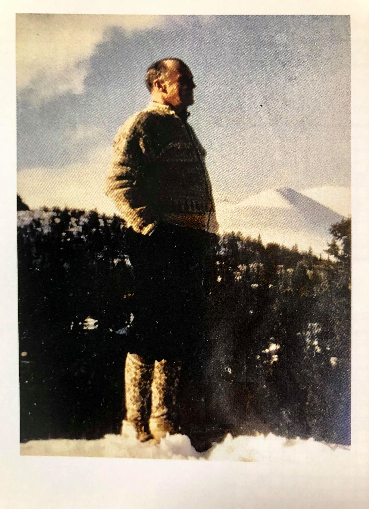
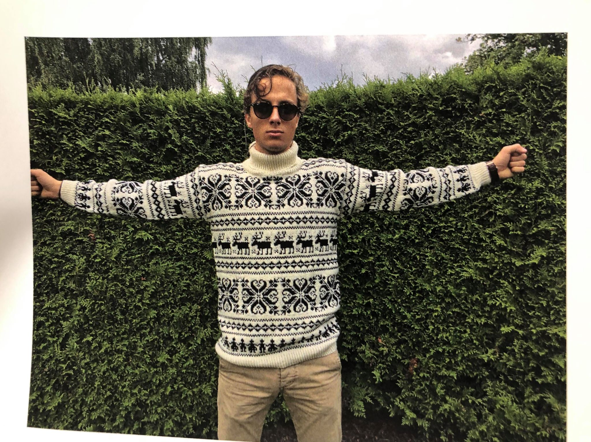
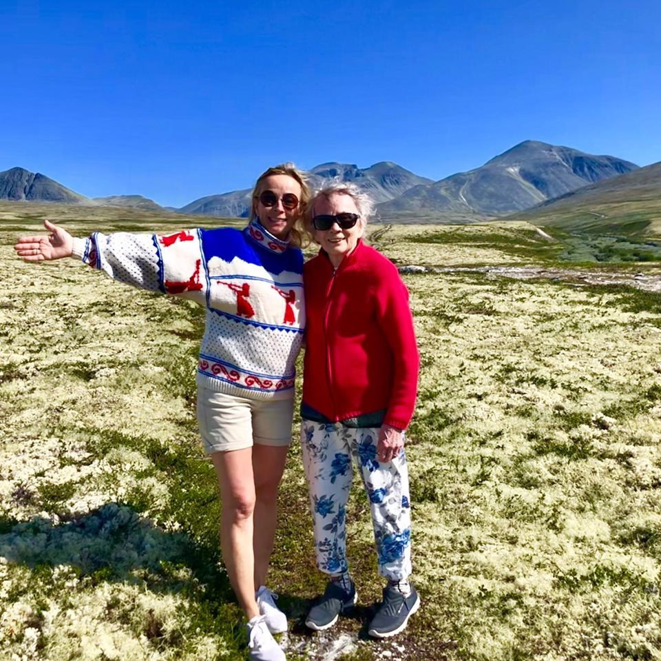

Visste du at det er designet en egen Rondanegenser? Ja, det er til og med designet en genser inspirert av den genseren Rondane Høyfjellshotells grunnlegger hadde på seg når han tok imot gjester.

Rondanegenseren var et resultat av det glade 80-tall og den gangen 25 år gamle Britt Erlandsens kreativitet. Erlandsen er datterdatter av Rondane Høyfjellhotells gründer Hans Nygaard. Det var i 1989 at hun designet genseren, som også fikk behørig omtale i Gudbrandsdølen. Rondanegenseren har fjellene Storronden og Illmannhø samt Pillarguri i mønsteret, og finnes også som jakke.

Og interessen for strikking har ikke på noen måte avtatt med årene. For noen år siden kom Britts sønn, Hans Kristian Erlandsen Villa kom over et bilde av sin oldefar med en strikkejakke – strikkejakken han alltid hadde på seg når han tok imot gjester. Om hun kunne strikke en slik til han? Ja, det kunne hun. Men det var lettere sagt enn gjort. Mønster var ikke å oppdrive og dermed måtte den rekonstrueres basert på bildet, border fra gamle oppskrifter og utregning av masketall etter mål. Genseren ble utrolig flott og vant pris i Mønsterstrikk på Strikkefestivalen ved Hadeland Glassverk i 2016.

Er du interessert i strikkeoppskriften på Hansagenseren, kan du henvende deg til Britt Erlandsen Villa på [bvilla@online.no](mailto:bvilla@online.no). Vipps 90 kroner, så sender hun deg oppskriften.

Foto1 (faksimile):
*Britt Erlandsen Villa med genseren hun strikket som 25-åring. Faksimile fra Gudbrandsdølen.*

Foto2:
*Rondane Høyfjellhotells gründer Hans Nygaard med genseren som inspirerte Britt Erlandsen Villa og hennes sønn Hans Kristian Erlandsen Villa.Foto3:
*Hans Kristian Erlandsen Villa med Hansagenseren.

Foto4:
*Britt Erlandsen Villa, her sammen med sin mor, Ingrid Erlandsen. Bildet er tatt i juli 2019.*

 [Gå tilbake](/javascript: history.go(-1))
