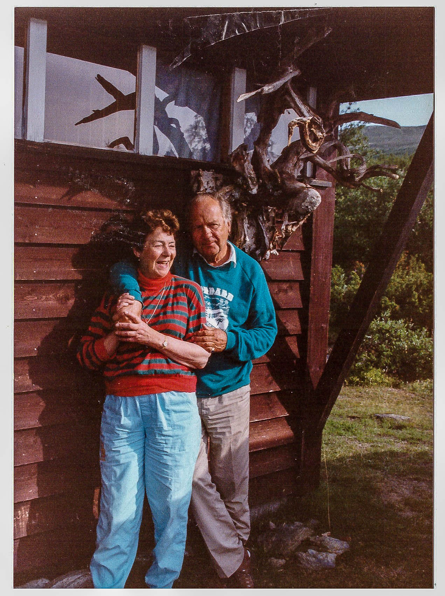
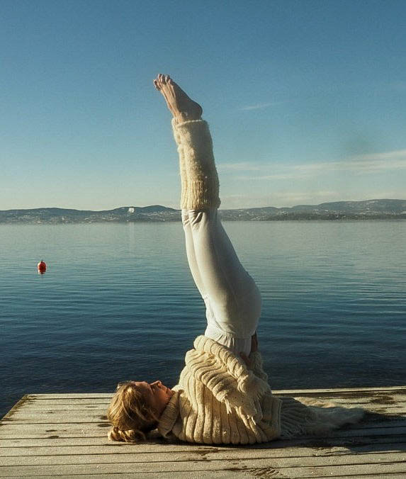
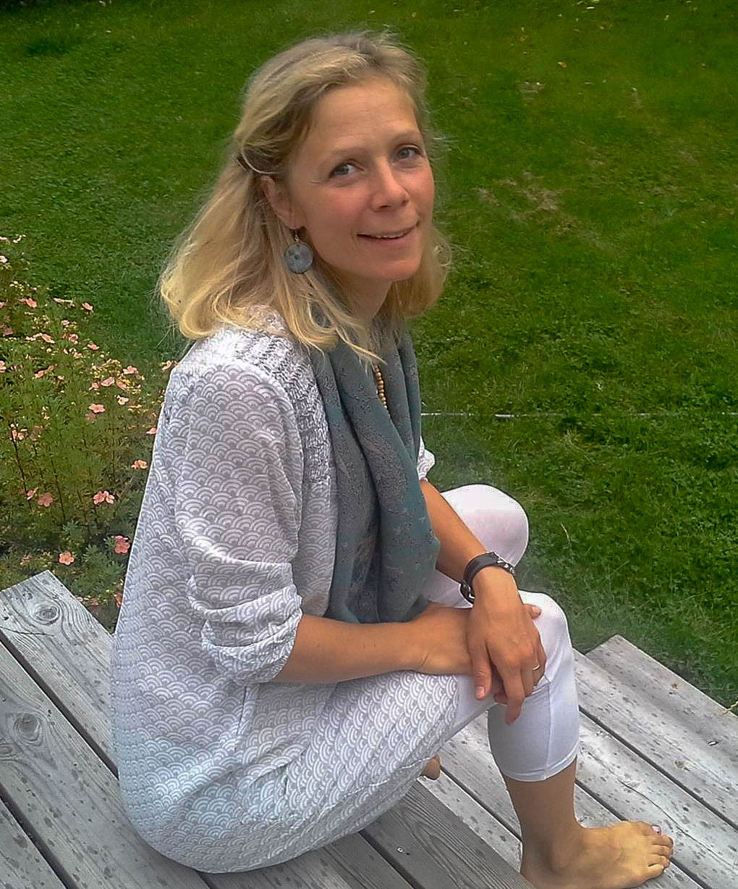

To ganger i halvåret kommer Kristin Bochud fra Sat Nam Yoga til oss for å holde kurs. Kristin er barnebarn av ingen ringere enn Henning von Zernichow som er hotellets arkitekt og Sigrid von Zernichow (mormor) som var yogakurspioner på 70-tallet.

- Mormor var lidenskapelig opptatt av yoga og hun var veldig glad i Rondane og spesielt Ulafossen, hvor hun fant noen fine plasser for yoga og meditasjon. Som yogalærer hjemme i Oslo tok hun seg av flere som hadde havnet på skråplanet og fikk dem tilbake på sporet gjennom disiplinert yogapraksis, forteller Kristin.

Morfar Henning von Zernichow tegnet hotellet sammen med Kjell Ullring i 1962. Henning og Sigrid var gode venner av hotellets eiere Erlend og Ingrid Erlandsen. De var derfor ofte på besøk og tok med seg hele familien.

*Fra venstre: Sigrid og Henning Zernichow, Kristin Bochud i samme positur som sin mormor ved Ulafossen en gang på 70-tallet og til slutt portrettbilde av Kristin Bochud.*

Allerede på tidlig 1970-tallet fattet ekteparet interesse for yoga etter at de hadde besøkt den indiske yogamester Swami Narayanananda,  som hadde en ashrama (en type kloster) i Danmark. De tok med familien, og flere yoga-interesserte fra Oslo, og sammen tilbragte de mange ferier og lærte mye om indiske tradisjoner, yoga og meditasjon. Kristin tilbragte flere uker hver sommer på ashramaen til hun var i midten av ungdomsårene.

I de senere årene har hun tatt opp yogaen igjen og lever nå av å undervise i yoga og meditasjon. Kristin har bakgrunn fra Den Norske Turistforeningen og elsker fjellet. Kombinasjonen fjell og yoga er spesielt fint, fordi disse to aspektene har så mange likheter: Ro, ingen konkurranse, styrker tilstedeværelsen, man legger bort alle roller og bare ER!

Kristin underviser i dag på eget yogasenter i Asker, ikke langt fra Skaugum. Hun fokuserer på Kundalini Yoga som er «Mediyogaens mor» og kalles «hverdagsyogaen».

Kundalini Yoga er en kraftfull, transformerende og helhetlig yogaform. Her er det fokus på kropp og sjel i forening. Med Kundalini Yoga kan du skape en sunn kropp, utvikle et balansert sinn og få dypere kontakt med din indre visdom. Fokuset ligger mer på utholdenhet og kraft enn avanserte, fysiske kroppsstillinger. Man trenger ikke være smidig eller veltrent, det blir snarere et resultat av yogatreningen. Kristin legger vekt på det helende og rolige aspektet av yoga og liker å inkludere gong-bad og syngebolle i timene.

Ta kontakt med oss for å sikre deg en plass på Kristins yogakurs neste gang!

 [Gå tilbake](/javascript: history.go(-1))
