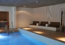
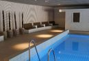
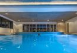
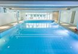
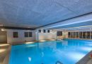
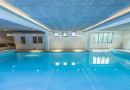
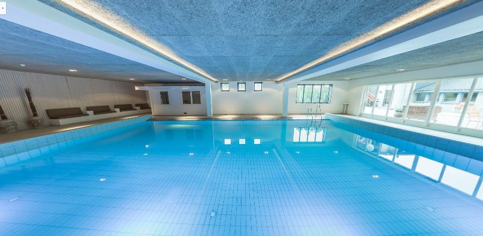

1. Bading skjer på eget ansvar. Bassengområdet er ikke bemannet med livvakt.
1. Barn får kun bade under tilsyn fra en voksen.
1. Dusj alltid godt og vask deg med såpe før du benytter bassengområdet.
1. Medbrakt mat og drikke er ikke tillatt i bassengområdet. Henvend deg i resepsjonen dersom du ønsker noe å drikke – vi serverer deg gjerne noe fra baren.
1. Vis hensyn til andre gjester – unngå roping og høye lyder. Stuping og løping er forbudt.
1. Ta av skoene ved skohyllene i gangen. Det er ikke tillatt å gå med utesko i bassengområdet eller garderobene.
1. Det er forbudt å ta med glass og andre knusbare gjenstander inn i bassengområdet.
1. Vi håper du vil hjelpe oss med å holde det rent og trivelig i garderobene. Brukte håndklær kan legges i skittentøyskurven.
1. Slapp av og nyt livet. Ikke nøl med å ta kontakt med hotellpersonalet om det er noe vi kan gjøre for å gjøre oppholdet ditt enda bedre.
1. Bassenget er åpent 08.00 – 22.00 alle dager.

Gå tilbake til side om basseng, boblebad og badstue. 

<Sidefelt>

Bassengområde

- Oppvarmet basseng (29℃)
- Sauna
- Nyoppussede garderober
- BoblebadSe bassenget i 360°

</Sidefelt>
