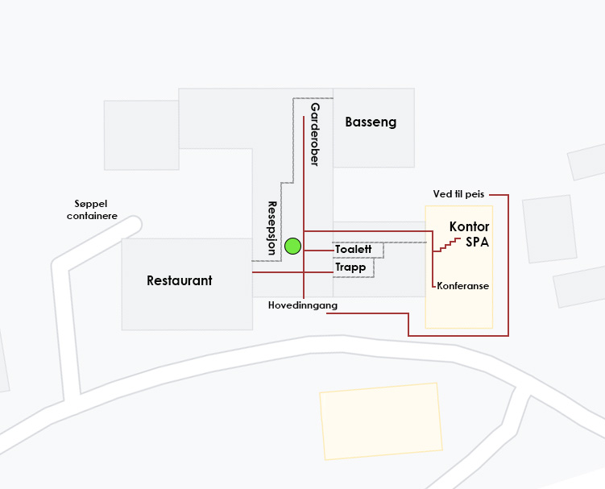

- Digital resepsjon, åpningstider

Åpent fra 09.00-16.00 i lavsesesong, 09.00-21.00 i høysesong.

Du finner den digitale respsjonen i vårt resepsjonsområde hvor du ved å trykke på skjermen blir koblet opp til en av våre hyggelige respsjonister.

- Om Hotellet

[https://rondane.no/om_hotellet](/om-hotellet/)

- Innsjekk/utsjekk

Insjekk er fra 16.00 og utsjekk fra 11.00. Du kan alikevel benytte vårt baggasjerom og benytte deg av dusj og garderober i bassengområdet etter utsjekk. Ønsker du beholde rommet lengre og det er ledig kapasitet, koster dette 100,- kr pr time.

- Restaurant, åpningstider

Frokost 08.00-10.00 (10.30 helger).

Lunch 13.00-15.00

Middag 18.00-20.00 (21.00 fredag/lørdag).

Pizza take away 12.00-21.00 alle dager.

Pizza og basseng deal, trykk her for info [rondane.no/pizza-og-basseng](/om-hotellet/restaurant/)

Du finner mer informasjon om vår resturang, samt meny ved å trykke deg inn på [rondane.no/restaurant ](/om-hotellet/restaurant/)

Anbefaler alle gjester og forhåndsbestille bord ved ankomst eller i link som følger med i ankomst sms da det fort blir fullt i høysesong.

- Bassengområde

Vårt bassengområde har et stort basseng, badstue og boblebad. Vannet holder 29 grader og du kan fritt disponere bassenget som gjest hos oss enten om du bor på hotellet, i hytte eller leilighet.

Åpningstider for basseng er 08.00-22.00 hver dag. Mer informasjon om bassenget finner du på rondane.no/basseng

- Nøkkel til hytte og leilighet

Nøkler og ankomstinfo til hytter og leiligheter finner du i merket konvolutt inne på resepsjonsdisken og i denne guiden. Skulle du ikke finne din hytte, kontakter du bare oss i digital resepsjon ved å trykke på knappen. Noen av hyttene har kodelås, du finner mer info om dette i din konvolutt.

- Leie av håndkle/sengetøy

Dette kommer i tilegg til ordinær bestilling og kan legges ved bestilling som tilvalg. Dersom du ikke har fått gjort dette før ankomst kan vi selvfølgelig være behjelpelige med å ordne dette. Det koster 110,- kr per sett, per person. Da får du ett sett sengetøy og håndklær.

- Ved

Kan forhåndsbestilles på nett for kr 110,- kr sekken. Det skal være en halv sekk med ved inne i hytten ved ankomst. Mer ved finner du ved å henvende deg i resepsjonen. Har du bestilt ved finnes vedsekker bak resepsjonen i bakgården.

- Kontakt

Kontakt oss gjerne på e-post  [booking@rondane.no](mailto:booking@rondane.no) eller på telefon +47 61 20 90 90

- Kjæledyr

Er tilatt på utvalgte hytter og hotellrom. Våre leiligheter tillater desverre ikke kjæledyr. Det koster 100,- kr i tilegg pr natt per rom, og 175 ,- kr pr opphold i hytte. Vi må vite om du har med kjæledyr før ankomst da vi ikke kan garantere ledig rom eller hytte tilatt med kjæledyr uten forhåndsbooking.

- Ladestasjon for el-bil

Finnes nede på parkering  til høyre der du tar av inn til hotellet. Vi har installert seks dedikerte ladere til el-bil på hotellet for 22 kwh. Det er også hurtigladere i Otta (Fortum) Kvam (Grønn kontakt), Vinstra(Tesla og Fortum),og Dombås (BKK og Tesla).

Mer informasjon finner du her [https://rondane.no/elbil-lading-pa-rondane-hoyfjellshotell](/om-hotellet/elbil-lading/)

<Sidefelt>

Se kart over bygget her:

</Sidefelt>
