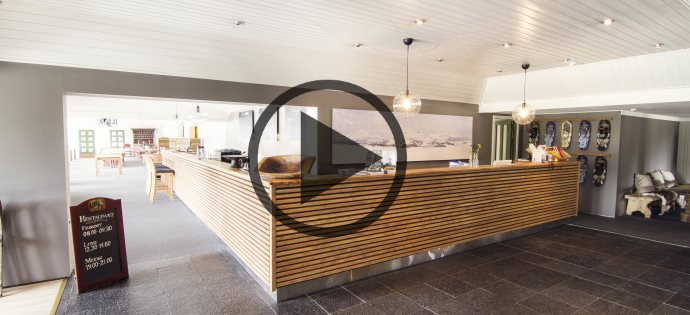

Se vår video-omvisning av hotellet

Rondane Høyfjellshotell ligger like ved et av Norges vakreste fjellområder og nasjonalpark, Rondane.

 Hotellet ble vesentlig oppgradert i 2016. Vi tilbyr overnatting i rom, leiligheter og hytter, og har totalt 210 sengeplasser. Hotellet har romslige møterom med plass til opptil 100 kursdeltagere.

Hotellet ligger nærmest Rondane nasjonalpark av samtlige hoteller i området, kun tre kilometer fra grensen. Hele seks fjelltopper over 2000 meter er tilgjengelige på dagsturer fra hotellet [(se kart)](https://goo.gl/maps/jJpeMnB25WM2).

Rondane Høyfjellshotell er stolt medlem av De kulinariske spisesteder, som legger stor vekt på lokalprodusert mat og at all mat i hovedsak lages fra bunnen av. Vi er blitt kortreistmatbedriften Gudbrandsdalsmats største kunde. Det er viktig for oss at våre gjester både skal føle og smake at de er i Gudbrandsdalen når de er på besøk.
