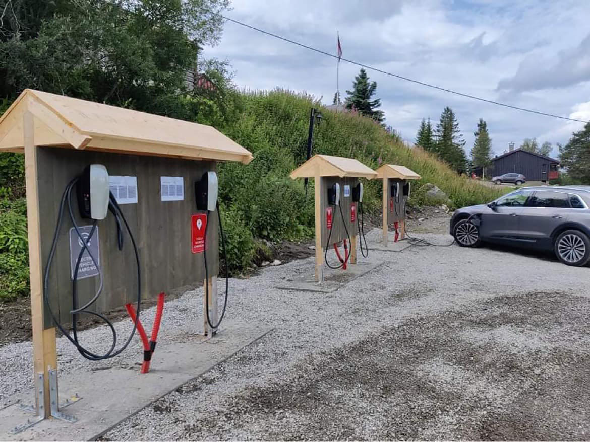
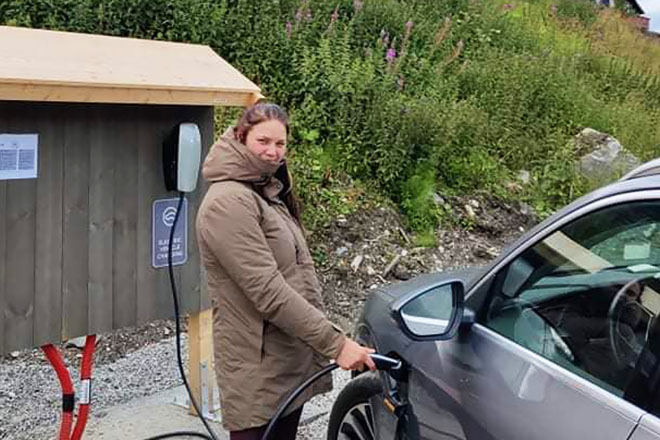

Elbilladere er en del av naturopplevelsen vår

Rondane Høyfjellshotell har hele seks 22 kw elbilladere. Vi har ikke sjekket alle høyfjellshotell i Norge, men tør påstå at vi er i en eksklusiv klubb. For oss er elektrifisering en del av helhetstanken ved å drive et høyfjellshotell,  noen få kilometer fra en av Norges vakreste nasjonalparker med klar luft og urørt natur.

Lad din elbil hos oss for 100kr per time, eller 250kr for fulladet bil. Husk å flytte bilen så fort den er fulladet, slik at andre får tilgang til laderne.

Å få elbilladere på plass har vært en av flere viktige milepæler for å kunne tilby et ekte grønt hotell, som setter så lite CO2-avtrykk som mulig.

Vi brukte hele tre år på å sette i stand vannkraftverket vårt, etter mange års vedlikeholdsetterslep, som kulminerte med et lynnedslag i transformatoren. Nå driftes hotellet med ren og fin strøm året rundt og vi kan tillate oss 30 grader i bassenget uten dårlig samvittighet.

<Sidefelt>

</Sidefelt>
