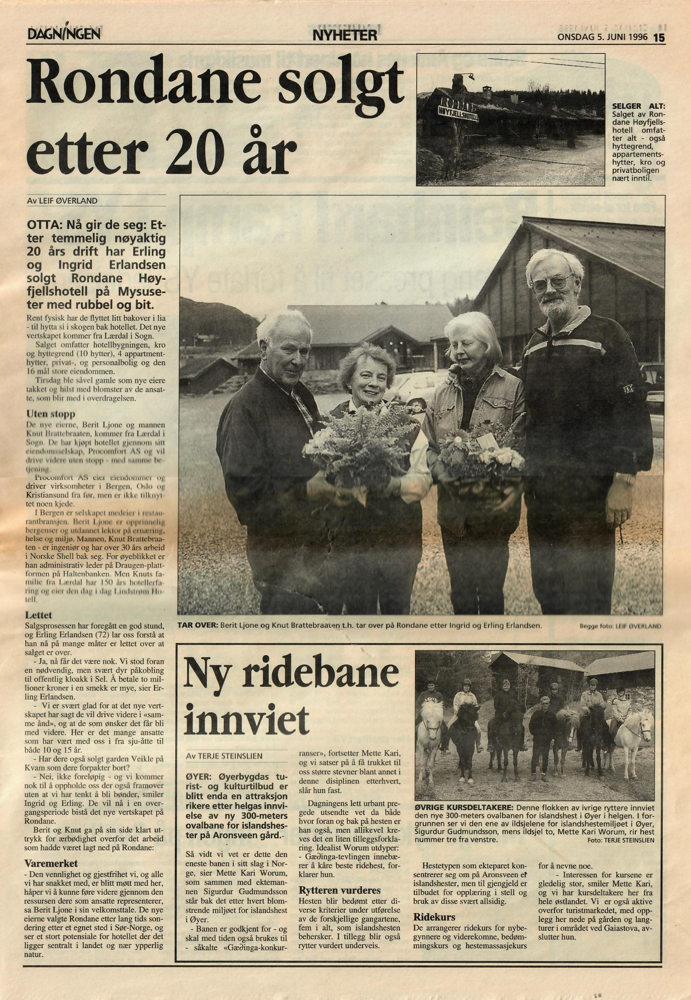

Rondane Fjellstue, som Rondane Høyfjellsstue først het, ble etablert 1. mars 1939 av Hans og Bergljot Nygaard. Hans var en uvanlig nevenyttig kar som bygde både hotellet og vannkraftverket. I tillegg var han kjent som en dyktig treskjærer. Bergljot hadde den hotellfaglige bakgrunnen av de to, som tidligere kokk på Grand Hotell i Otta.

Det viste seg snart at ekteparet hadde truffet en tidsånd, og hotellet ble et drivverdig foretagende.

Til høyre ses bilder av Rondane Fjellstue, slik det fremsto i oppstartsåret. Det nærmeste bygget i er bestyrerboligen hvor Hans og Bergjljot bodde når hotellet var i sesongdrift. Her vokste Ingrid (Nygaard) Erlandsen opp, som senere giftet seg med Erling Erlandsen. De to ble 2. generasjons bestyrerpar.

Ett av bildene viser en ku foran hotellet, tatt i 1943. Ingrid Erlandsen har fortalt at Rondane Fjellstue var rene bondegården under krigen med både ku, griser og høner. Tyskerne patruljerte området konstant fordi det var mange flydropp med våpen til hjemmefronten i området, noe som naturlig nok gikk utover normal hotelldrift. Hans Nygaard var selv med i motstandsbevegelsen og deltok i kampene rundt Rosten bru.

Brann

I 1961 brant hotellet og fikk navnet Rondane Høyfjellshotell da det gjenoppsto i ny form i 1962.

Et annet av bildene til høyre viser interiøret i hotellets spisesal og resepsjonsområde etter gjenoppbygningen. 50- og 60-tallet var høyfjellshotellenes storhetstid i Norge. Mange av gjestene var blant landets rikeste fra Oslos bedre vestkant, og hotellets ansatte fra den tiden husker særlig at fruene kom med de flotteste designkjoler fra Europas motehus.

I 1975 overtok Ingrid og Erling Erlandsen roret. I 1982 ble det bygget innendørs svømmebasseng og konferanseavdeling. I 1987 ble hotellet kraftig utvidet med ti hytter samt Erlingstugu med fire leiligheter.

Etter mange års hotelldrift besluttet familien seg for å selge hotellet til Berit Ljone og Knut Brattebraaten. Brattebraaten startet Norges første høyfjellsspa i 1999. I 2011 ble hotellet solgt til Kari Gripp og Willy Roar Rahm fra Rahm Gruppen.

Dagens eiere

I mai 2014 ble Rondane Høyfjellshotell overtatt av dagens eiere.  Hotellets omsetning hadde sunket til rundt fem millioner kroner, mot 12-13 millioner kroner i normalår. Selv om de nye eierne hadde stort pågangsmot var oppstarten svært krevende. To av hyttetakene falt sammen, som følge av mye snø, og lynet slo ned i kraftverket med totalhavari som resultat. Hotellet var dårlig innkjørt på rutiner og kundeanmeldelsene var lite hyggelige. Det ble klaget på både mat, dårlig vedlikehold og pris.

Fra oktober 2015 til februar 2016 var hotellet akuttmottak for asylsøkere fra konfliktene i Øst-Afrika og Midt-Østen. ([Se nyhetsinnslag)](https://tv.nrk.no/serie/distriktsnyheter-oestnytt/DKOP98102215/22-10-2015#t=38s)  Rondane Høyfjellshotell var [landets rimeligste akuttmottak](http://korsetsseier.no/2016/01/06/lite-profit-nar-frelsesarmeen-driver-asylmottak/) da UDI hentet inn anbud i første omgang. Etter andre anbudsrunde var de landets nest rimeligste mottak. Likevel ga husingen av flyktninger solide inntekter, men alle inntektene og enda litt mer, ble brukt for å bygge opp et godt hotellprodukt og sikre lokale arbeidsplasser. 17. juni 2016 gjenoppsto hotellet i nyoppusset drakt.

Facebookkonkurransene

I desember samme år fikk vi mye oppmerksomhet gjennom en Facebookkonkurranse som gikk viralt. Over 1,5 millioner nordmenn så innlegget. En rekke nyhetsmedier fanget opp saken og vi fikk blant annet omtale på NRK. [Se nyhetsinnslaget](https://tv.nrk.no/serie/dagsrevyen-21/NNFA21120716/07-12-2016#t=9m52s).

I november i år la vi ut nok en Facebookonkurranse, hvor hele 31.000 personer skrev på vår Facebookside at de kunne tenke seg å bo hos oss.

Etter at ordinær drift kom i gang igjen 17. juni 2016 har hotellet hatt en hyggelig utvikling i antall gjestedøgn og omsetning. Det er brukt store ressurser og pengebeløp på å pusse opp og oppgradere hotellet de siste fem årene. Mat har hatt en sentral rolle i hotellets gjenoppbygging. I 2016 ble Rondane Høyfjellshotell stolt medlem av [De kulinariske spisesteder](http://www.dekulinariske.no/).

Vi er blitt kortreistmatbedriften [Gudbrandsdalsmats](https://www.gudbrandsdalsmat.no/) største kunde, noe som ikke er tilfeldig. Hotellets ledelse setter sin stolthet i at det skal oppleves annerledes å være kunde på et hotell i Gudbrandsdalen. Man skal som gjest føle at man er på besøk i et lokalt område. Vi vil ikke være et hvilket som helst høyfjellshotell, som kunne ligget hvor som helst.

Ole P. Christensen ledet hotellet i perioden 2015 til juli 2019. Stafettpinnen ble overtatt av Pål Berthling-Hansen, som både er styreleder og daglig leder. Han drifter hotellet i tett samarbeid med assisterende leder leder Anne Martrhe Ingeberg.

Du kan lese mer historikk om hotellet og andre ting knyttet til nærområdet på vår [blogg](http://www.rondane.no/blogg).

<Sidefelt>

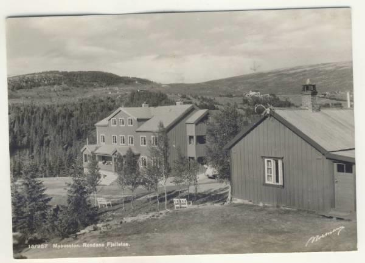

 Rondane Fjellstue slikt det fremsto i 1939

Utsikten var den samme

Et av de mest berømte postkortene i Norge i sin samtid, tatt av fotograf Anders beer Wilse i 1912 med tittelen "Rondane".

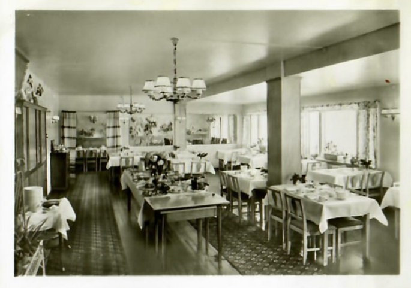

Restauranten, 1956

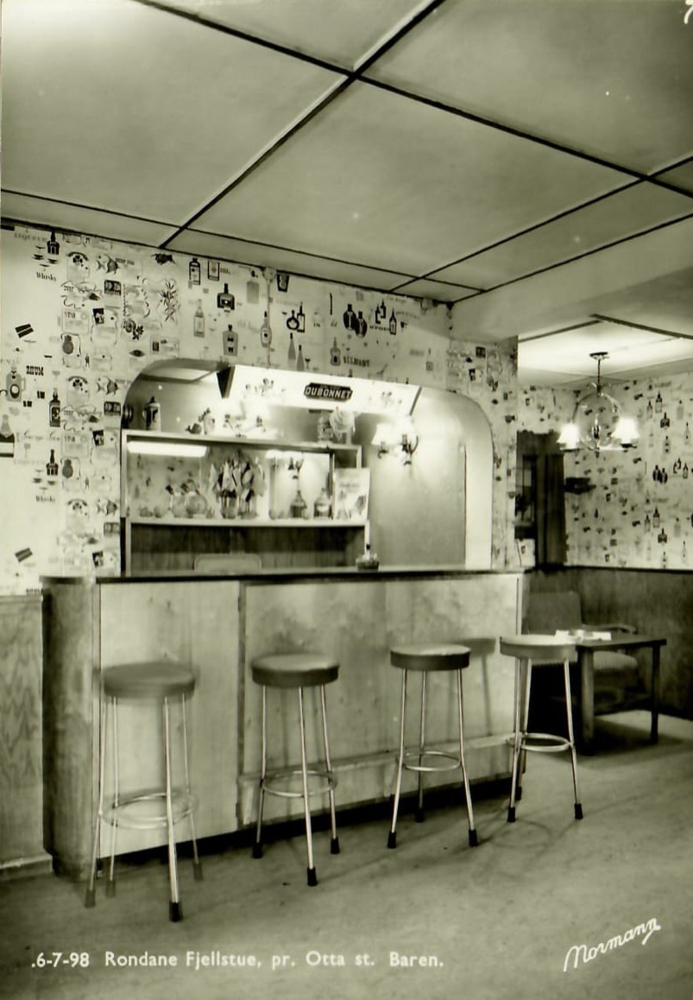

Baren, 1956

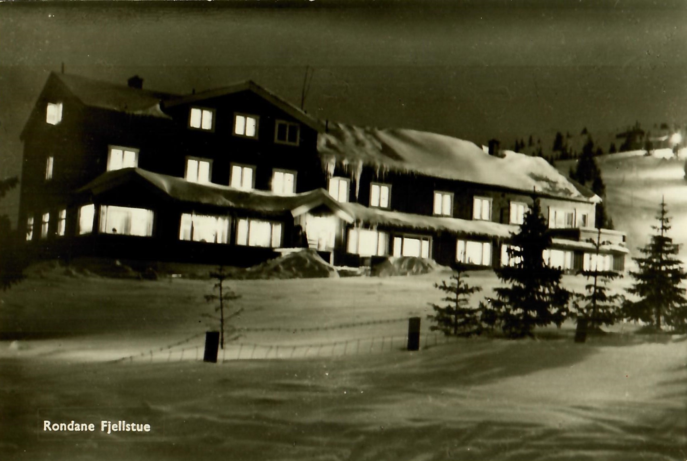

Rondane Fjellstue før 1961Rondane Fjellstue var staselig bygg for sin tid

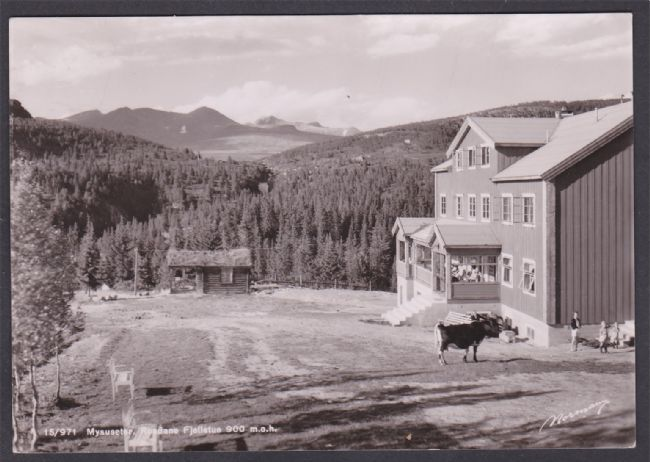

Rondane Fjellstue 1943

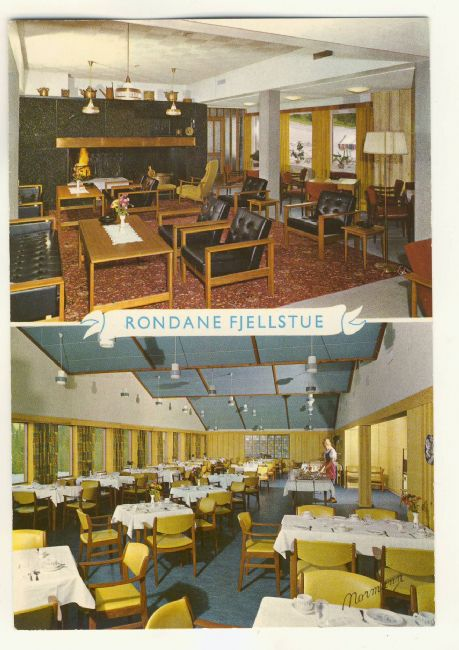

Interiør i hotellets spisesal og resepsjon på 60-tallet

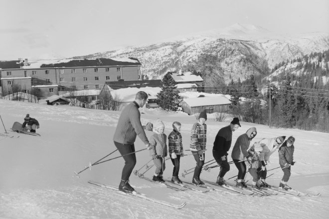

 Rondane Høyfjellshotell i 1965.

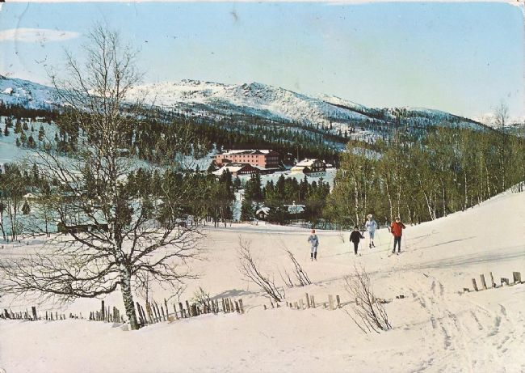

Postkort fra Mysuseter i 1966

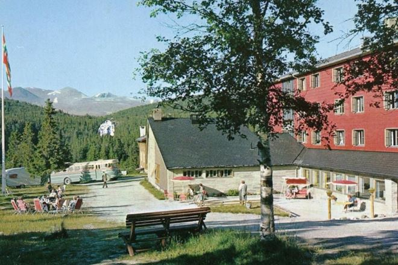

 Rondane Høyfjellshotell mot slutten av 60-tallet.

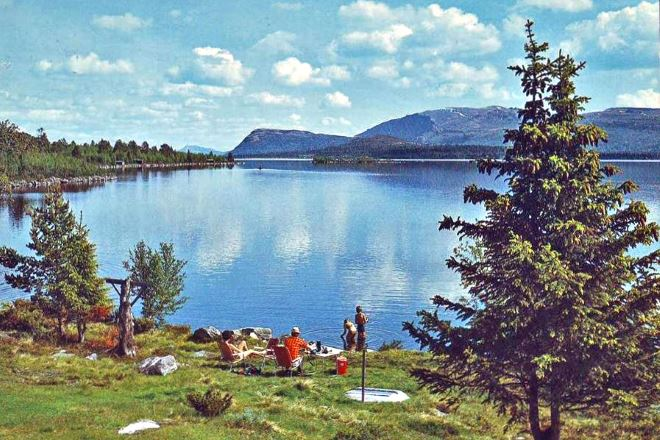

 Furusjøen på 70-tallet.

</Sidefelt>
