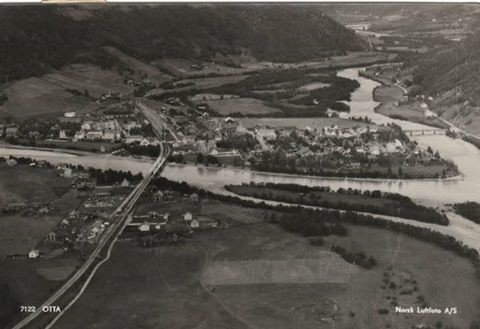

Mens det var forholdvis rolig i resten av Sør-Norge i denne perioden raste harde kamper i Gudbrandsdalen, etter at britiske styrker vi ilandsatt på Åndalsnes og kom norske styrker til unnsetning. Kvam ble spesielt hardt rammet, men det var også enkelte trefninger i vårt nærområde.

Krigen i Gudbrandsdalen fikk for øvrig ringvirkninger som endret krigens gang. Det britiske parlamentet gjorde opprør mot statsminister [Neville Chamberlain](https://www.google.no/search?q=Neville+Chamberlain&spell=1&sa=X&ved=0ahUKEwjEiP_pqZ3YAhUiApoKHZMwBvoQvwUIJCgA)

 for hans dårlige håndteringen av felttoget og Winston S. Churchill tok hans plass. Den siste boken om felttoget i Gudbrandsdalen kom ut i april 2017: [Anatomy of a Campaign: The British Fiasco in Norway, 1940 ](https://www.amazon.co.uk/Anatomy-Campaign-Cambridge-Military-Histories/dp/1107194598) og er skrevet av tidligere Falklandsveteran General Løytnant John Panton Kiszely.

Vi har funnet noen få kilder som forteller litt om hva som skjedde på Rondane Høyfjellshotell under de dramatiske april- og maidagene i 1940. Denne beretningen ligger på Facebooksiden [Lokalhistorie fra Sel kommune](https://nb-no.facebook.com/selhistorie/photos/a.293759923414.150663.293744588414/10153200529003415/?type=3).

#### Aprildagene 1940

Den 9. april 1940 kom krigen til Norge. Folk hørte den utrolige nyheten på radioen. Ifølge slektsboka "Ulvolden på Selsverket" fikk Rolf i oppdrag av mor si å varsle faren. Olaf Kvåle og faren hadde dratt til skogs for å hogge tømmer, og det var en redd tiåring som løp til skogs den gangen. Rolf husker Olaf Kvåle sa til faren: - Nå blir det andre boller, Syver!

Denne morgenen fikk sønnen Syver og hans medsoldater på Trandum utlevert nødvendig utstyr fra depotene, og klokka seks presis stilte de opp feltmessig. Soldatene delvis marsjerte, delvis kjørte buss. Retningen var Oslo. Det ble stopp i nærheten av Bjerkebanen, hvor Syver ble satt til å dirigere bussene med soldater til rett plass.

– Ei dame viste meg dagens avis med bilder av tyskerne som marsjerer opp Karl Johans gate, fortalte Syver i 1996.

Avdøde Astrid Kjos (f. Vangen) fortalte i 2011 til Selhistorie.no at hun husket godt aprildagene 1940, med invasjonen og krigshandlingene i Bredebygden. Hun hadde nemlig bursdagen sin på nettopp invasjonsdagen, 9. april, og dette året fylte hun ti år. Denne dagen kom John Haugen heim etter en tur til Otta og fortalte at det var blitt krig i landet vårt.

Familien på Søre Haugen ovenfor Varphaugen ble redde og usikre på det som kunne skje. Radio hadde de ikke, så eventuell ordre om mobilisering fikk de ikke. Astrid husket godt at moren likevel forberedte seg og fant fram klær og utstyr til faren. Det ble neppe noe bursdagselskap for Astrid denne dagen.

#### Redsel og virvar

Lars Grøneng fra Otta/Hamar skriver i en artikkel på Selhistorie.no om rykter, redsel og virvar på denne skjebnedagen:

"Den 9. april 1940 ble det meddelt på nyhetene at tyske tropper hadde inntatt Norge og at tyske soldater marsjerte i Oslos gater. Krigens første dag på norsk jord var full av rykter, redsel og virvar. Selv arbeidet jeg på Bjørkheim som assisterende hotellgutt. Hotellgutten fikk det travelt med å gifte seg, for deretter å dra ut i krigen. Dermed var jeg alene om dette arbeidet.

Om kvelden var jeg med hotellverten for å kjøre hans og en annen familie til Mysuseter. Dette var det første jeg hørte om evakuering. Fra den turen husker jeg at vi kjørte uten lys på bilen så lenge det gikk. Deretter satt jeg på panseret med en lommelykt, men opp kom vi."

#### Uforbreredt befolkning

Tidligere provisor på Otta apotek, Hermann Køhn (1909-1998), skrev dette om de første krigsdagene, ifølge Selhistorie.no:

"Meldingen i radio om morgenen den 9. april om at også Norge var trukket inn i krigen, hadde man inntrykk av virket meget forstemmende på befolkningen. Tross de mange hendelser som hadde gått forut, lot det til at storparten av folk var uforberedt på denne utvikling.

Sel merket ganske lite til krigsbegivenhetene i de første dager, og folk tok det hele med stor ro. Av og til hadde man besøk av tyske fly i meget stor høide, men det så ut til at flyene ble betraktet med større interesse enn egentlig frykt, folk kunde likesom ikke tenke sig at de kunne være farlige, hvilket i denne første tiden viste sig å være riktig. Men et tegn på at folk allikevel forstod situasjonen, var at den påbudte blending ble utført med stor nøiaktighet."

BILDET: Slik så det ut på Otta rett før krigen (1939). Bildet er lånt av Stig Sørlie Pettersen fra Otta.

#### Krigsberetning fra  boka ”Ei bygd”fra 1947

[Se side 58 til 63.](https://www.nb.no/nbsok/nb/cbaa897036dc193bc8365d4c2111c86c?lang=no#0)

[Diverse historier fra krigen](https://web.archive.org/web/20160821051200/http://www.selhistorie.no/sel/krigen/krigen.html) og kamphandlinger i vårt distrikt.
