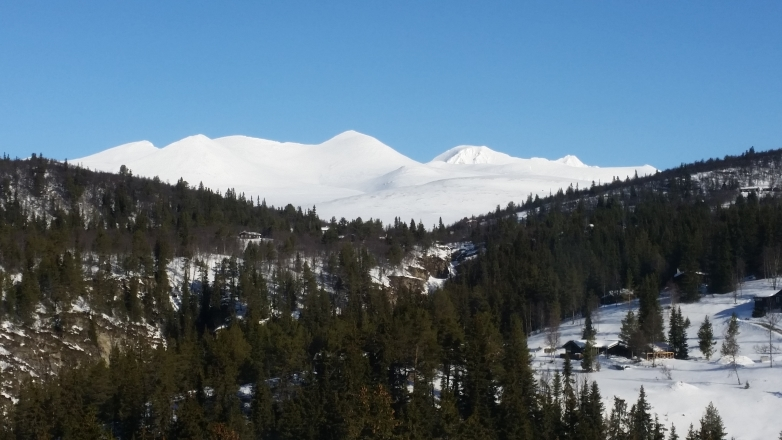

Logoen vår

Logoen til Rondane Høyfjellshotell er laget etter idé av vår hotellsjef Ole P. Christensen. Han fikk idéen en morgen han sto foran hotellet og beundret utsikten. Logoen viser omrisset av fjellformasjonen Smiubelgen, som sett fra gårdsplassen foran hotellets restaurant.
Logen ble tegnet av markedsmedarbeider Michael Aasheim og rentegnet av U2pia - et lokalt reklamebyrå i Otta og tatt i bruk våren 2015. Man kan se den samme ikoniske fjellformasjonen fra flere av hotellets rom og fellesområder.

Bildet som inspirerte, og logoen ble tegnet fra

