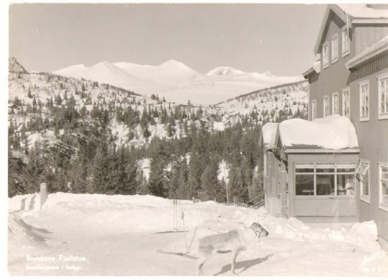
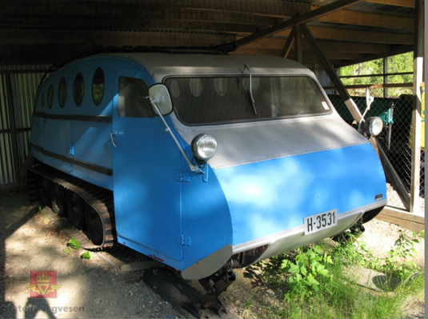
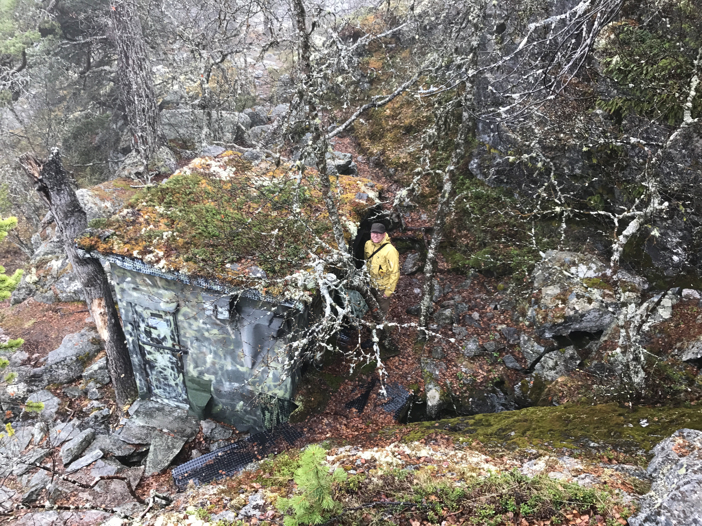
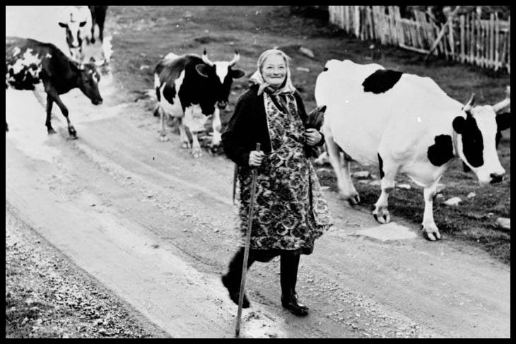
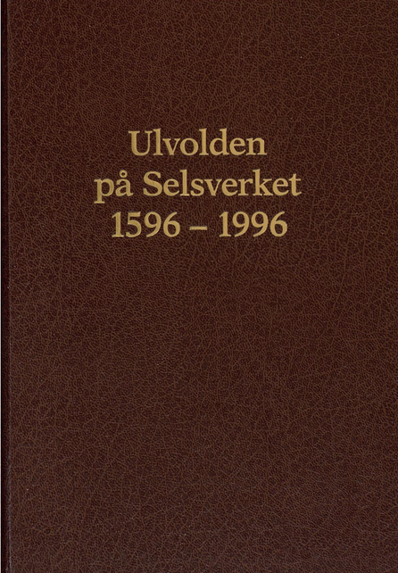
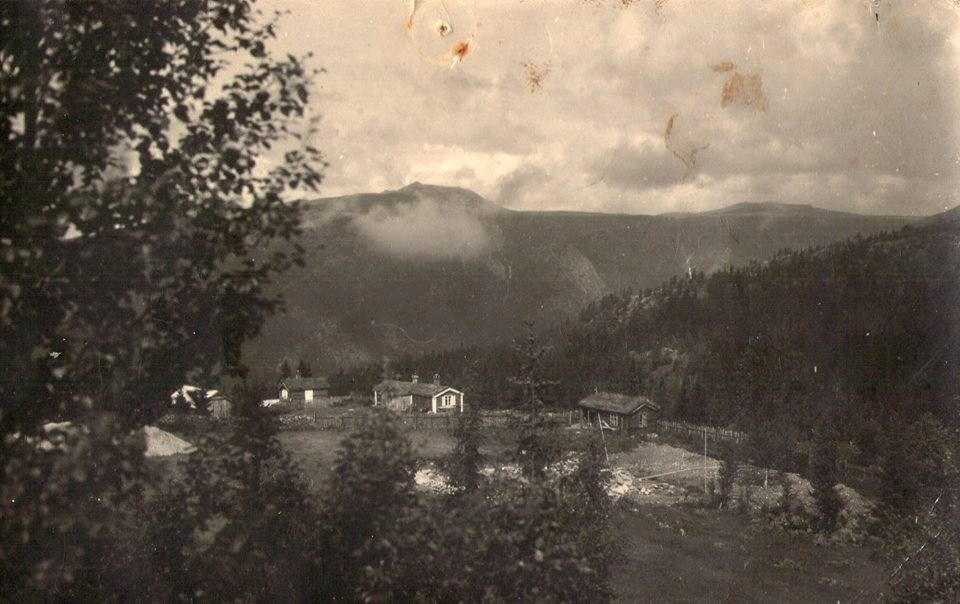

Her har vi reinsdyret Per, som varen slags maskot på Rondane Fjellstue, som hotellet het den gangen. Per gikk fritt rundt i området og den eneste han adlød var hotellgründer og direktør Hans Nygaard. I dag ville det nok vært utenkelig å la en tamrein gå rundt fritt i området, fordi bevisstheten rundt naturforvaltning er helt forskjellig fra på 40 og 50-tallet. Rondane nasjonalpark ble innstiftet for å ta vare på Nord-Europas siste villreinstamme, og genblanding er ikke ønsket, fordi villreinen har helt spesielle egenskaper.

Dette er Rondane Høyfjellshotells [gamle beltebil](https://youtu.be/orI3tnCqb70). I dag er den staselig pusset opp og står på [Norsk vegmuseum](https://www.vegvesen.no/om+statens+vegvesen/om+organisasjonen/Norsk+vegmuseum) ved siden av Hunderfossen familiepark. Bildet er hentet fra Digitalt Museum, hvor du kan se flere bilder og lese [mer](https://digitaltmuseum.no/021025641070/beltebil?i=0&aq=owner?:"HH"+text:"Rondane+Fjellstue") om bilen. Bilen kunne også brukes på sommerstid med hjul foran i stedet for ski, men dette var ikke å anbefale da det medførte stor slitasje på beltene.

Motstandsbevegelsens skjulested Reiret er et artig turmål, ikke langt fra hotellet. Når det blåser friskt på fjellet, kan det være et bra alternativ, siden det er omgitt av skog. [Her](http://www.stiglaget.no/Velkommen/index.php/11-kortere-turer/25-reiret) kan du lese litt historikk om den lille bua. Du kan lese mer om Reiret og krigshendelser i boka ”[Det var ei rar tid](https://www.nb.no/items/e4adf979db63f46938ef22ae95e8d313?page=0&searchText="Rondane fjellstue")”, som er digitalisert av Nasjonalbiblioteket.

For oss som er født på 60-tallet føles det litt spesielt å lese at dette bildet er tatt i 1960. Brått føler man seg litt eldre enn man er, eller kanskje det rett og slett er slik? Dette er ihvertfall Ragnhild Grønn, budeie på Pungen seter, ca. tre kilometer fra Rondane Høyfjellshotell. Seterdriften på Pungen tok slutt i 1967. Siste seter i drift på Mysuseter slukket lyset på i 1970. [Her](http://selhistorie.no/artikkel.php?id=338) kan du lese mer og [her](https://www.facebook.com/selhistorie/photos/a.293759923414.150663.293744588414/10153437926673415/?type=3&theater) (Lokalhistorie fra Sel kommune på Facebook).

Vil du fordype deg litt i gamledager på Mysuseter vil vi anbefale boka Ulvolden på Selsverket 1596 – 1996. Den er digitalisert av Nasdjonalbiblioeteket og kan leses [her](https://www.nb.no/items/5413428c7c592b9849a80245f704f2ac?page=0&searchText=Mysuseter).

Og her ser vi det gamle geitefjøset vårt, som står foran Erlingstugu. Det sto opprinnelig på Skjenna gård Selsverket. Huset i forgrunnen nede ved riksvegen er en såkalt tørrstugu som ble kalt Skjennaskuten. Bildet er tatt i 1910.

I forgrunnen av dette bildet vises tomtearbeid og mest sannsynlig er dette starten på gravearbeidet til Rondane Fjellstue. som er i gang. Arealet var bygsla fra garden Ulvolden. Bildet er sendt som postkort og er poststemlet Oslo 22.12. 1938, det skulle stemme bra med at hotellet sto ferdig 1. Mars 1939.

Bildet er hentet fra Facebooksiden [Lokalhistorie fra Sel kommune](https://www.facebook.com/selhistorie/photos/a.293759923414.150663.293744588414/10155775005908415/?type=3&theater)

Fjelloppsynsmann Norman Heitkøtter var den mest sentrale enkeltpersonen ved opprettinga av Rondane nasjonalpark for 50 år siden. Les meir om kampen han førte og om debatten som resulterte i [opprettelsen av Norges første nasjonalpark her](http://www.selhistorie.no/fjellet_i_sel/rondane_nasjonalpark_debatten_om_oppretting_av_den_forste_nasjonalparken_i_landet.html.).

 For 50 år siden raste debatten om oppretting av nasjonalpark i Rondane. Visste du at det ble foreslått å bygge veg i Musvolldalen, regulere Rondvatnet og Ula og lage kraftline gjennom nasjonalparken? [Les mer her](http://www.selhistorie.no/fjellet_i_sel/rondane_nasjonalpark_debatten_om_oppretting_av_den_forste_nasjonalparken_i_landet.html).

Radiointervju med 87-åring fra 1950 om Mysuseter

Vi har funnet et artig radiointervju på Nasjonalbiblioteket fra 1950 med Ole Gundersen Mohn, den gangen 87 år gammel. Mohn begynte som fjellfører ved Rondevatn i 1903. Det første året kom det to norske turister. De første utlendingene kom i 1912-15, forteller han.

[https://www.nb.no/nbsok/nb/4e51aa4a74b4d28a0c324166c83c8018?index=1](https://www.nb.no/nbsok/nb/4e51aa4a74b4d28a0c324166c83c8018?index=1)
