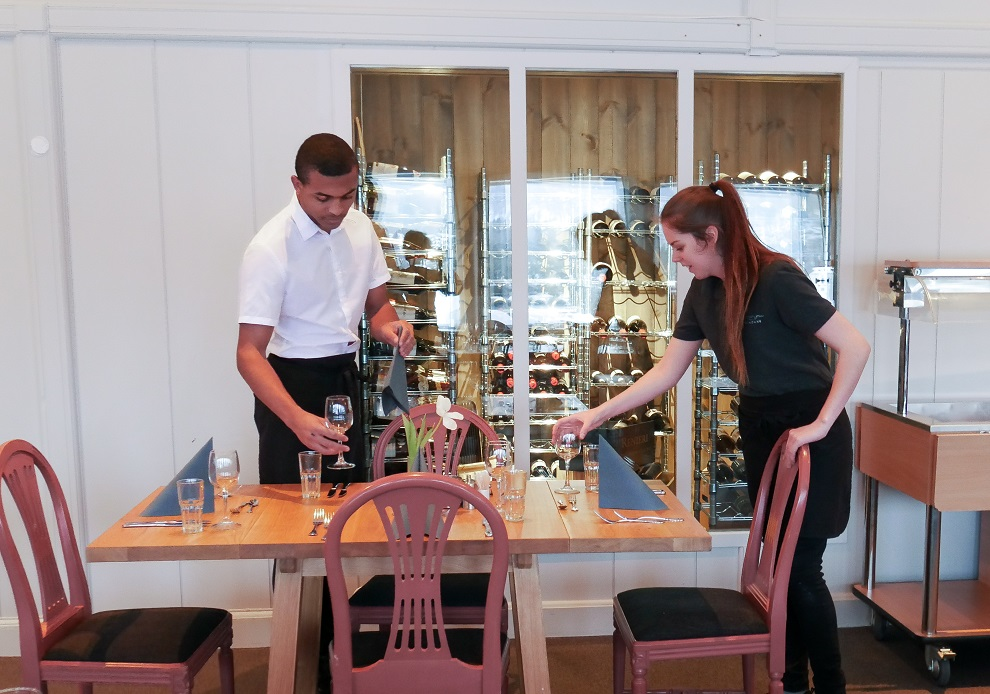
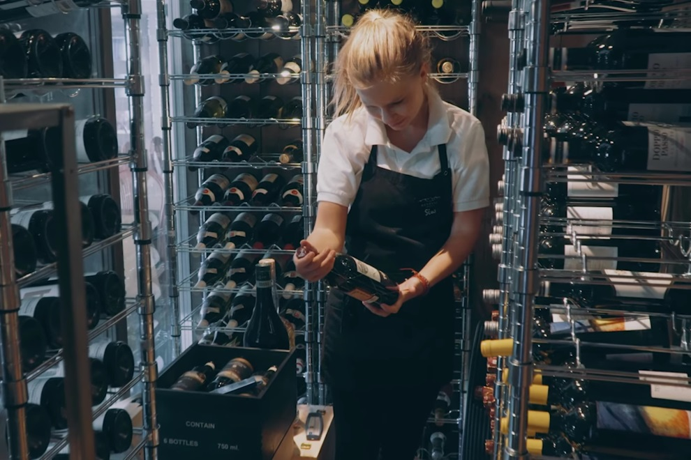
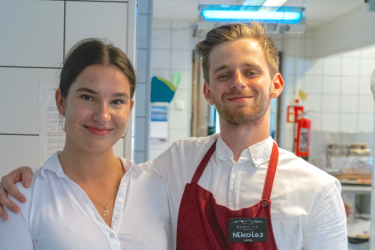

Rondane Høyfjellshotell jobber kontinuerlig med å ansette flinke folk. Først og fremst til servering og resepsjon. Vi har alltid ekstra behov i høysesong og vi trenger ringevikarer hele året.

 Send oss din CV! Vi vil bekrefte at vi har mottatt den, deretter vil du bli kontaktet hvis behov.

 Våre sesongansatte stortrives på Rondane Høyfjellshotell og mange kommer igjen år etter år. Det er gode muligheter for å spare en del penger, fordi overnatting og mat er særdeles rimelig, samtidig har de som har glede av fjellturer fantastiske muligheter. Hotellarbeid er sosialt og ingen dager er like. Vi kan organisere henting på togstasjonen på Otta, hvilket gjør det mulig å bo langt unna og jobbe helger.
 Vi foretrekker selvsagt at du snakker norsk og har noe erfaring, men vi ser også at personer, som ikke har jobbet i hotellbransjen kan bli flinke med opplæring. For å jobbe hos oss er riktig innstilling til service helt avgjørende!

Vi kan tilby følgende:

- Full opplæring
- Hotellet er behjelpelig med transport fra/til Otta/Vinstra dersom behov for dette
- Varierte arbeidsoppgaver

Som en av oss ønsker vi at du har følgende kvaliteter:

- Forstår hva service er
- At du er over 18 år
- At du snakker relativt godt norsk eller engelsk

Arbeidsoppgavene vi kan tilby:

- Servering i hotellets restaurant
- Resepsjonsarbeid
- Salg

<Sidefelt>

</Sidefelt>
