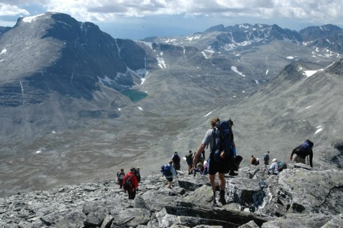

I 1953 ble gudbrandsdølen Norman Heitkøtter ansatt som fjellopsynsmann av Sel fjellstyre. Han engasjerte seg tidlig for at Rondane skulle få status som nasjonalpark og det ble nedsatt en komité for formålet i 1957, som besto av flere fjellstyrer i området. Et viktig argument for fredning var Rondanes villreinstamme, som er siste villreinstamme i Norge. I dag er det over 3.000 villrein i Rondane, men du er heldig om du kan se noen av dem. Dette er dyr som har utviklet en ekstrem evne til å være mennesker og andre farer. I 1962 lyktes gruppen endelig med å få Stortinget til å vedta Rondane som Norges første nasjonalpark.

Rondane nasjonalpark dekker 963 kvadratkilometer. Det er over dobbelt så stort som Oslo, inkludert Nordmarka. Parken ble sist utvidet i 2003 og dekket opprinnelig 572 kvadratkilometer.

Rondane som naturområde skiller seg ut fra andre fjellområder i Norge ved at hele området er lett tilgjengelig for alle fjellvandrere. Rondane Høyfjellshotell er i den lykkelige situasjon at det ligger nærmest Rondane nasjonalpark av alle hoteller i området, noe ivrige turgåere vet å benytte seg av år etter år. Rondane nasjonalpark består av ti topper over 2000 meter, som alle kan bestiges uten andre ”hjelpemidler” enn gode fjellsko.

Norman Heitkøtter
Bilde fra www.fjelloppsynet.no

<Sidefelt>

</Sidefelt>
