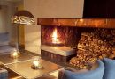
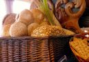
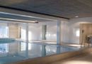

Forretningsreisende, som kjører gjennom Gudbrandsdalen: Dette bør du lese!

Det er viktig med tilstrekkelig hvile og god mat når man er på farten som forretningsreisende. Slitne selgere er det verste en kjøper vet.

E6 kan by på mange hoteller og overnattingssteder i nærheten. Felles for mange av dem er at de er ganske like og mange har langtidsboende anleggsarbeidere med mer, og er helt- eller nesten fulle.

De siste par årene har stadig flere forretningsreisende oppdaget at de kan ta avstikkeren 13 kilometer fra Otta og opp til oss. Hva får du som forretningsreisende hos på Rondane Høyfjellshotell?

- Fred og ro: Foruten skoleferier er det stort sett rolig hos oss på hverdager, foruten ett og annet kurs og konferanse.
- Hyggelig personale
- God frokost, som kan nytes mens du ser utover Smiubelgen
- Vi skraper bilen for deg om morgenen
- Og ikke minst: Kan du dokumentere at du er reisende i embeds medfør gir vi deg en svært god pris: Middag når du kommer. Frokost når du reiser.

Kampanjekode REISENDEPK gir frokost, middag og en enhet til maten i enkeltrom til kun 1645,- inkl. mva.

Ta kontakt på [booking@rondane.no](mailto:booking@rondane.no) eller tlf. [61 20 90 90](tel:61209090).

