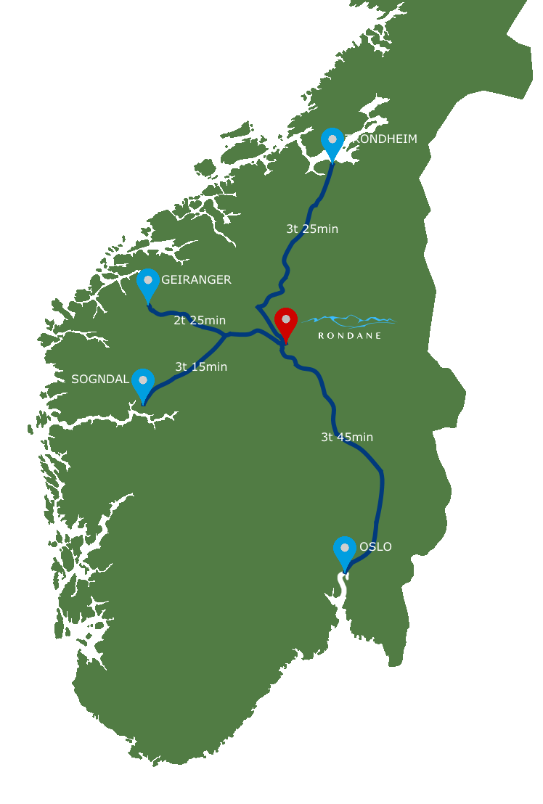

Rondane Høyfjellshotell tilbyr gode priser til større grupper. Totalt har hotellet 72 individuelle rom , inkludert hytter og leiligheter og 210 sengeplasser.Kurs- og konferanser
Hotellet har lang erfaring med å være vertskap for kurs og konferanser. Vi er også kjent for et rikholdig aktivitetstilbud til større grupper utover bare opphold og mat.

<Sidefelt>

Hotellets fasiliteter:

- Restaurant & Bar
- Overnatting med over 50 rom
- Stuer med servering
- Toppturer fra hotellet
- Fottur i Nasjonalparken

</Sidefelt>
