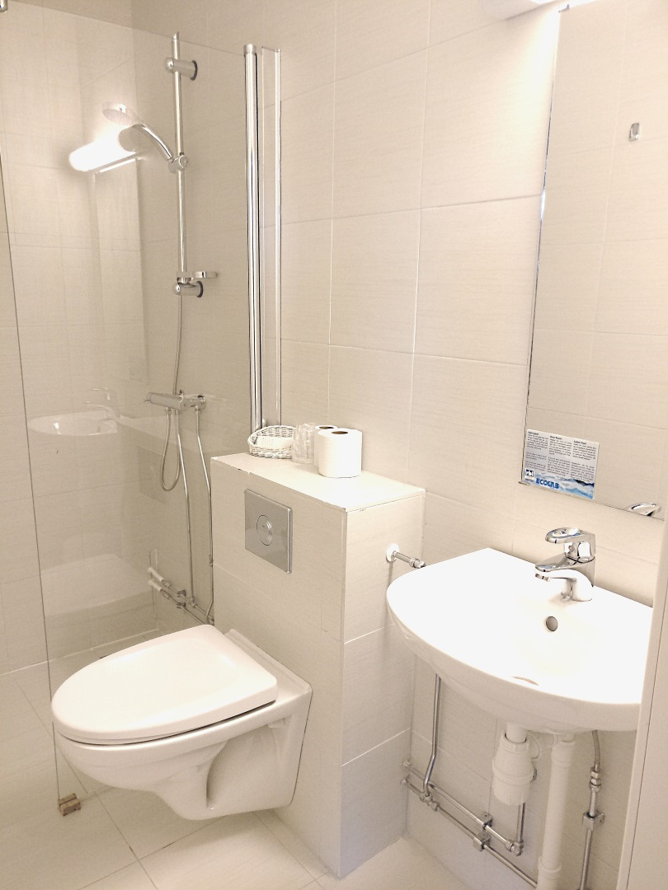
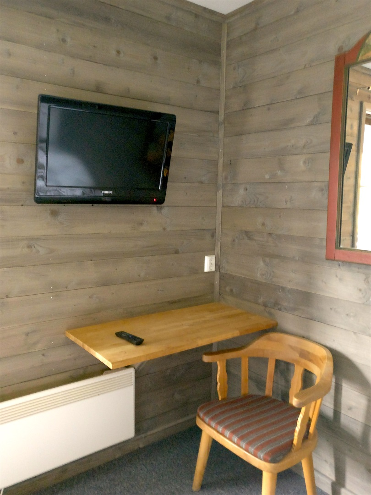

Rondane Høyfjellshotell har dobbeltrom med sitteplasser.

Rommene har dobbeltseng, sitteplasser og eget bad. Alle dobbeltrom har plass til oppbevaring av baggasje på gulv og i skap. En del av rommenerommene har fantastisk utsikt over Mysuseter og Rondane nasjonalpark. Enkelte rom har egen balkong.

De fleste  dobbeltrommene er pusset opp i smakfulle farger i løpet av 2015 eller 2016. Enkelte bad er ikke pusset opp.

Vi har imidlertid et kontinuerlig oppgraderingsprogram for hele hotellet og har fått mange positive tilbakemeldinger på det arbeidet som er gjort så langt.

<Sidefelt>

Alle overnattinger inkluderer frokost

</Sidefelt>
