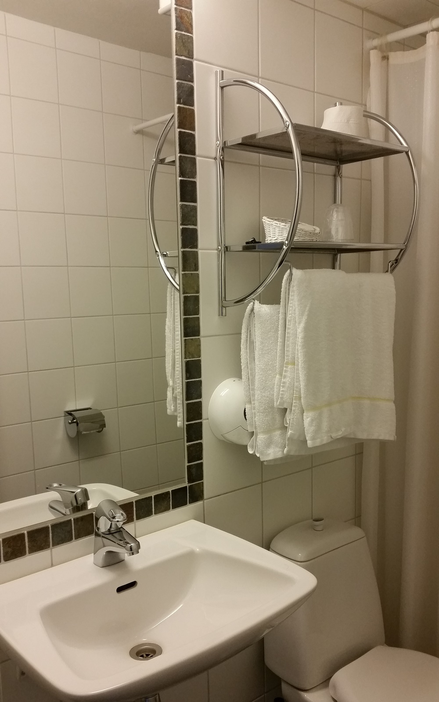
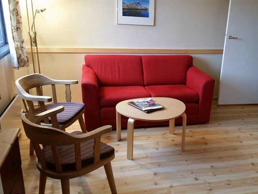

Rondane Høyfjellshotell tilbyr store og lyse dobbeltrom med egen stue og bad.

Rommene har dobbeltseng med egen stue og bad. Alle rommene har plass til oppbevaring av baggasje, med skapplass.

Mange av dobbeltrommene er pusset opp i smakfulle farger i løpet av 2015 eller 2016. Vi legger imidlertid ikke skjul på at enkelte bad,  som ikke er pusset opp, har en noe varierende standard. Vi bruker betegnelsen "høy fjellvandrerstandard". Alle hotellrommene har eget bad og TV, men inventar med 12 kanaler.

Rondane Høyfjellshotell har et kontinuerlig oppgraderingsprogram og har fått mange positive tilbakemeldinger på det arbeidet som er gjort så langt.

<Sidefelt>

Alle overnattinger inkluderer frokost

</Sidefelt>
