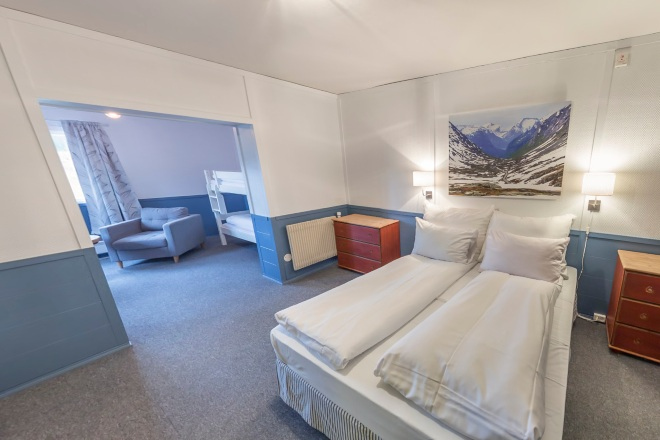
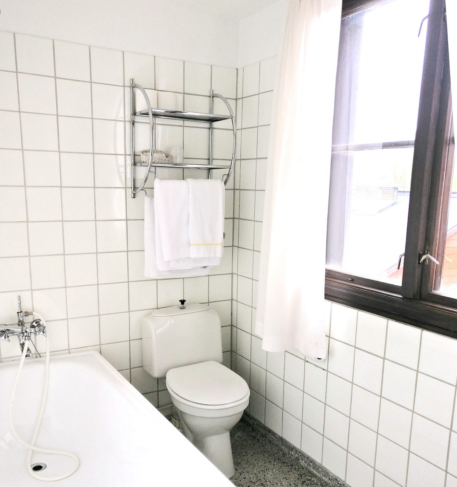

Rondane Høyfjellshotell tilbyr store og lyse familierom med tilhørende stue og bad.

Rommene har fire til fem sengeplasser samt sitteplasser, eget oppholdsrom og bad. Alle rom har dobbeltseng og enkeltsenger eller køyeseng. Alle rommene har plass til oppbevaring av baggasje, med skapplass. Noen av rommene har også en fantastisk utsikt over Mysuseter og Rondane nasjonalpark.

Noen av familierommene er pusset opp i smakfulle farger i løpet av 2015 eller 2016. Vi legger imidlertid ikke skjul på at familierom som ikke er pusset opp, har en noe varierende standard. Vi vil beskrive dem som å ha "høy fjellvandrerstandard". Dvs at alle har eget bad (noen har også 2 bad) og flatskjerm-TV, men inventar og bad kan fremstå med litt preg av "åtti-tallet".

<Sidefelt>

Alle overnattinger inkluderer frokost

</Sidefelt>
