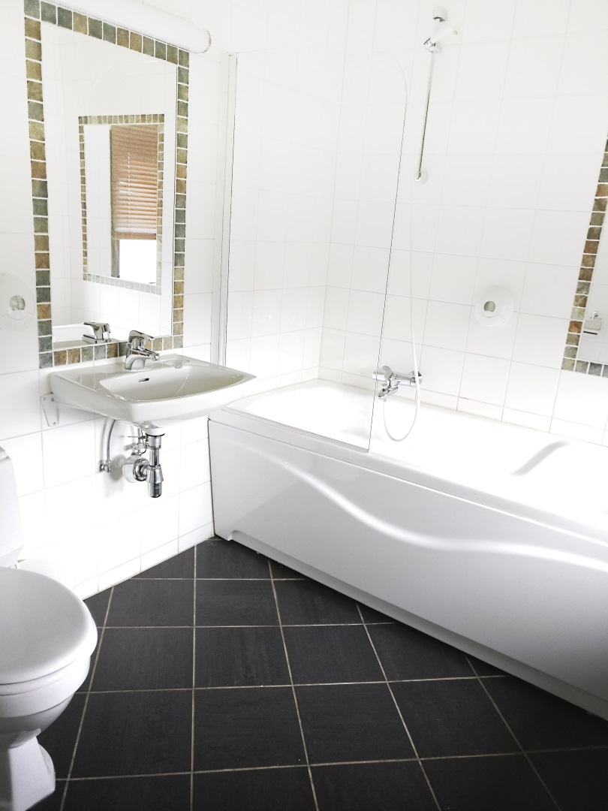

Økonomi dobbeltrom på Rondane Høyfjellshotell inneholder dobbeltseng, sitteplasser og eget bad. Alle rommene har skap og TV med 12 kanaler.

Rommene er kalt økonomirom fordi de ikke er pusset opp til 2022-standard. Rondane Høyfjellshotell følger et nøye oppsatt program for utvikling av eiendomsmassen og hvert eneste rom skal pusses opp, i noen tilfeller bygges om. De rommene som ikke er pusset opp er priset ca. 200 kroner lavere enn øvrige rom.

<Sidefelt>

Alle overnattinger inkluderer frokost

</Sidefelt>
