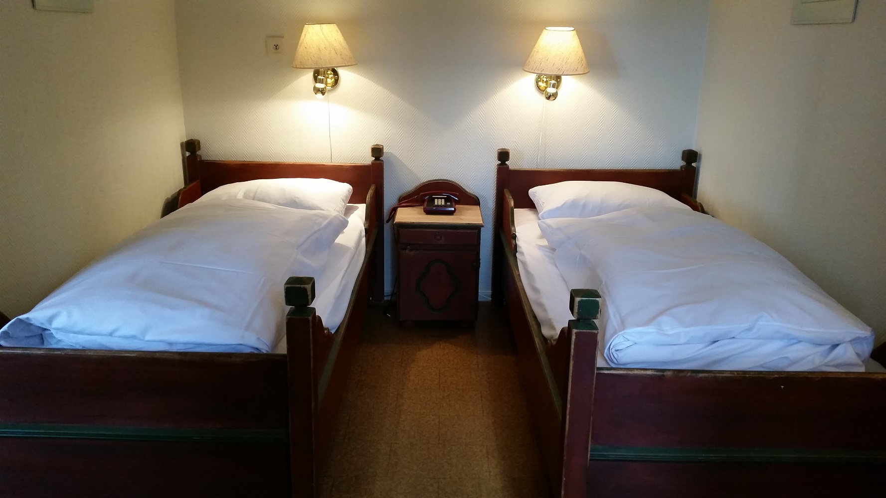

Rondane Høyfjellshotell tilbyr twinrom med bad og sittegruppe.

Rommene har to separate senger samt sitteplasser og eget bad. Alle rommene har plass til oppbevaring av baggasje, med skapplass. Noen av rommene har også en fantastisk utsikt over Mysuseter og Rondane nasjonalpark.

Noen av twinrommene er pusset opp i smakfulle farger i løpet av 2015 eller 2016. Badene er ikke pusset opp. Alle rom har TV med 12 kanaler.

<Sidefelt>

Alle overnattinger inkluderer frokost

</Sidefelt>
