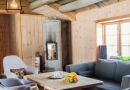
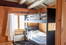
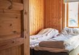
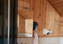
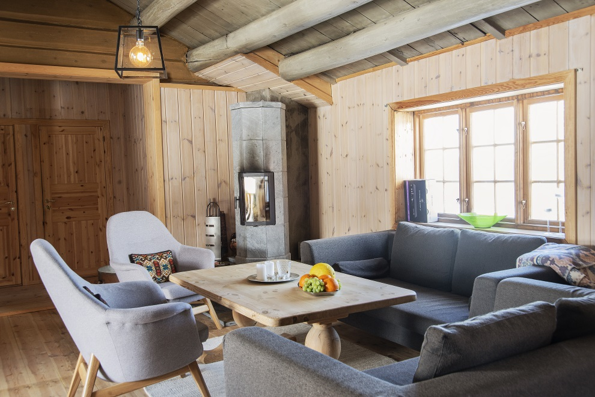

Fjellhytta er 400m fra hotellet med bilvei frem og god parkering og ligger som nabo til Rondane Fjellstue. Hyttegjester kan benytte alle fasilititer på Rondane Høyfjellshotell gratis (Svømmebasseng, sykler og kanoer).

Hytta består av kombinert stue og kjøkken i åpen løsning, to soverom, med køyeseng for to personer i det ene og to enkeltsenger i det andre. Våre hytter har selvhushold og er utstyrt med kjøkkenredskaper, panner og kjeler. Håndklær, laken og sengetøy kan leies av hotellet eller bringes selv. Tillat med kjæledyr.

*Husk å hente nøkkel på Rondane Høyfjellshotell.*

<Sidefelt>

Praktisk informasjon:

- Obligatorisk utvask: kr. 500,-
- Utsjekk 11:00, innsjekk 16:00
- Kjældyr er tillatt. Tillegg kr. 175,-
- Leie av sengetøy (inkl. håndklær): kr. 110,-. Vennligst gi oss beskjed før ankomst, så legger vi dette klart til deg på hytta

Sekk med ved: kr. 110,-, hentes bak hotellet

- Frokost og nistepakke samlet på Rondane Fjellstue: kr. 140,- per pers. Vennligst gi oss beskjed før ankomst
- Turtips og aktiviteter
- [Ta meg til hytta (Google Maps lenke)!](https://goo.gl/maps/ukjMq12UY1NuRYjN8) 61.811268, 9.685279

</Sidefelt>
