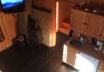
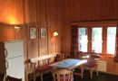
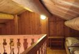
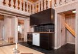
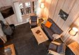
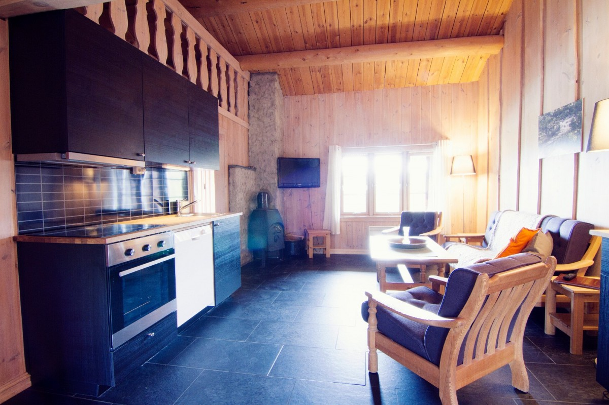
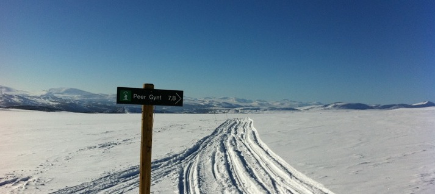

Rondane Høyfjellshotell tilbyr ti romslige utleiehytter som ligger mindre enn hundre meter fra hotellet

Hyttene er utstyrt med fullt kjøkken, stue, bad, ett eller to soverom med dobbeltseng og 4-6 ekstra sengeplasser på hems. Hyttene er ca 65-70m2 store, og har egen parkering og kveldssolvennlig veranda.

Våre hytter og leiligheter har selvhushold. Sengetøy og barnesenger kan leies i vår resepsjon.

Leietagere har tilgang til alle hotellets tjenester og fasiliteter, sykler og kanoer.

NB! Noen av våre hytter og leiligheter er renovert 2014/2015.

Alt ligger til rette for å slappe av til fjells med dine nærmeste!

<Sidefelt>

Praktisk informasjon:

- Obligatorisk utvask: kr. 500,- per hytte
- Utsjekk 11:00, innsjekk 16:00
- Kjældyr er tillatt. Tillegg kr. 175,- per hytte
- Leie av sengetøy (inkl. håndklær): kr. 110,- per pers.
- Sekk med ved: kr. 110,- per sekk, hentes bak hotellet
- Frokost kr. 170,- / Nistepakke 110,-
pris per pers. per dag
- Turtips og aktiviteter
- Disse hyttene ligger ca. 50 meter fra hotellet

</Sidefelt>
