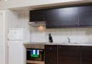
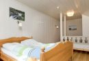
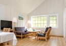
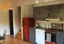
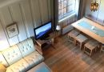
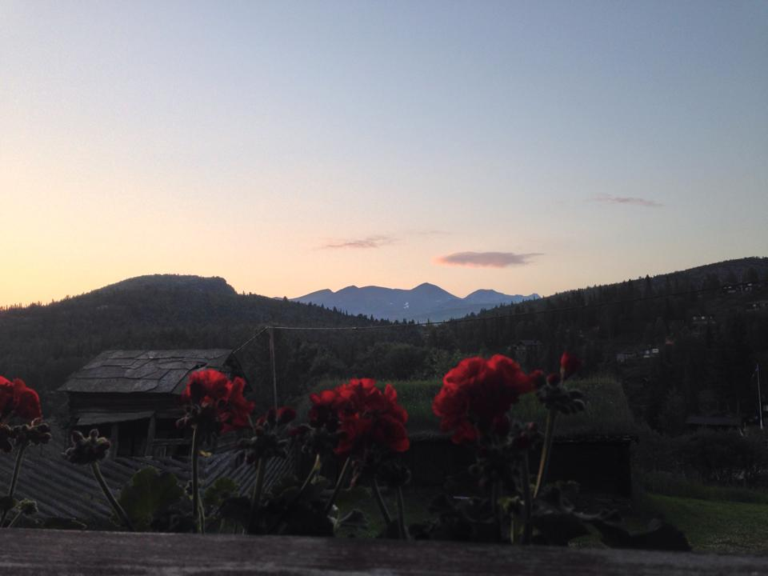

Rondane Høyfjellshotell tilbyr fire leiligheter i eget bygg, 50 meter fra hotellet.

Alle leilighetene er utstyrt med fullt kjøkken, bad og seks sengeplasser (dobbeltseng + fire enkeltsenger). Leilighetene er ca. 70m2 store. Alle har egen parkering. To har egen veranda med fantastisk utsikt mot Rondane nasjonalpark. Sengetøy og barnesenger kan leies ved henvendelse til resepsjonen.

*Det er ikke tillat med hund i våre leililigheter. Men de er hjertelig velkommen i flere av våre hytter.*

I underetasjen ligger vår villmarkskro Erlingstugu. Denne kan også leies i sammenheng med at større grupper benytter hele eller deler av bygget. Lokalet er godt egnet for felles bespisning samt møter.

Noen av leilighetene er pusset opp i 2015 og 2017.

<Sidefelt>

</Sidefelt>
