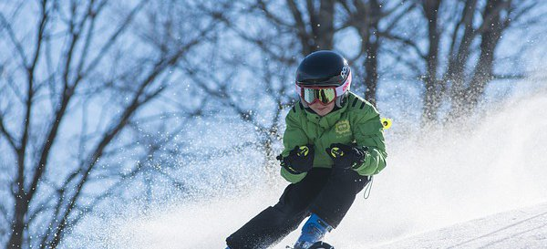
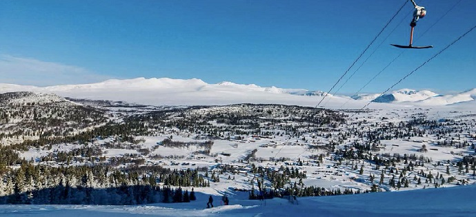
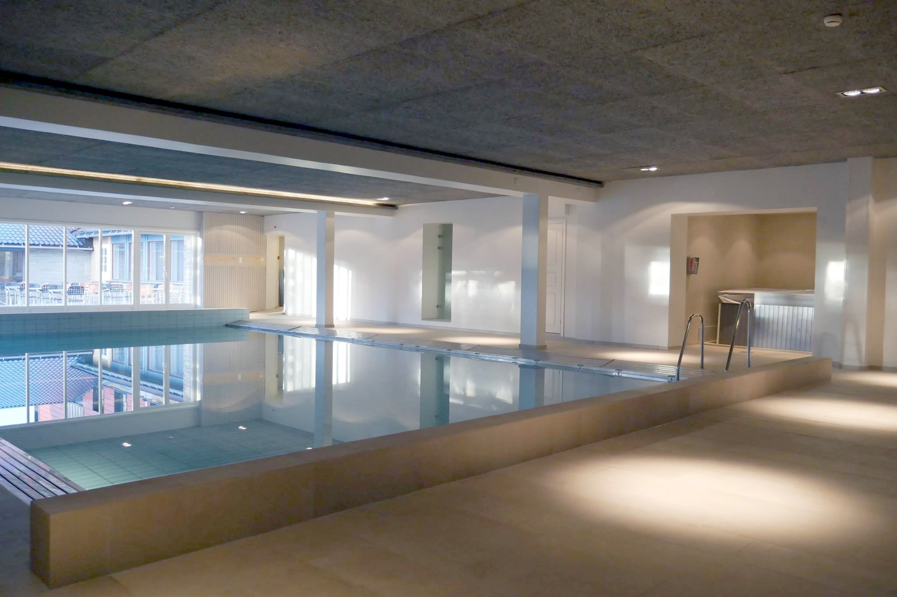

Rondane Høyfjellshotell mottar stadig oppmuntrende gjesteanmeldelser som gjør oss stolte og inspirerer oss til å stå på hver dag. Her om dagen plukket en av våre kolleger opp et eksemplar av den kjente turistguiden Lonely Planet på en flyplass i Australia og kunne lese følgende om oss:

"A comfortable upmarket option with good spa facilities, including pedicures for worn-out hikers´ feet, and pine-tinged rooms that are unusually good value. The restaurant serves hearty Norwegian and international fare (set dinner menu 475kr). Needless to say, the views are a knockout. It´s on the road from Otta towards the Spranghaugen car park."

Rondane Høyfjellshotell er et av de hotellene med flest kundeanmeldelser i Norge på Booking.com. For tiden har vi nesten tusen anmeldelser, hvilket er overveldende, fordi ingen av dem er mer enn to år gamle.

Vi setter pris på anmeldelsene fordi de er ærlige. De feilene som vi kan gjøre noe med rettes opp og vi er stolte av at folk skryter av det vi ser som det viktigste med et hotell: Service, mat og gode senger. Selve rommene blir ikke vurdert så høyt fordi noen ikke er pusset opp, men vi har et kontinuerlig oppussingsprogram og forbedringer er på gang.

Noen eksempler på anmeldelser på Booking.com:

"Desk staff were very helpful in locating the waterfall nearby, which was stunning and well worth the walk (only about a 5-10 minute walk to the bottom). View was amazing. Breakfast was delicious and the waiter was very friendly."
Ethan fra USA

"A lot of activities to make use of in and around the Hotel. The location near Rondane National Park is awesome and the Personal was very useful in recommending the Best routes. Breakfast was very good."
Michael fra Tyskland

"Vintage ski hotel. Nice bedroom and bathroom. Welcomed pool and sauna after long hikes. The restaurant is great too."
Marie fra Sveits

"The room was big, we got actually two parts one for the kids and one for the parents which was nice. The room was clean and the bath was big. The staff is nice. The lobby is very nice with some games for the kids."
Raviv fra Israel

"We really enjoyed the atmosphere and the wonderful staff"
Malcolm fra Australia

<Sidefelt>

</Sidefelt>
