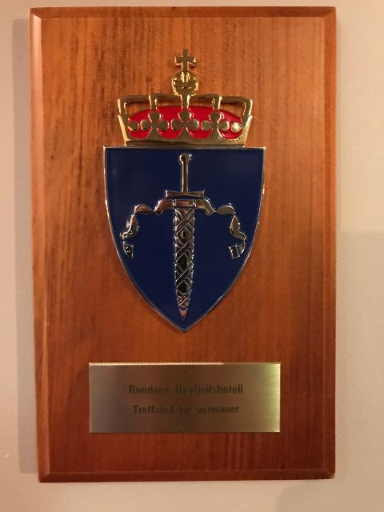

3. desember i år ble Rondane Høyfjellshotell et offisielt treffsted for veteraner. Vi gir 20 prosent rabatt til alle med norske eller britiske veterankort.

Rabatten gjelder hele året og for veteran med nærmeste familie. Rondane Høyfjellshotell er godt egnet som treffsted for grupper av veteranvenner fordi vi ligger sentralt plassert i Sør-Norge. Avstanden fra oss til Oslo, Trondheim, Molde, Ålesund og Voss er omtrent den samme.

Plaketten fikk vi av forsvarets veteraninspektør, brigader Tom Guttormsen, etter at vi som hotell har engasjert oss i veteransaken. Ingen på hotellet er veteraner selv, men mener det er viktig å være samfunnsengasjert som bedrift og ønsker å sette fokus spesielt på de veteraner som sliter. [Les mer her](/blogg/official-meeting-place/). 

Veibeskrivelse til Rondane høyfjellshotell

Det er enklere og billigere å reise fra Storbritannia til Rondane enn man kanskje tror.

Med norsk fra Gatwick flyplass til Oslo flyplass, Gardermoen (OSL)
Med Ryanair fra Stansted flyplass til Oslo flyplass, Gardermoen (OSL)
Fra Oslo flyplass, NSB (tog) (retning Trondheim) til Otta stasjon

NSB gir en rabatt på 10 til 60 prosent for grupper større enn 10 personer. kontakt gruppereiser@nsb.no eller +47 61 05 19 10

Med Ryanair fra Stansted Airport (STN) til Sandefjord Lufthavn Torp (TRF)
Med Ryanair fra Manchester (MAN) til Sandefjord Lufthavn Torp (TRF)
Med tog fra Sandefjord Lufthavn Torp til Oslo sentralstasjon. Tog til Otta stasjon (retning Trondheim)

Vi tilbyr transport fra Otta stasjon. Vi henter oss i minibussen vår som tar 8 passasjerer. Prisen for fire personer er 350 nok. Prisen for 5-8 personer er 650 nok.

Hvis du vil besøke Rondane som en del av en større reise i Norge, kan du også komme til Otta fra andre flyplasser:
Fra Gatwick (LGW) til Ålesund (AES) eller
Molde (MOL)

Fra Gatwick (LGW) til Trondheim (TRD).

Et annet alternativ er å leie bil. Her er anvisningene fra Oslo og Trondheim.
