We give a 20 percent discount for all British and Norwegian veterans. In collaboration with The Royal Marines club and the Norwegian SIOPS, Rondane Høyfjellshotell hosted the event “Christmas in Rondane” from December 3rd to 8th this year.

78 veterans and familiy members participated. Meals and accomodation expenses were covered by the hotel. The photos from the event speaks for themselves. The reason why we invited the Royal Marines were based on personal acquaintances, however, Norwegians and Brits do have a special relationship.

The Royal Marines trained in the mountains near our hotel during the cold war. Rondane Høyfjellshotell is an official meeting point for veterans, and we warmly welcome British veterans from all military branches. British veterans with their immediate family get a 20 percent discount on the accomadation bill, regardless of season. if you are a group who would like meals and activities included in your price.

Please contact us by mail at [booking@rondane.no](mailto:booking@rondane.no) or by phone [+47 61 20 90 90](tel:61209090)

Directions to Rondane høyfjellshotell

It is easier and less expensive to travel from Great Britain to Rondane than one might think.

With Norwegian from Gatwick Airport to Oslo airport, Gardermoen (OSL)
With Ryanair from Stansted Airport to Oslo airport, Gardermoen (OSL)
From Oslo Airport, NSB (train) (direction Trondheim) to Otta station

NSB gives a 10 to 60 percent discount for groups larger than 10 people. contact gruppereiser@nsb.no or +47 61 05 19 10

With Ryanair from Stansted Airport (STN) to Sandefjord Lufthavn Torp (TRF)
With Ryanair from Manchester (MAN) to Sandefjord Lufthavn Torp (TRF)
With train from Sandefjord Lufthavn Torp to Oslo Central station. Train to Otta station (direction Trondheim)

We offer transportation from Otta station. We will pick you up in our mini bus which takes 8 passengers. The price for four people is 350 nok. The price for 5-8 people is 650 nok.

If you want to visit Rondane as a part of a greater Norway trip, may also get to Otta from other airports:
From Gatwick (LGW)to Ålesund (AES) or
Molde (MOL)

From Gatwick (LGW) to Trondheim (TRD).

Another alternative is to rent a car. Here are the directions from Oslo and Trondheim.

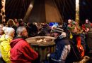

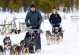

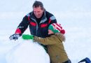

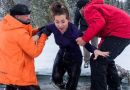

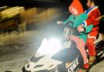

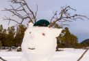

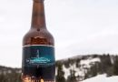

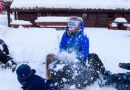

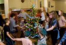

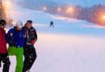

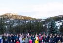

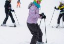

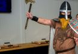

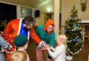

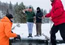

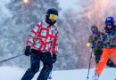
