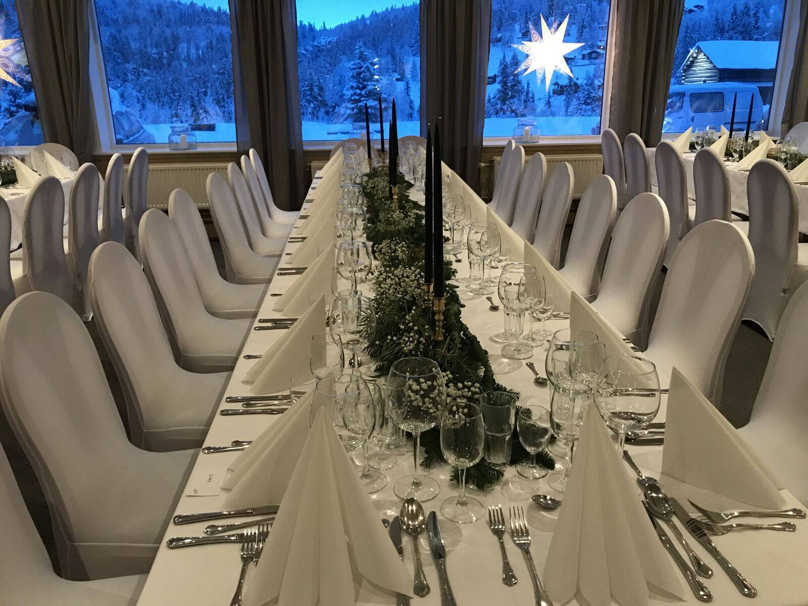
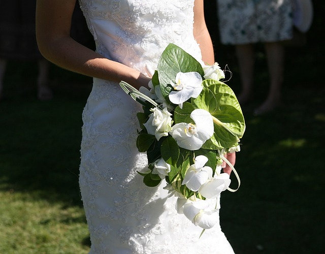

Vinterbryllup i Rondane
Rondane Høyfjellshotell er et perfekt sted for folk som er glade i naturen og vil ha bryllupsfering i et av Norges vakreste fjellområder. Her kan bryllupsgjestene bo komfortabelt, og samtidig har man fantastisk natur like utenfor døra, med store fossefall og utsikt mot Norges eldste nasjonalpark.

Har du gifteplaner og ønsker å vite mer om hva vi kan tilby?
Ta kontakt med oss på booking@rondane.no, så kontakter vi deg for en hyggelig prat og et konkret pristilbud.

Å planlegge et bryllup på Rondane Høyfjellshotell
Vi på Rondane Høyfjellshotell har lang erfaring med å være vertskap for bryllup, og tilbakemeldingene fra par som har giftet seg her er svært gode. Som brudepar får man personlig oppfølging fra den dagen man starter planleggingen av et fjellbryllup. Det er alltid mange praktiske detaljer som skal landes, og vi bistår og gir tett oppfølging hele veien.

Vi lover å gjøre vårt beste for at ditt drømmebryllup skal bli virkelighet, enten du ønsker deg en utendørsseremoni i Rondane, eller du vil gå til alteret i en av de vakre, gamle kirkene i Gudbrandsdalen. Etter vielsen kan vi servere en flott festmiddag i vår restaurant, der man har utsikt mot fjellene. Vi byr på mat laget med kjærlighet, basert på lokale råvarer og tradisjoner. Bryllupsfesten kan avholdes i en av våre hyggelig peisestuer.

Praktisk informasjon
- Hotellet har 50 rom, og totalt 210 sengeplasser med hytter og leiligheter.
- Restaurant med plass til festmiddag for opptil 100 personer.
- Møterom med plass til opptil 120 personer i kinoppsett. Rommet kan om ønskelig benyttes som seremonirom.
- Egnet festlokale inne på hotellet (Gildehallen), eller i bygningen Erlingstugu.
- Bryllupsgjester har fri tilgang til bassengområde, med boblebad, svømmebasseng og badstue.

<Sidefelt>

</Sidefelt>
