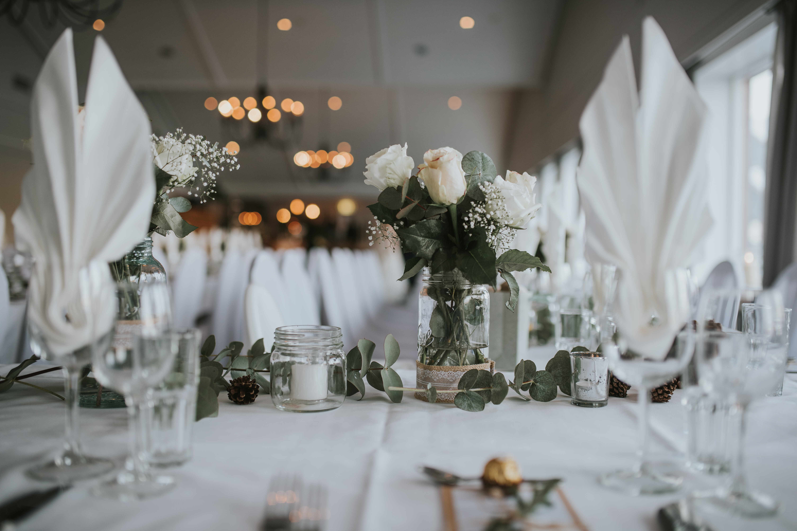
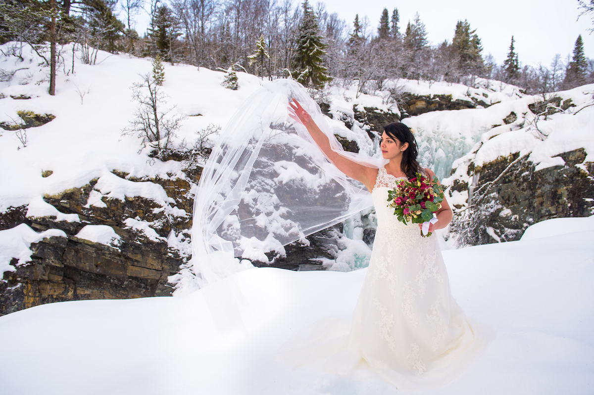
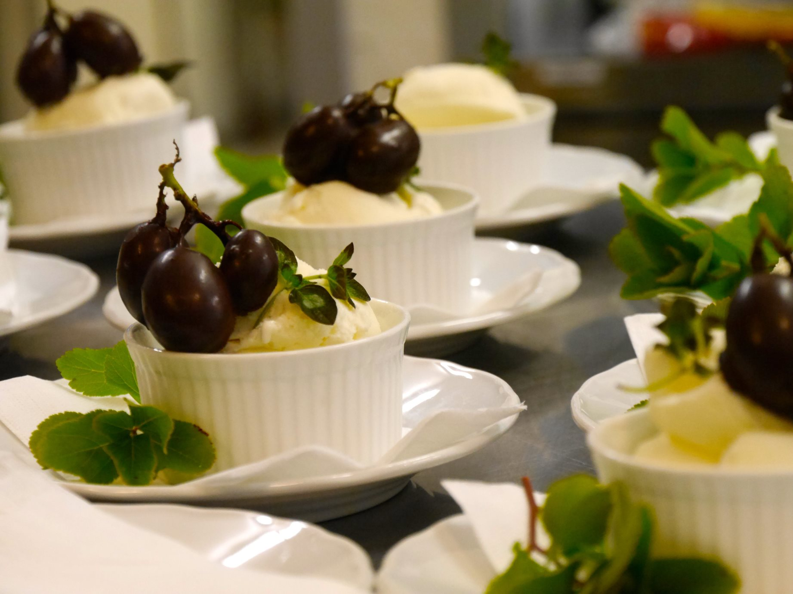
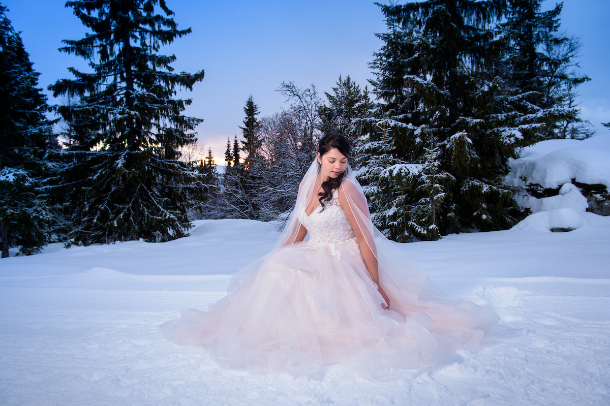

Rondane Høyfjellshotell har hatt mange vinterbryllup de siste årene og vi kaller oss nå vinterbryllupeksperter.

- Utendørs bar
- Trugeturer for gjester på formiddagen
- Spektakulære bilder i Norges vakreste nasjonalpark
- Fjellinspirert festmat av superb kvalitet
 Vi kan gi deg referanser på meget fornøyde brudepar som har giftet seg hos oss ifjor og i 2018.

 For den nye generasjonen av fjellelskende unge er det å gifte seg i fjellet om vinteren et naturlig valg. Ikke så rent få av de som har giftet seg hos oss har også hatt kjæresteturer hos oss tidligere. På mange måter er vi et "kjærestehotell".

 Vi tilbyr seriøse par med planer om å gifte seg hos oss en gratis planleeggingsstur på hotellet vårt en helg i mai.

 Av disse parene trekker vi ut et heldig par som får:

- Gratis make up, levert av Sans for bryllup i Lillehammer
- Gratis brudbukett, levert av Mester Grønn i Otta
- Gratis overnatting for brudeparet, spandert av Rondane Høyfjellshotell.
 Kjolene er fra [Sans for Bryllup Lillehammer](https://www.facebook.com/SansForBryllup/) og fotografen er Ant Upton.

 Book gratis planleggingstur, en helg i mai, her: [booking@rondane.no](mailto:booking@rondane.no)

<Sidefelt>

</Sidefelt>
