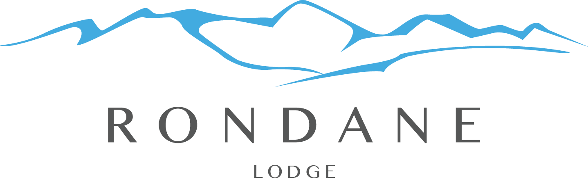
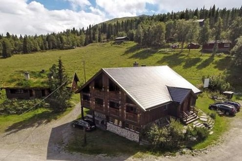

Rondane Lodge er et leilighetskompleks bestående av fire leiligheter, hver av dem har syv senger. Egner seg svært godt for idrettslag, selskaper og arrangementer, da gjestene selv kan disponere kroen under (Erlingstugu). Hotellet har alle rettigheter og kan stille med servitør for eventuell alkoholservering.
 Adgang til svømmehall og trimrom er naturligvis også inkludert, sykler lånes ut så langt lageret rekker. Ved Furusjøen har vi to kanoer til disposisjon for våre gjester.
