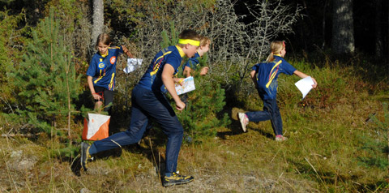

Vi som eier og driver Rondane Høyfjellshotell er fan av idrettsmiljøet i Norge! Vi har fått mye av idretten og nå vil vi gjerne gi noe tilbake ved å tilby spesielt gode priser for utleie av Rondane Lodge, som ligger bare 50 meter fra hotellet. Rondane Lodge egner seg godt for treningsleire eller andre idrettssamlinger fordi det kan benyttes helt separat fra hotellet.

Det beste av alt er at idrettslagene kan ordne seg helt selv med hensyn til mat og drikke*. I I 1. etasje ligger Erlingstugu med eget kjøkken og spisesal, hvor det også kan avholdes møter. Her har vi 65" TV, prosjektor om nødvendig, samt at det inneholder herre/dame garderobe med dusj.

Rondane byr på perfekt treningsterreng. Du finner alt fra flate strekninger til mer krevende partier. Og det beste av alt: Inspirasjonen ved å bruke kroppen i vakkert fjellterreng.

Kapasitet
 - 28 sengeplasser fordelt på fire leiligheter
 - Erlingstugu har plass til ca. 50 deltagere

Som tilleggstjenester kan hotellet tilby
 - Flere sengeplasser på våre hytter/hotell
 - Alle måltider
 - Ytterligere to konferanserom
 - Guidede turer
 - Utleie av sengetøy og håndklær

*Alkohol kan pga sjenkebevilgningsreglene kun serveres på hotellet, eller av hotellets ansatte i Erlingstugu. Vi kan dog tilby dette som en del av totalpakken.

Ta kontakt for tilbud

<Sidefelt>

</Sidefelt>
