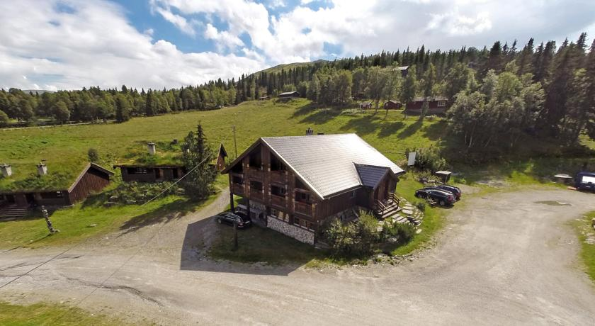

Vi er stolte av å kunne annonsere at Modum Røde Kors Hjelpekorps vant konkurransen om å få hele Erlingstugu med fire leiligheter, én helg, for bare ti kroner. Hele 70 lag, foreninger og klubber deltok i trekningen. Uten frivilligheten stanser Norge, og vi synes det er gøy å gi vårt lille bidrag.

Erlingstugu er et flott bygg som ligger ca. 50 meter fra Rondane Høyfjellshotell, oppført i 1987 og fikk den gangen en pris for god byggeskikk. Bygget inneholder fire leiligheter, en kro og stort kjøkken. Kjøkkenet og kroa står ofte ledig, mens leilighetene med totalt 24 sengeplasser er leid ut i høysesong og en del andre helger i året. Det at klubber og foreninger kan lage mat selv gjør kostpris pr. deltager kommer helt ned mot 312,50 pr. hode pr. døgn, om ditt lag eller forening leier hele bygget.

Normalkostnaden for hele bygget inkludert vask er kr. 15.000 for en helg, utenom norske skoleferier.

På toppen av det hele: Vi lar oss sjarmere av godt skrevne søknader og kan bli lurt til å gå ytterligere ned i pris deler av året. Dette gjelder spesielt i sent oktober, november, januar og mai.

Rondane Høyfjellshotell kan også by på flere sengeplasser i våre hytter og selvsagt i hotellet. Tilgang til svømmehallen kan kjøpes og selvsagt måltider.
Interessert? Ta kontakt med [oleth@rondane.no](mailto:oleth@rondane.no)

<Sidefelt>

</Sidefelt>
